# Bible RAG 系統架構深度分析

---

## 目錄

- [1. 系統概覽](#1-系統概覽)
- [2. 系統架構](#2-系統架構)
- [3. 技術棧](#3-技術棧)
- [4. 資料處理管線](#4-資料處理管線)
  - [4.1 階段一：層級式切塊](#41-階段一層級式切塊)
  - [4.2 階段二：實體抽取](#42-階段二實體抽取)
  - [4.3 階段三：嵌入向量生成](#43-階段三嵌入向量生成)
  - [4.4 階段四：資料庫匯入](#44-階段四資料庫匯入)
- [5. 資料庫系統](#5-資料庫系統)
  - [5.1 PostgreSQL 關聯式資料庫](#51-postgresql-關聯式資料庫)
  - [5.2 Neo4j 知識圖譜](#52-neo4j-知識圖譜)
  - [5.3 Qdrant 向量資料庫](#53-qdrant-向量資料庫)
- [6. 後端 RAG 系統](#6-後端-rag-系統)
  - [6.1 檢索路由器架構](#61-檢索路由器架構)
  - [6.2 經文直查策略](#62-經文直查策略)
  - [6.3 語意搜尋策略](#63-語意搜尋策略)
  - [6.4 圖譜實體策略](#64-圖譜實體策略)
  - [6.5 候選融合與去重](#65-候選融合與去重)
  - [6.6 重排序模組](#66-重排序模組)
  - [6.7 LLM 整合](#67-llm-整合)
- [7. 評估系統](#7-評估系統)
- [8. API 參考](#8-api-參考)
- [9. 部署架構](#9-部署架構)

---

## 1. 系統概覽

Bible RAG 是一套針對**繁體中文聖經文本**的 Retrieval-Augmented Generation（RAG）問答系統。系統接受自然語言問題，透過多策略檢索取得相關經文段落，再由大型語言模型（LLM）生成引用經文的回答。

### 核心特點

| 特點 | 說明 |
|------|------|
| **層級式文本切塊** | 書卷 → 章 → 段落（Pericope） → 塊（Chunk），保留聖經結構語境 |
| **六類實體抽取** | 人物、地點、群體、事件、物件、主題，共 14,845 個實體 |
| **多策略檢索** | 經文直查、語意搜尋、圖譜遍歷、交叉引用四策略並行 |
| **三資料庫多語持久化** | PostgreSQL + Qdrant + Neo4j，各司其職 |
| **證據優先生成** | 兩階段 LLM 流程：先抽取證據，再生成回答 |
| **完整評估框架** | 100 題測試集、RAGAS 指標、自定義指標、視覺化儀表板 |

### 資料規模

| 指標 | 數量 |
|------|------|
| 書卷 | 66 |
| 章 | 1,189 |
| 段落（Pericope） | 2,779 |
| 塊（Chunk） | 431 |
| 嵌入向量 | 3,041 |
| 實體 | 14,845 |
| 實體提及 | 80,912 |
| PostgreSQL 記錄 | 100,222 |
| Neo4j 節點 | 19,310 |
| Neo4j 關係 | 57,877 |

---

## 2. 系統架構

### 六層架構

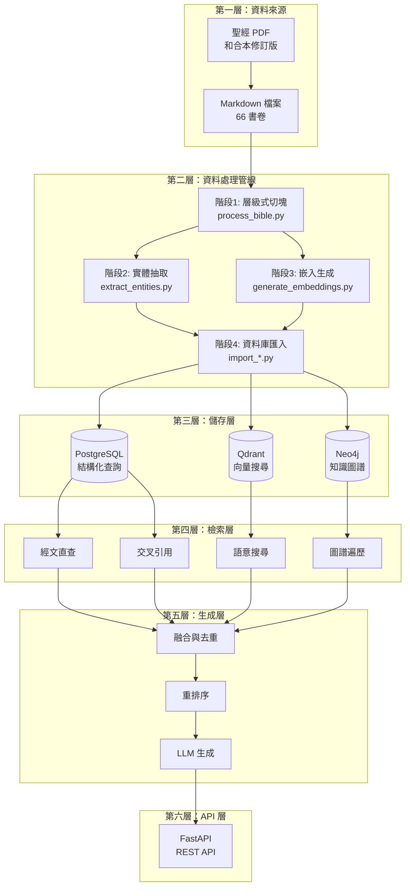

### 雙路徑檢索路由

系統採用**快速路徑**與**正常路徑**的雙路由策略：

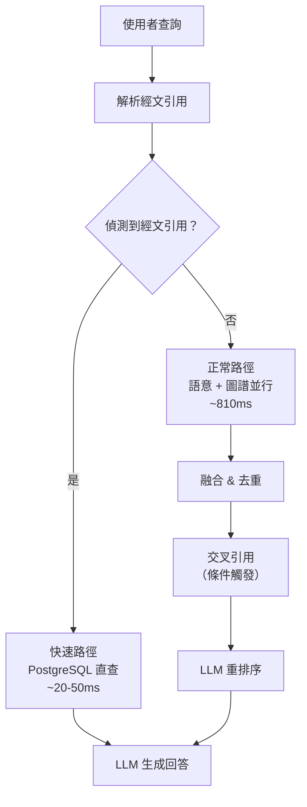

---

## 3. 技術棧

### 核心框架與工具

| 類別 | 技術 | 說明 |
|------|------|------|
| **語言** | Python 3.12 | 搭配 UV 套件管理器 |
| **Web 框架** | FastAPI | 非同步 API 伺服器 |
| **容器化** | Docker Compose | 多服務編排 |
| **嵌入模型** | BGE-M3 (BAAI/bge-m3) | 1024 維，最大 8192 tokens |
| **NER 引擎** | CKIP Transformers | 中文命名實體識別 |
| **向量資料庫** | Qdrant | 餘弦相似度搜尋 |
| **圖資料庫** | Neo4j 5.15.0 | 含 APOC 外掛 |
| **關聯式資料庫** | PostgreSQL | 結構化資料與全文搜尋 |

### LLM 提供者（可插拔式）

| 提供者 | 預設模型 | 使用場景 |
|--------|----------|----------|
| **Claude** | `claude-haiku-4-5` | 預設生產環境 |
| **Gemini** | `gemini-1.5-flash` | 低延遲替代 |
| **OpenAI** | `gpt-4o-mini` | 成本效益選項 |
| **Ollama** | 本地模型 | 離線開發，無 API 費用 |

### Docker Compose 服務

| 服務 | 映像 | 連接埠 |
|------|------|--------|
| `backend` | 自建 Python 映像 | 8000 |
| `postgres` | postgres:16 | 5432 |
| `qdrant` | qdrant/qdrant | 6333, 6334 |
| `neo4j` | neo4j:5.15.0 | 7474, 7687 |

---

## 4. 資料處理管線

四階段管線將原始聖經 Markdown 轉化為三個資料庫中的結構化資料：

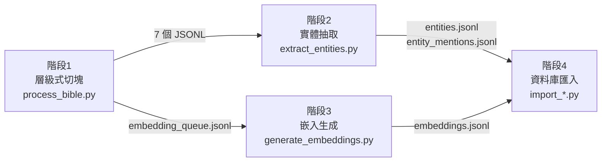

### 4.1 階段一：層級式切塊

**入口腳本**：`scripts/process_bible.py`

將 66 個聖經 Markdown 檔案解析為四層階層結構：

```
書卷 (Book, 66)
 └── 章 (Chapter, 1,189)
      └── 段落 (Pericope, 2,779)
           └── 塊 (Chunk, 431)
```

#### 切塊策略

| 參數 | 值 | 說明 |
|------|---|------|
| 目標 token 數 | 512-1024 | 平衡語境與精度 |
| 最大 token 數 | 1024 | 嵌入模型 8192 限制下的安全值 |
| 分割器 | Tokenizer 感知 | 依 token 而非字元切割 |
| 邊界策略 | 經節感知 | 不在經節中間切割 |

#### 輸出 JSONL 檔案

| 檔案 | 記錄數 | 說明 |
|------|--------|------|
| `books.jsonl` | 66 | 書卷後設資料 |
| `chapters.jsonl` | 1,189 | 章後設資料 |
| `pericopes.jsonl` | 2,779 | 段落（含標題、摘要） |
| `chunks.jsonl` | 431 | 長段落的子區塊 |
| `embedding_queue.jsonl` | 3,041 | 待嵌入的文本佇列 |
| `neo4j_nodes.jsonl` | 4,465 | Neo4j 結構節點 |
| `neo4j_relationships.jsonl` | 8,209 | Neo4j 結構關係 |

#### ID 命名模式

| 層級 | 格式 | 範例 |
|------|------|------|
| 書卷 | `{book_id}` | `GEN`, `ROM` |
| 章 | `{book_id}-{chapter}` | `GEN-1`, `ROM-3` |
| 段落 | `{book_id}-{chapter}-{index}` | `GEN-1-1` |
| 塊 | `{pericope_id}-chunk-{index}` | `GEN-1-1-chunk-0` |

---

### 4.2 階段二：實體抽取

**入口腳本**：`scripts/extract_entities.py`

從 3,041 個文本片段中抽取聖經實體，支援兩種模式：

#### 兩種抽取模式

| 模式 | 指令 | API 費用 | 速度 | 品質 |
|------|------|----------|------|------|
| **NER-Only** | `--ner-only` | 無 | 快 | 基準 |
| **Full（NER + LLM）** | 預設 | 需 LLM API | 慢 | 增強 |

#### 六類實體類型

| 類型 | 說明 | 範例 |
|------|------|------|
| **Person** | 聖經人物 | 亞伯拉罕、摩西、耶穌 |
| **Place** | 地理位置 | 耶路撒冷、埃及、加利利 |
| **Group** | 群體/民族 | 以色列人、法利賽人 |
| **Event** | 重要事件 | 出埃及、復活 |
| **Object** | 重要物件 | 約櫃、會幕 |
| **Theme** | 抽象主題 | 救贖、恩典、信心 |

#### 核心元件

| 元件 | 類別 | 職責 |
|------|------|------|
| `NERExtractor` | CKIP NER | 基於 CKIP Transformers 的中文命名實體識別 |
| `LLMExtractor` | LLM 強化 | 使用 LLM 驗證與補充實體（特別是主題類） |
| `EntityNormalizer` | 正規化 | 去重、分配正規名稱、生成 UUID |

#### 輸出統計

| 輸出 | 記錄數 | 用途 |
|------|--------|------|
| `entities.jsonl` | 14,845 | 唯一實體定義 |
| `entity_mentions.jsonl` | 80,912 | 實體出現記錄 |
| 平均提及次數 | 5.4 次/實體 | 顯示實體在語料中高度重用 |

---

### 4.3 階段三：嵌入向量生成

**入口腳本**：`scripts/generate_embeddings.py`

使用 BGE-M3 模型為所有文本片段生成密集向量嵌入。

#### BGE-M3 模型規格

| 參數 | 值 |
|------|---|
| 模型 | `BAAI/bge-m3` |
| 維度 | 1024 |
| 最大 tokens | 8192 |
| 嵌入向量數 | 3,041 |
| 載入方式 | 延遲初始化（首次使用時載入） |

#### 處理流程

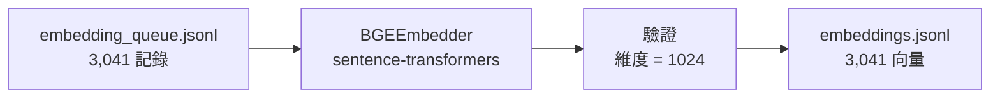

#### CLI 選項

```bash
# 完整生成
python scripts/generate_embeddings.py

# 自訂輸出目錄與批次大小
python scripts/generate_embeddings.py --output-dir output --batch-size 32

# 驗證已有嵌入
python scripts/validate_output.py
```

---

### 4.4 階段四：資料庫匯入

三個獨立的匯入腳本，可平行執行：

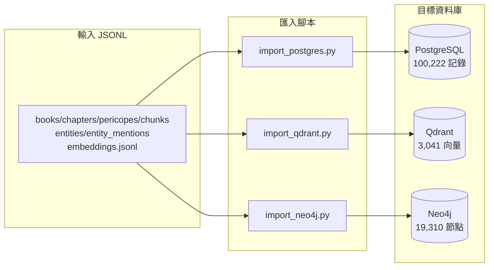

| 匯入腳本 | 策略 | 冪等機制 |
|----------|------|----------|
| `import_postgres.py` | `execute_values` 批次插入 | `ON CONFLICT DO NOTHING` |
| `import_qdrant.py` | `client.upsert()` 批次 100 | 覆寫式 upsert |
| `import_neo4j.py` | Cypher `MERGE` 批次 500-2000 | MERGE 匹配或建立 |

---

## 5. 資料庫系統

### 三資料庫多語持久化架構

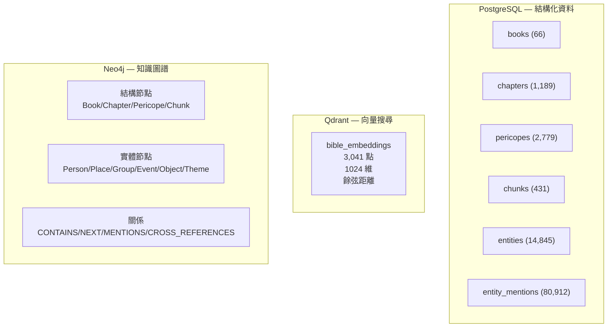

三資料庫通過共享 ID 體系互相連結：
- **Pericope ID** 同時存在於 PostgreSQL、Qdrant（`record_id`）、Neo4j（`node.id`）
- **Entity ID** 同時存在於 PostgreSQL（`entities.id`）、Neo4j（`entity_id`）

---

### 5.1 PostgreSQL 關聯式資料庫

#### 6 張表 + 1 個視圖

| 表名 | 記錄數 | 主要用途 |
|------|--------|----------|
| `books` | 66 | 書卷後設資料（名稱、順序、新/舊約） |
| `chapters` | 1,189 | 章後設資料（書卷外鍵、章號） |
| `pericopes` | 2,779 | 段落（標題、摘要、經文範圍、全文） |
| `chunks` | 431 | 長段落的子區塊（token 數、索引） |
| `entities` | 14,845 | 實體（類型、正規名稱、描述、別名） |
| `entity_mentions` | 80,912 | 實體出現位置（文本ID、位置偏移） |
| `embedding_sources`（VIEW） | 3,041 | 聯合 pericopes + chunks 供嵌入查詢 |

#### 關聯結構

```
books (1) ──< chapters (1) ──< pericopes (1) ──< chunks
                                    │
                                    └──< entity_mentions >── entities
```

所有外鍵使用 `ON DELETE CASCADE`，刪除書卷時自動級聯清理。

#### 索引策略

共 11 個索引，包括：
- 主鍵約束自動索引
- `idx_pericopes_book_chapter` — 加速按書卷/章查詢段落
- `idx_entities_type` — 加速按類型篩選實體
- `idx_entity_mentions_entity` / `idx_entity_mentions_source` — 加速實體-文本雙向查詢

---

### 5.2 Neo4j 知識圖譜

#### 節點類型

**結構節點（4,465）：**

| 標籤 | 屬性 | 數量 |
|------|------|------|
| `Book` | `id`, `book_name`, `book_order` | 66 |
| `Chapter` | `id`, `book_id`, `chapter_num` | 1,189 |
| `Pericope` | `id`, `chapter_id`, `title`, `summary` | 2,779 |
| `Chunk` | `id`, `pericope_id`, `text`, `word_count` | 431 |

**實體節點（14,845）：**

所有實體具有雙標籤（如 `Entity:Person`），共享屬性：`entity_id`, `canonical_name`, `description`, `mention_count`, `aliases`

#### 關係類型

| 類型 | 來源 → 目標 | 說明 |
|------|-------------|------|
| `CONTAINS` | Book→Chapter→Pericope→Chunk | 階層包含 |
| `NEXT` | Chapter→Chapter, Pericope→Pericope | 序列排序 |
| `NEXT_BOOK` | Book→Book | 書卷順序 |
| `MENTIONS` | Pericope/Chunk→Entity | 實體出現（含 `text_span`, `start_pos`, `end_pos`） |
| `CROSS_REFERENCES` | Pericope→Pericope | 主題交叉引用 |

#### 範例 Cypher 查詢

```cypher
-- 查找提到「摩西」的所有段落
MATCH (s)-[m:MENTIONS]->(e:Entity)
WHERE e.canonical_name IN ['摩西']
RETURN s.id AS source_id, collect(e.canonical_name) AS entities
ORDER BY count(m) DESC
LIMIT 20
```

---

### 5.3 Qdrant 向量資料庫

#### 集合配置

| 參數 | 值 |
|------|---|
| 集合名稱 | `bible_embeddings` |
| 向量維度 | 1024 |
| 距離度量 | COSINE（餘弦相似度） |
| 向量總數 | 3,041 |
| 索引閾值 | 0（立即索引） |

#### Payload 後設資料

每個向量點包含豐富的後設資料：

| 欄位 | 說明 | 範例 |
|------|------|------|
| `record_id` | 階層式 ID | `genesis:1:0` |
| `type` | 文本類型 | `pericope` / `chunk` / `verse` |
| `book_id` / `book_name` | 書卷資訊 | `GEN` / `創世記` |
| `chapter_num` | 章號 | `1` |
| `title` | 段落標題 | `創造天地` |
| `verse_range` | 經文範圍 | `1-5` |
| `content_preview` | 內容預覽（前 200 字） | `起初，神創造天地...` |

#### 三層粒度嵌入

| 層級 | 說明 | 用途 |
|------|------|------|
| Pericope | 段落級嵌入 | 主要檢索粒度 |
| Chunk | 子區塊嵌入 | 長段落的細粒度匹配 |
| Verse | 經節級嵌入 | 精確匹配 |

---

## 6. 後端 RAG 系統

### 6.1 檢索路由器架構

核心函式：`retrieve_and_rerank()`（`backend/utils/retrieval/router.py`）

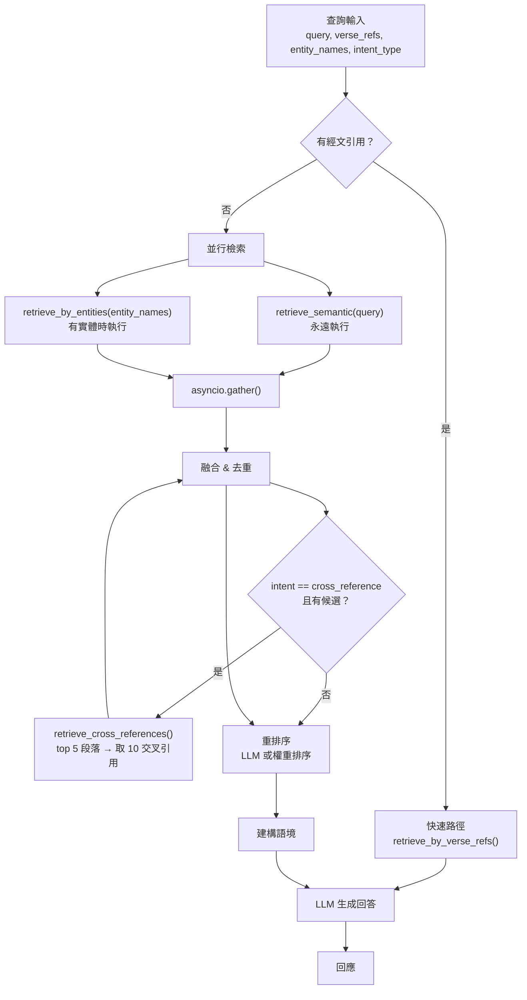

---

### 6.2 經文直查策略

**檔案**：`backend/utils/retrieval/verse_retriever.py`

當查詢包含明確經文引用（如「羅馬書3:23-24」）時觸發快速路徑，直接從 PostgreSQL 查詢精確經節。

#### 三種查詢情況

| 情況 | 條件 | 查詢函式 | 範例 |
|------|------|----------|------|
| 經節範圍 | `verse_start` 和 `verse_end` 都有值 | `get_verses_range()` | 羅馬書3:23-24 |
| 單一經節 | 只有 `verse_start` | `get_verse()` | 羅馬書3:23 |
| 整章 | `verse_start` 為 None | `search_pericopes_by_verse_ref()` | 創世記第1章 |

#### 效能優勢

| 操作 | 快速路徑 | 正常路徑 |
|------|----------|----------|
| 向量嵌入生成 | 跳過 | ~50ms |
| Qdrant 相似搜尋 | 跳過 | ~100ms |
| Neo4j 圖遍歷 | 跳過 | ~150ms |
| 融合演算法 | 跳過 | ~10ms |
| LLM 重排序 | 跳過 | ~500ms |
| PostgreSQL 查詢 | ~20ms | 不使用 |
| **總延遲** | **~20-50ms** | **~810ms** |

快速路徑實現約 **16 倍延遲降低**。

---

### 6.3 語意搜尋策略

**檔案**：`backend/utils/retrieval/semantic_retriever.py`

將查詢轉為 BGE-M3 1024 維向量，在 Qdrant 中進行餘弦相似度搜尋。

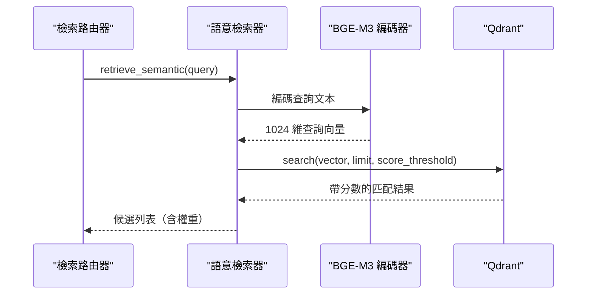

**優點**：概念匹配（即使無關鍵字重疊也能找到相關段落）
**限制**：固定語料（新增內容需重新嵌入）、查詢需先嵌入（+100-300ms）

---

### 6.4 圖譜實體策略

**檔案**：`backend/utils/retrieval/graph_retriever.py`

當查詢中偵測到實體名稱時，遍歷 Neo4j 知識圖譜查找提及這些實體的文本段落。


**適合查詢類型**：
- 「耶穌在耶路撒冷做了什麼？」（Person + Place）
- 「十二門徒參與的事件」（Event + Group）
- 「與恩約和應許相關的主題」（Theme）

**錯誤處理**：若 Neo4j 連線失敗，系統優雅降級，僅使用語意搜尋結果。

---

### 6.5 候選融合與去重

所有策略的結果通過 ID 去重、保留最高權重的演算法進行融合：

```python
# backend/utils/retrieval/router.py:74-80
deduped: dict[str, dict] = {}
for c in all_candidates:
    cid = c["id"]
    if cid not in deduped or c["weight"] > deduped[cid]["weight"]:
        deduped[cid] = c
candidates = list(deduped.values())
```

#### 交叉引用條件融合

當 `intent_type == "cross_reference"` 且有候選時：
1. 取前 5 個段落 ID（`":" in c["id"]`）
2. 呼叫 `retrieve_cross_references(source_pericope_ids, top_k=10)`
3. 新交叉引用僅在 ID 不存在時加入（不覆蓋原有高權重候選）

#### 權重來源

| 策略 | 權重來源 | 典型範圍 |
|------|----------|----------|
| 經文直查 | 固定 `1.0` | 1.0 |
| 語意搜尋 | Qdrant 餘弦相似度分數 | 0.0 - 1.0 |
| 圖譜遍歷 | 實體提及次數 | 可變 |
| 交叉引用 | 資料庫定義的強度分數 | 可變 |

---

### 6.6 重排序模組

融合後的候選經過重排序產生最終 top-k 結果：

```python
# backend/utils/retrieval/router.py:97-103
try:
    ranked = reranker_mod.rerank(query, candidates, top_k=k)
except Exception:
    # 降級為權重排序
    ranked = sorted(candidates, key=lambda x: x.get("weight", 0), reverse=True)[:k]
```

**主要機制**：LLM 重排序（基於查詢與候選的語意相關性評分）
**降級機制**：若 LLM 重排失敗，按權重值降序排列

---

### 6.7 LLM 整合

#### 提供者選擇

通過 `LLM_PROVIDER` 環境變數選擇，支援四家提供者：

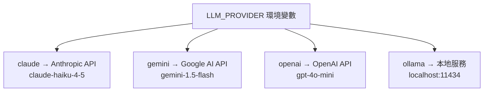

#### 共用請求參數

| 參數 | 環境變數 | 預設值 | 說明 |
|------|----------|--------|------|
| 最大 tokens | `LLM_MAX_TOKENS` | 1024 | 回應最大長度 |
| 溫度 | `LLM_TEMPERATURE` | 0.1 | 低溫度 = 確定性、事實性回答 |
| 速率限制 | `LLM_RATE_LIMIT_DELAY` | 1.0s | 請求間隔 |
| 最大重試 | `LLM_MAX_RETRIES` | 3 | 指數退避重試 |
| 重試延遲 | `LLM_RETRY_DELAY` | 5.0s | 重試基礎延遲 |

#### 證據優先生成流程

系統採用兩階段生成策略：
1. **證據抽取**：從 top-k 重排序後的候選中抽取關鍵證據
2. **回答生成**：基於抽取的證據生成結構化回答，並附帶經文引用

#### 語境壓縮

當候選過多時，使用語意過濾進行壓縮：
- **相似度閾值**：0.45
- **方法**：計算每個候選與查詢的語意相似度，過濾低於閾值的候選

---

## 7. 評估系統

**目錄**：`evaluation/`

三階段評估管線：收集 → 評估 → 視覺化

### 評估管線架構

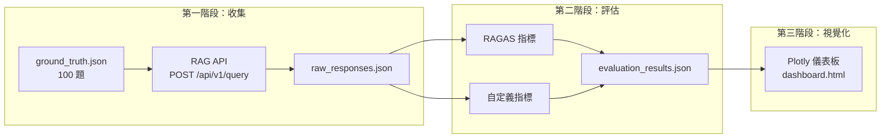

### Ground Truth 測試集

100 題，涵蓋 5 種問題類型：

| 類型 | 說明 | 範例 |
|------|------|------|
| **經文查詢** | 指定經文引用 | 「羅馬書3:23說什麼？」 |
| **主題問題** | 神學主題探討 | 「聖經怎麼談饒恕？」 |
| **人物問題** | 聖經人物相關 | 「亞伯拉罕是誰？」 |
| **事件問題** | 歷史事件 | 「出埃及的過程是什麼？」 |
| **一般問題** | 綜合性問題 | 「舊約和新約有什麼關係？」 |

### 評估指標

| 指標類別 | 具體指標 | 說明 |
|----------|----------|------|
| **RAGAS** | Faithfulness | 回答是否忠實於檢索語境 |
| **RAGAS** | Answer Relevancy | 回答與問題的相關性 |
| **RAGAS** | Context Precision | 檢索語境的精確度 |
| **RAGAS** | Context Recall | 檢索語境的召回率 |
| **自定義檢索** | Retrieval Precision | 檢索結果的精確度 |
| **自定義檢索** | Retrieval Recall | 檢索結果的召回率 |
| **參考比對** | BLEU / ROUGE | 與參考答案的文本相似度 |
| **語意相似度** | Embedding Similarity | 回答與參考答案的語意相似度 |
| **LLM 評審** | Correctness Score | LLM 判斷的正確性分數 |

### 視覺化儀表板

使用 Plotly + Jinja2 模板生成互動式 HTML 儀表板，包括：
- 各指標分數分布圖
- 按問題類型的效能對比
- 個別問題的詳細結果
- 快取系統避免重複呼叫 LLM

---

## 8. API 參考

### 基本資訊

| 項目 | 值 |
|------|---|
| **基礎 URL** | `http://localhost:8000/api/v1` |
| **Swagger UI** | `http://localhost:8000/api/v1/docs` |
| **ReDoc** | `http://localhost:8000/api/v1/redoc` |
| **認證** | 無（設計用於本地部署） |
| **CORS** | 允許 `localhost:5173`, `localhost:3000` |

### 端點總覽

#### RAG 查詢

| 方法 | 路徑 | 說明 |
|------|------|------|
| POST | `/api/v1/query` | 執行完整 RAG 管線查詢 |

**請求範例**：
```json
{
  "query": "聖經怎麼談饒恕？",
  "mode": "auto",
  "options": { "max_results": 5, "include_graph": true }
}
```

**回應包含**：LLM 生成的回答 + 檢索段落 + 後設資料（查詢類型、使用策略、處理時間）

#### 聖經瀏覽

| 方法 | 路徑 | 說明 |
|------|------|------|
| GET | `/api/v1/books` | 列出所有 66 書卷 |
| GET | `/api/v1/books/{id}` | 書卷詳情（含統計） |
| GET | `/api/v1/books/{id}/chapters` | 書卷的所有章 |
| GET | `/api/v1/books/{id}/pericopes` | 書卷的所有段落 |
| GET | `/api/v1/books/{id}/verses` | 書卷的經節（可按章篩選） |
| GET | `/api/v1/pericopes` | 分頁段落列表 |
| GET | `/api/v1/pericopes/{id}` | 段落詳情（含經節） |
| GET | `/api/v1/verses` | 分頁經節列表 |
| GET | `/api/v1/verses/{id}` | 經節詳情 |
| GET | `/api/v1/verses/search` | 全文搜尋經節 |

#### 知識圖譜

| 方法 | 路徑 | 說明 |
|------|------|------|
| GET | `/api/v1/graph/health` | Neo4j 連線健康檢查 |
| GET | `/api/v1/graph/stats` | 圖譜統計 |
| GET | `/api/v1/graph/entity/search` | 搜尋實體 |
| GET | `/api/v1/graph/entity/{id}` | 實體詳情（含關聯實體） |
| GET | `/api/v1/graph/topic/search` | 搜尋主題 |
| GET | `/api/v1/graph/topic/{id}` | 主題詳情 |
| GET | `/api/v1/graph/topic/{id}/related` | 相關主題（共現分析） |
| GET | `/api/v1/graph/verse/{id}/entities` | 經節相關實體 |
| GET | `/api/v1/graph/verse/{id}/cross-references` | 經節交叉引用 |
| GET | `/api/v1/graph/verse/{id}/prophecies` | 預言-應驗關係 |
| GET | `/api/v1/graph/pericope/{id}/parallels` | 對觀福音平行段落 |
| GET | `/api/v1/graph/relationships` | 關係子圖（視覺化用） |

### QueryMode 列舉

| 值 | 說明 |
|---|------|
| `auto` | 自動分類 |
| `verse` | 經文查詢模式 |
| `topic` | 主題檢索模式 |
| `person` | 人物檢索模式 |
| `event` | 事件檢索模式 |

### QueryType 列舉

| 值 | 說明 |
|---|------|
| `VERSE_LOOKUP` | 直接經文引用 |
| `TOPIC_QUESTION` | 主題問題 |
| `PERSON_QUESTION` | 人物問題 |
| `EVENT_QUESTION` | 事件問題 |
| `GENERAL_BIBLE_QUESTION` | 一般聖經問題 |

---

## 9. 部署架構

### Docker Compose 服務編排

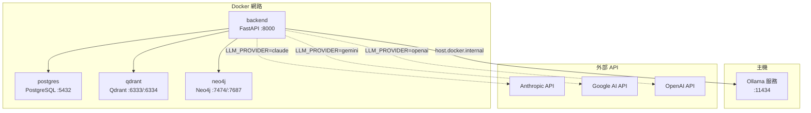

### 環境變數配置

| 變數 | 預設值 | 說明 |
|------|--------|------|
| `DATABASE_URL` | `postgresql://...` | PostgreSQL 連線字串 |
| `QDRANT_HOST` | `localhost` | Qdrant 主機 |
| `QDRANT_HTTP_PORT` | `6333` | Qdrant HTTP 埠 |
| `NEO4J_URI` | `bolt://localhost:7687` | Neo4j Bolt 協定端點 |
| `NEO4J_USER` | `neo4j` | Neo4j 使用者 |
| `NEO4J_PASSWORD` | `neo4j_password` | Neo4j 密碼 |
| `LLM_PROVIDER` | `claude` | LLM 提供者 |
| `ANTHROPIC_API_KEY` | — | Claude API 金鑰 |
| `GOOGLE_API_KEY` | — | Gemini API 金鑰 |
| `OPENAI_API_KEY` | — | OpenAI API 金鑰 |
| `OLLAMA_BASE_URL` | `http://localhost:11434` | Ollama 端點 |
| `CKIP_USE_GPU` | `false` | 是否使用 GPU 加速 CKIP |

### 啟動流程

```bash
# 1. 複製環境變數範本
cp .env.example .env
# 編輯 .env 設定 API 金鑰與資料庫密碼

# 2. 啟動所有服務
docker-compose up -d

# 3. 執行資料處理管線（首次）
python scripts/process_bible.py          # 階段1: 切塊
python scripts/extract_entities.py       # 階段2: 實體抽取
python scripts/generate_embeddings.py    # 階段3: 嵌入生成
python scripts/import_postgres.py        # 階段4a: 匯入 PostgreSQL
python scripts/import_qdrant.py          # 階段4b: 匯入 Qdrant
python scripts/import_neo4j.py           # 階段4c: 匯入 Neo4j

# 4. 驗證
curl http://localhost:8000/api/v1/docs
```

### Neo4j 記憶體配置

```yaml
neo4j:
  environment:
    NEO4J_dbms_memory_heap_initial__size: 512m
    NEO4J_dbms_memory_heap_max__size: 1G
    NEO4J_PLUGINS: '["apoc"]'
```

---

> 本文件由 DeepWiki MCP 自動分析 [Bible_RAG](https://github.com/KenZx0521/Bible_RAG) 專案後整合生成。
