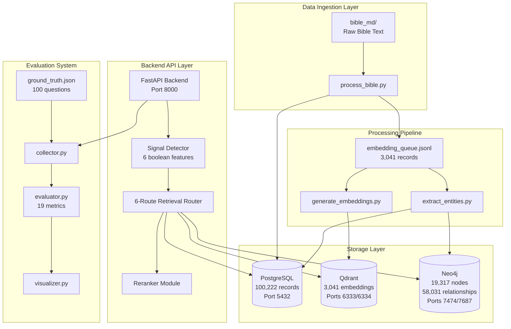
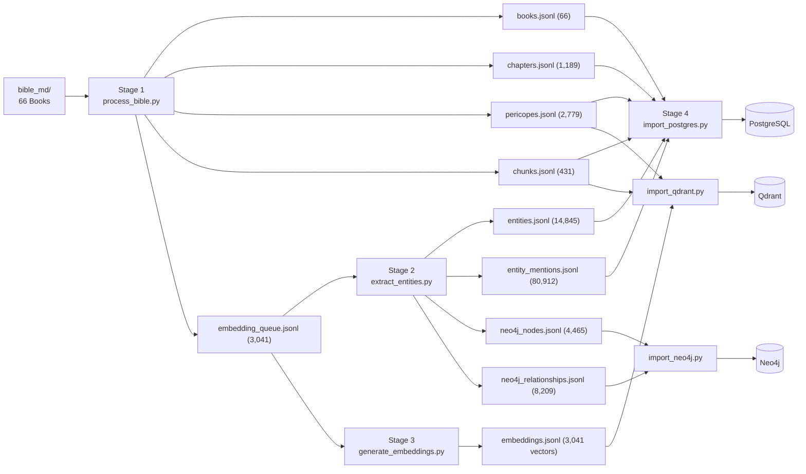
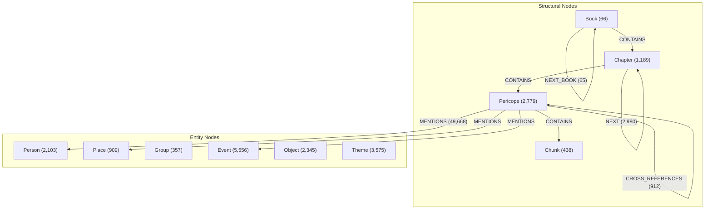
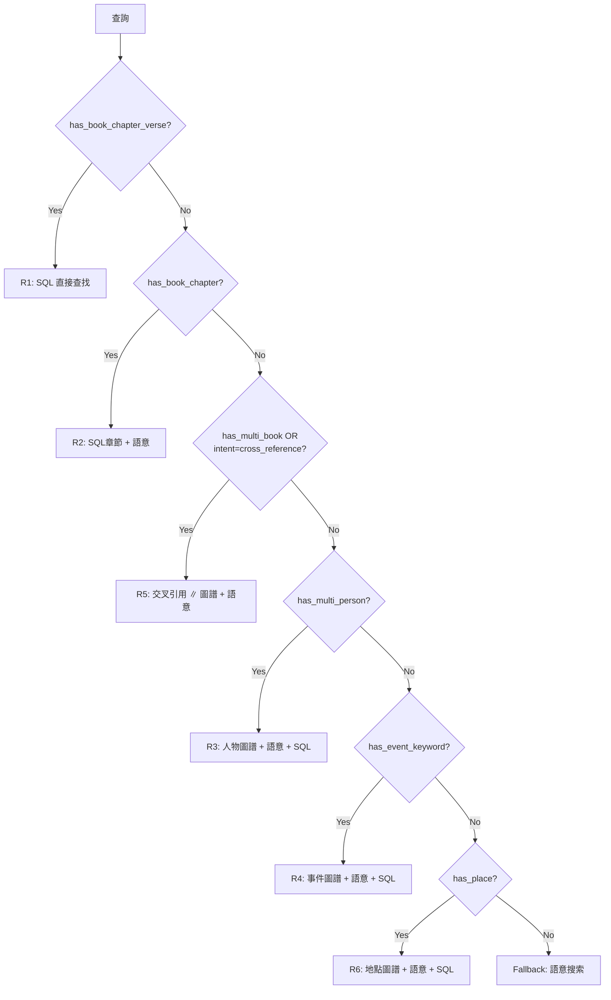

# Bible RAG 系統架構深度分析

> 基於 DeepWiki 自動生成文件與原始碼之完整技術分析
> Repository: [KenZx0521/Bible_RAG](https://github.com/KenZx0521/Bible_RAG)

---

## 目錄

1. [系統概覽](#1-系統概覽)
2. [六層系統架構](#2-六層系統架構)
3. [四階段資料處理管線](#3-四階段資料處理管線)
4. [三資料庫多語言持久化](#4-三資料庫多語言持久化)
5. [Signal-Driven 六路由檢索架構](#5-signal-driven-六路由檢索架構)
6. [LLM 整合與答案生成](#6-llm-整合與答案生成)
7. [評估系統（19 指標）](#7-評估系統19-指標)
8. [部署與設定](#8-部署與設定)
9. [關鍵檔案索引](#9-關鍵檔案索引)
10. [效能特性](#10-效能特性)

---

## 1. 系統概覽

Bible RAG 是一套基於 **檢索增強生成 (RAG)** 的繁體中文聖經問答系統。系統將 66 卷聖經原文 markdown 經由四階段管線處理，建構出三資料庫的多語言持久化架構，再透過 FastAPI 後端提供多策略檢索與 LLM 答案生成服務。

### 核心數據

| 指標 | 數值 |
|------|------|
| 聖經書卷數 | 66 |
| PostgreSQL 記錄總數 | 100,222 (6 張表) |
| Qdrant 向量數 | 3,041 (1024 維, BGE-M3) |
| Neo4j 節點數 | 19,317 |
| Neo4j 關係數 | 58,031 |
| 實體數 | 14,845 (6 類型) |
| 實體提及數 | 80,912 |
| 評估題數 | 100 (5 類型 x 20) |
| 評估指標數 | 19 |
| 檢索路由數 | 6 + Fallback |

### 完整系統架構圖



---

## 2. 六層系統架構

系統採用 **管線到服務 (Pipeline-to-Service)** 架構，離線資料處理填充多個資料庫，然後由線上 API 服務進行查詢。

| 層級 | 名稱 | 核心組件 | 職責 |
|------|------|----------|------|
| L1 | 資料攝取層 | `bible_md/`, `process_bible.py` | 原始 markdown 文字處理 |
| L2 | 處理管線層 | `extract_entities.py`, `generate_embeddings.py` | 四階段結構化轉換 |
| L3 | 儲存層 | PostgreSQL, Qdrant, Neo4j | 三專用資料庫互補查詢模式 |
| L4 | 後端 API 層 | FastAPI, Signal Detector, 6-Route Router | 多策略檢索 + 融合 + 重排序 |
| L5 | 評估層 | `collector.py`, `evaluator.py`, `visualizer.py` | 三階段評估框架 |
| L6 | 部署層 | `docker-compose.yml`, `.env` | Docker Compose 編排 |

---

## 3. 四階段資料處理管線

### 管線流程圖



### 各階段詳細說明

#### Stage 1: 層級式分塊 (`process_bible.py`)

將 66 卷原始 markdown 文字轉換為四層階級結構：

| 層級 | 數量 | 說明 | 平均粒度 |
|------|------|------|----------|
| **Book** | 66 | 聖經書卷 (創世記, 約翰福音 等) | ~1,000 節 |
| **Chapter** | 1,189 | 傳統章節劃分 | ~25 節 |
| **Pericope** | 2,779 | 主題/敘事單元，帶標題 | ~8-12 節 |
| **Chunk** | 431 | 過長 pericope 拆分為嵌入大小限制內的片段 | ~5 節 |

`embedding_queue.jsonl` 包含 3,041 筆記錄 (2,779 pericopes + 431 chunks - 169 被拆分的 pericopes)，代表所有接受嵌入的文字片段。

#### Stage 2: 實體抽取 (`extract_entities.py`)

支援兩種抽取模式：

| 模式 | 工具 | API 成本 | 速度 |
|------|------|----------|------|
| **NER-only** (`--ner-only`) | CKIP Transformers | 零成本 (本地) | ~2 秒/記錄 |
| **Full LLM** (預設) | NER + Claude/Gemini/OpenAI | 需 API 費用 | ~5-8 秒/記錄 |

六類實體類型：

| 類型 | 範例 | 約略數量 |
|------|------|----------|
| Person | 亞伯拉罕, 摩西, 耶穌, 保羅 | ~2,103 |
| Place | 耶路撒冷, 埃及, 加利利 | ~909 |
| Group | 以色列人, 法利賽人, 門徒 | ~357 |
| Event | 出埃及, 逾越節, 復活 | ~5,556 |
| Object | 約櫃, 會幕, 十誡 | ~2,345 |
| Theme | 救贖, 恩典, 信心, 審判 | ~3,575 |

平均每個實體被提及 **5.45 次** (80,912 mentions / 14,845 entities)。

#### Stage 3: 嵌入生成 (`generate_embeddings.py`)

| 參數 | 值 |
|------|-----|
| 模型 | `BAAI/bge-m3` |
| 向量維度 | 1024 |
| 最大輸入 token | 8192 |
| 嵌入數量 | 3,041 |
| 儲存大小 | ~12.5 MB |
| 批次大小 | 32 (可配置) |

#### Stage 4: 資料庫匯入 (`import_*.py`)

三個獨立腳本可平行執行，使用 MERGE 操作實現冪等性。

---

## 4. 三資料庫多語言持久化

### 資料庫總覽

| 資料庫 | 容器名 | 記錄/大小 | 主要用途 | 查詢模式 |
|--------|--------|-----------|----------|----------|
| **PostgreSQL** | `bible_rag_postgres` | 100,222 筆 (6 表) | 結構化查詢、經節查找 | SQL, FTS |
| **Qdrant** | `bible_rag_qdrant` | 3,041 嵌入 (1024 維) | 語意相似度搜索 | 餘弦距離, HNSW |
| **Neo4j** | `bible_rag_neo4j` | 19,317 節點, 58,031 關係 | 知識圖譜遍歷 | Cypher |

### PostgreSQL Schema

| 表名 | 記錄數 | 用途 |
|------|--------|------|
| `books` | 66 | 書卷元資料 |
| `chapters` | 1,189 | 章節資訊 |
| `pericopes` | 2,779 | 段落單元 (主要檢索粒度) |
| `chunks` | 431 | 細粒度文字片段 |
| `entities` | 14,845 | 抽取的命名實體 |
| `entity_mentions` | 80,912 | 實體在文本中的出現 |

特色：pgvector 擴充、外鍵階層結構、`embedding_sources` VIEW。

### Neo4j 知識圖譜



關係類型統計：

| 關係 | 數量 | 用途 |
|------|------|------|
| MENTIONS | 49,668 | 實體提及 |
| CONTAINS | 4,406 | 結構層級 |
| NEXT | 2,980 | 順序排列 |
| CROSS_REFERENCES | 912 | 經文交叉引用 |
| NEXT_BOOK | 65 | 書卷順序 |

### Qdrant 向量存儲

- **Collection**: `bible_embeddings`
- **向量數**: 3,041
- **維度**: 1024 (BGE-M3)
- **索引**: HNSW
- **相似度**: Cosine
- **Metadata**: pericope 標題、chunk 文字、階層上下文

---

## 5. Signal-Driven 六路由檢索架構

這是本系統最核心的創新設計。不同於傳統的雙路徑路由，本系統採用 **6 布林信號驅動的決策樹**，將查詢精確路由至最適合的檢索策略組合。

### 5.1 信號偵測器 (`signal_detector.py`)

偵測器分析查詢文字與元資料，產生 6 個布林信號：

| 信號 | 變數名 | 偵測邏輯 | 對應路由 |
|------|--------|----------|----------|
| S1 | `has_book_chapter_verse` | 解析出含書卷+章+節的引用 | R1 |
| S2 | `has_book_chapter` | 解析出書卷+章（無節數） | R2 |
| S3 | `has_multi_book` | `count_books_in_text(query) >= 2` | R5 |
| S4 | `has_multi_person` | 字典匹配 + LLM 實體，人物 >= 2 | R3 |
| S5 | `has_event_keyword` | 事件關鍵詞字典匹配 | R4 |
| S6 | `has_place` | 地點名稱字典匹配 | R6 |

信號偵測結合兩個來源：
1. **字典匹配** (`entity_dicts.py`): `match_persons_in_text()`, `match_places_in_text()`, `match_events_in_text()`, `count_books_in_text()` — 基於預編譯的人物/地點/事件字典快速匹配
2. **LLM 分類結果**: `entity_names`, `intent_type`, `keywords` — 由上游 LLM 意圖分類提供

### 5.2 決策樹 (`select_route()`)

優先順序：**R1 > R2 > R5 > R3 > R4 > R6 > Fallback**



### 5.3 六路由詳細定義

#### R1: 精確經節引用 → SQL 直接查找

- **觸發條件**: 查詢包含精確經節引用（例如「羅馬書3:23-24」）
- **策略**: `retrieve_by_verse_refs()` → PostgreSQL
- **權重**: 直接匹配，weight=1.0
- **重排序**: 跳過（精確匹配不需要）
- **降級**: 若無結果，自動降級至 R2

#### R2: 章節 + 語意 → SQL(0.9) + Semantic(0.6)

- **觸發條件**: 有書卷+章引用但無節數（例如「創世記第一章」）
- **策略**: `retrieve_by_verse_refs()` + `retrieve_semantic()`
- **權重**: SQL=0.9, Semantic=0.6

#### R3: 人物圖譜 (≥2 人物) → Graph(0.9) + Semantic(0.7) + SQL(0.5)

- **觸發條件**: 偵測到 2 個以上人物（例如「摩西和亞倫的關係」）
- **策略**: `retrieve_by_entities(persons)` ∥ `retrieve_semantic()` → 去重 → SQL 補充
- **並行執行**: Graph + Semantic 透過 `asyncio.gather()` 同時執行
- **權重**: Graph=0.9, Semantic=0.7, SQL_supplement=0.5

#### R4: 事件搜索 → Graph_Event(0.85) + Semantic(0.7) + SQL(0.5)

- **觸發條件**: 偵測到事件關鍵詞（例如「出埃及記中的神蹟」）
- **策略**: `retrieve_by_events(event_keywords)` ∥ `retrieve_semantic()` → 去重 → SQL 補充
- **權重**: Graph=0.85, Semantic=0.7, SQL=0.5

#### R5: 交叉引用 → Semantic seed + CrossRef(0.85) ∥ Graph(0.75) + SQL(0.4)

- **觸發條件**: 提及 ≥2 本書卷 OR intent=cross_reference
- **策略**:
  1. 先取得 Semantic seed 結果
  2. 從 top-5 seed 取交叉引用 ∥ Graph 實體檢索（並行）
  3. SQL 補充
- **權重**: CrossRef=0.85, Graph=0.75, Semantic=0.65, SQL=0.4

#### R6: 地點搜索 → Graph_Place(0.85) + Semantic(0.7) + SQL(0.5)

- **觸發條件**: 偵測到地點名稱（例如「耶路撒冷的歷史」）
- **策略**: `retrieve_by_places(place_names)` ∥ `retrieve_semantic()` → 去重 → SQL 補充
- **權重**: Graph=0.85, Semantic=0.7, SQL=0.5

#### Fallback: 純語意搜索

- **觸發條件**: 以上所有信號均未觸發
- **策略**: `retrieve_semantic()` 或 `retrieve_hybrid()`（若啟用混合搜索）

### 5.4 路由總覽表

| 路由 | 觸發條件 | 檢索策略組合 | 權重配置 |
|------|----------|-------------|----------|
| **R1** | 精確經節引用 | SQL Direct | 1.0 |
| **R2** | 章節引用(無節) | SQL(0.9) + Sem(0.6) | 可配置 |
| **R3** | ≥2 人物 | Grp_Person(0.9) + Sem(0.7) + SQL(0.5) | 可配置 |
| **R4** | 事件關鍵詞 | Grp_Event(0.85) + Sem(0.7) + SQL(0.5) | 可配置 |
| **R5** | ≥2 書卷/交叉引用 | Sem seed → XRef(0.85) ∥ Grp(0.75) + SQL(0.4) | 可配置 |
| **R6** | 地點名稱 | Grp_Place(0.85) + Sem(0.7) + SQL(0.5) | 可配置 |
| **FB** | 無信號觸發 | Semantic / Hybrid | — |

### 5.5 融合與去重

所有路由（除 R1 外）在組合多策略結果後，執行以下融合演算法：

```python
def _dedup(candidates: list[dict]) -> list[dict]:
    seen: dict[str, dict] = {}
    for c in candidates:
        cid = c["id"]
        if cid not in seen or c["weight"] > seen[cid]["weight"]:
            seen[cid] = c
    return list(seen.values())
```

- 以候選者 `id`（pericope/chunk ID）為鍵去重
- 重複 ID 保留最高 `weight` 的版本
- 確保同一段落被多策略檢索到時，保留最有信心的來源

### 5.6 SQL 補充機制

R3/R4/R5/R6 路由在主要檢索後，會從相關章節中額外擷取 pericopes 作為補充：

```python
async def _sql_supplement(book_chapters, existing_ids, limit=5):
    # 從最多 3 個章節中取得額外 pericopes
    # 避免已在候選集中的重複項
    # 權重設為 0.5（低於主要策略）
```

### 5.7 重排序

除 R1 外，所有路由的結果經過 LLM-based 重排序：

```python
if route == "R1":
    ranked = candidates[:k]  # 直接截斷
elif candidates:
    try:
        ranked = reranker_mod.rerank(query, candidates, top_k=k, text_key="content")
    except Exception:
        ranked = sorted(candidates, key=lambda x: x.get("weight", 0), reverse=True)[:k]
```

---

## 6. LLM 整合與答案生成

### 支援的 LLM 提供者

| 提供者 | 配置 | 模型 | API 類型 |
|--------|------|------|----------|
| **Claude** | `LLM_PROVIDER=claude` | `claude-haiku-4-5` | Anthropic API |
| **Gemini** | `LLM_PROVIDER=gemini` | `gemini-1.5-flash` | Google API |
| **OpenAI** | `LLM_PROVIDER=openai` | `gpt-4o-mini` | OpenAI API |
| **Ollama** | `LLM_PROVIDER=ollama` | 本地模型 (gemma3:4b 等) | Local HTTP |

### 答案生成流程

系統支援兩種生成模式：

1. **Evidence-First 生成**（預設）: LLM 先抽取證據要點，再基於證據合成答案
2. **Standard 生成**: 直接從上下文生成答案

### 錯誤處理與降級

系統在多個層級實現優雅降級：

| 組件 | 失敗場景 | 降級行為 |
|------|----------|----------|
| 重排序 | 模型載入失敗 | 使用 weight 排序 |
| 上下文壓縮 | 嵌入/過濾失敗 | 使用標準未壓縮上下文 |
| 證據抽取 | 解析失敗 | 回退至標準生成 |
| LLM 生成 | 任何異常 | 返回錯誤訊息 + 上下文引用 |

---

## 7. 評估系統（19 指標）

### 三階段評估管線


### Ground Truth 資料集

100 題平均分佈於 5 種問題類型：

| 類型 | 數量 | 測試目標 | 範例 |
|------|------|----------|------|
| VERSE_LOOKUP | 20 | 經節回憶精確度 | 「約翰福音3:16的內容是什麼？」 |
| TOPIC_QUESTION | 20 | 主題理解與綜合 | 「聖經中關於信心的教導有哪些？」 |
| PERSON_QUESTION | 20 | 人物關係查詢 | 「保羅和彼得的關係如何？」 |
| EVENT_QUESTION | 20 | 事件敘事序列 | 「出埃及記中發生了哪些神蹟？」 |
| GENERAL_BIBLE_QUESTION | 20 | 跨文本綜合 | 「新舊約中救贖的概念如何發展？」 |

### 完整 19 項評估指標

#### RAGAS 框架指標 (5 項)

| # | 指標 | 說明 |
|---|------|------|
| 1 | **Faithfulness** | 答案與上下文的事實一致性 |
| 2 | **Answer Relevancy** | 答案與問題的對齊程度 |
| 3 | **Context Precision** | 檢索上下文的排序品質 |
| 4 | **Context Recall** | 真實答案在檢索上下文中的覆蓋率 |
| 5 | **Answer Correctness** | 與參考答案的語意/事實相似度 |

#### 自訂檢索指標 (7 項)

| # | 指標 | 說明 |
|---|------|------|
| 6 | **Precision@k** | 檢索結果中相關項的比例 |
| 7 | **Recall@k** | 被找到的相關項比例 |
| 8 | **F1@k** | Precision 與 Recall 的調和平均 |
| 9 | **MRR** | 第一個相關結果出現的排名倒數 |
| 10 | **MAP@k** | 所有排名的平均精確度 |
| 11 | **NDCG@k** | 正規化折扣累積增益 |
| 12 | **Hit Rate** | 至少檢索到一個相關結果的比例 |

#### 參考答案指標 (5 項)

| # | 指標 | 說明 |
|---|------|------|
| 13 | **BLEU** | N-gram 精確度 |
| 14 | **ROUGE-1** | Unigram 重疊 |
| 15 | **ROUGE-2** | Bigram 重疊 |
| 16 | **ROUGE-L** | 最長公共子序列 |
| 17 | **BERTScore** | 基於 BERT 嵌入的語意相似度 |

#### 語意相似度 (1 項)

| # | 指標 | 說明 |
|---|------|------|
| 18 | **Cosine Similarity** | 答案與參考答案嵌入的餘弦相似度 |

#### 答案要點覆蓋率 (1 項)

| # | 指標 | 說明 |
|---|------|------|
| 19 | **Answer Point Coverage** | LLM 評判答案覆蓋多少預期要點（使用 Claude API） |

### 模型比較結果

系統比較了 **Claude Haiku 4.5** 與 **Gemma 3 4B** 兩個模型：

- **關鍵發現**: 12 項生成指標中有 9 項差異 < 4%，兩模型各有所長
- **Claude 優勢**: Faithfulness (0.887 vs 0.849)
- **Gemma 優勢**: Answer Relevancy (0.658 vs 0.592)

### 模組化執行

```bash
python evaluation/run_eval.py --collect-only     # 僅收集
python evaluation/run_eval.py --eval-only         # 僅評估
python evaluation/run_eval.py --visualize-only    # 僅視覺化
```

支援增量檢查點，可從 `raw_responses.json` 恢復執行。

---

## 8. 部署與設定

### Docker Compose 服務

| 服務 | 容器名 | 映像 | 連接埠 | 健康檢查 |
|------|--------|------|--------|----------|
| `backend` | `bible_rag_backend` | 自建 | 8000 | `/api/v1/health` |
| `postgres` | `bible_rag_postgres` | `pgvector/pgvector:pg15` | 5432 | `pg_isready` |
| `qdrant` | `bible_rag_qdrant` | `qdrant/qdrant:v1.7.4` | 6333/6334 | TCP 6333 |
| `neo4j` | `bible_rag_neo4j` | `neo4j:5.15-community` | 7474/7687 | HTTP 7474 |

### 持久化 Volume

| Volume | 掛載點 | 用途 |
|--------|--------|------|
| `postgres_data` | `/var/lib/postgresql/data` | PostgreSQL 資料 |
| `qdrant_data` | `/qdrant/storage` | Qdrant 儲存 |
| `neo4j_data` | `/data` | Neo4j 資料 |
| `neo4j_logs` | `/logs` | Neo4j 日誌 |
| `model_cache` | `/root/.cache` | 嵌入模型快取 |

### 環境變數

| 類別 | 變數 | 說明 |
|------|------|------|
| LLM 提供者 | `LLM_PROVIDER`, API Keys | 選擇 claude/gemini/openai/ollama |
| LLM 參數 | `LLM_MAX_TOKENS=1024`, `LLM_TEMPERATURE=0.1` | 生成控制 |
| 資料庫 | `POSTGRES_HOST`, `QDRANT_HOST`, `NEO4J_URI` | 連線設定 |
| 處理 | `BATCH_SIZE`, `VERBOSE`, `CKIP_USE_GPU` | 管線參數 |

### 啟動命令

```bash
# 啟動所有服務
docker compose up -d

# 資料管線
python scripts/process_bible.py --input-dir bible_md --output-dir output
python scripts/extract_entities.py --ner-only
python scripts/generate_embeddings.py --batch-size 32
python scripts/import_postgres.py
python scripts/import_qdrant.py
python scripts/import_neo4j.py
```

---

## 9. 關鍵檔案索引

### 核心架構

| 檔案路徑 | 說明 |
|----------|------|
| `backend/utils/signal_detector.py` | 6 信號查詢偵測器 + 決策樹 |
| `backend/utils/entity_dicts.py` | 人物/地點/事件字典匹配橋接 |
| `backend/utils/retrieval/router.py` | 6 路由 signal-driven 檢索路由器 |
| `backend/utils/retrieval/verse_retriever.py` | PostgreSQL 經節直接查找 |
| `backend/utils/retrieval/semantic_retriever.py` | Qdrant 語意搜索 |
| `backend/utils/retrieval/graph_retriever.py` | Neo4j 圖譜遍歷 (person/event/place) |
| `backend/utils/retrieval/cross_ref_retriever.py` | Neo4j CROSS_REFERENCES 遍歷 |
| `backend/utils/retrieval/hybrid_retriever.py` | 混合檢索 (dense + sparse) |
| `backend/utils/reranker.py` | LLM-based 重排序模組 |
| `backend/utils/verse_parser.py` | 經節引用解析器 |
| `backend/routers/query.py` | 主 RAG pipeline endpoint |

### 資料處理

| 檔案路徑 | 說明 |
|----------|------|
| `scripts/process_bible.py` | Stage 1: 層級式分塊 |
| `scripts/extract_entities.py` | Stage 2: 實體抽取 |
| `scripts/generate_embeddings.py` | Stage 3: BGE-M3 嵌入生成 |
| `scripts/import_postgres.py` | Stage 4: PostgreSQL 匯入 |
| `scripts/import_qdrant.py` | Stage 4: Qdrant 匯入 |
| `scripts/import_neo4j.py` | Stage 4: Neo4j 匯入 |
| `scripts/entity_extraction/` | 實體抽取模組套件 |

### 評估系統

| 檔案路徑 | 說明 |
|----------|------|
| `evaluation/ground_truth.json` | 100 題真實答案資料集 |
| `evaluation/collector.py` | Phase 1: 回應收集 (async HTTP) |
| `evaluation/evaluator.py` | Phase 2: 19 指標計算 |
| `evaluation/visualizer.py` | Phase 3: Plotly 視覺化 |
| `evaluation/run_eval.py` | CLI 入口點 |
| `evaluation/results/` | 評估結果儲存 |

### 部署設定

| 檔案路徑 | 說明 |
|----------|------|
| `docker-compose.yml` | 4 服務 Docker 編排 |
| `.env.example` | 環境變數範本 |
| `Dockerfile` | 後端 Docker 映像 |
| `scripts/db/schema.sql` | PostgreSQL 初始化 schema |

---

## 10. 效能特性

### 延遲分解

| 階段 | 時間 (ms) | 佔比 | 可平行化 |
|------|-----------|------|----------|
| 查詢分類 | 150-300 | 3-8% | 否 |
| 平行檢索 | 200-500 | 5-12% | **是** (asyncio.gather) |
| 融合去重 | 10-20 | <1% | 否 |
| 重排序 | 200-400 | 5-10% | 批次處理 |
| 上下文建構 | 50-100 | 1-3% | 否 |
| 答案生成 | 2000-7000 | 60-80% | 否 (LLM 瓶頸) |
| **總計** | **3000-10000** | 100% | — |

### 記憶體使用

| 組件 | 記憶體 | 說明 |
|------|--------|------|
| `bge-m3` 嵌入模型 | ~1.2 GB | 啟動時載入 |
| `bge-reranker-v2-m3` | ~600 MB | 延遲載入 |
| `gemma3:4b` LLM | ~2.8 GB | Ollama 伺服器處理 |
| PostgreSQL 連線池 | ~50 MB | 可配置 |
| Neo4j 驅動 | ~30 MB | 每 session |

後端總記憶體需求：~2-3 GB（不含 Ollama）。

---

*本文件基於 DeepWiki 自動生成文件（36 頁, 746K 字元）及原始碼深度分析整合而成。*
