# Bible RAG 系統架構總覽 — 從知識圖譜建置到 GraphRAG 檢索

> **文件日期**:2026-07-06(排序融合層上線、benchmark 97/100 時點)
> **性質**:全景架構文件 — 從原始資料、知識圖譜建置策略,到線上 RAG 檢索與評估的完整脈絡
> **數據來源**:所有資料庫規模數字為 2026-07-06 live 直查(Neo4j Cypher / Qdrant HTTP / PostgreSQL psql);設定值為 live `.env` 實測
> **相關文件**:各階段細節見 [文件索引](#10-文件索引)

---

## 目錄

1. [系統概觀](#1-系統概觀)
2. [核心設計理念](#2-核心設計理念)
3. [離線建庫管線(資料 → 三資料庫)](#3-離線建庫管線)
4. [知識圖譜架構](#4-知識圖譜架構)
5. [KG 品質演進史(策略層)](#5-kg-品質演進史)
6. [線上 RAG 檢索架構](#6-線上-rag-檢索架構)
7. [部署架構](#7-部署架構)
8. [評估框架](#8-評估框架)
9. [現況、限制與 Roadmap](#9-現況限制與-roadmap)
10. [文件索引](#10-文件索引)

---

## 1. 系統概觀

Bible RAG 是一套**繁體中文聖經 GraphRAG 問答系統**:將 66 卷新標點和合本聖經拆解為結構化資料,同時建立**向量索引**(Qdrant)與**知識圖譜**(Neo4j),以「意圖偵測 → 信號驅動 6 路由多策略檢索 → 排序融合 → LLM 生成」的管線回答問題。

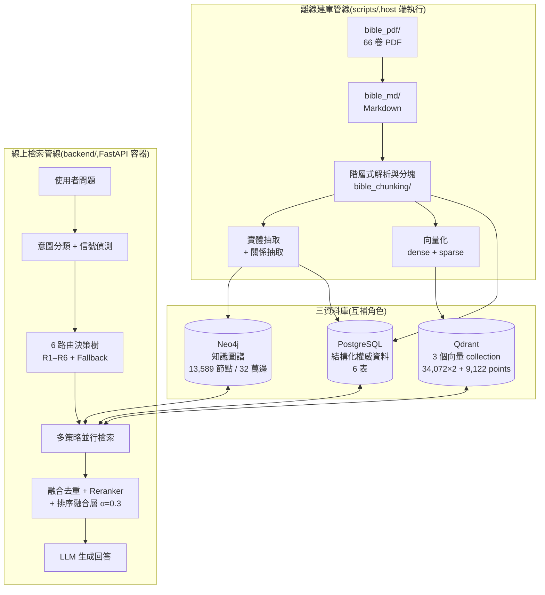

**技術棧一覽**:

| 元件 | 技術 |
|------|------|
| Backend | FastAPI + uvicorn(Docker 容器) |
| 結構化資料 | PostgreSQL 15 + pgvector |
| 向量搜尋 | Qdrant v1.13.2(dense + sparse hybrid) |
| 知識圖譜 | Neo4j 5.15 Community + APOC |
| 嵌入模型 | BAAI/bge-m3(1024 維) |
| 稀疏向量 | BM25 + CKIP 中文斷詞 |
| 重排序 | BAAI/bge-reranker-v2-m3(cross-encoder) |
| 生成 LLM | 可插拔:Ollama(現役 gemma4:e4b)/ Claude / OpenAI / Gemini |
| 評估 | RAGAS + 自訂檢索指標 + LLM Judge(gemma4:26b) |
| 套件管理 | uv(backend / scripts / evaluation 三套獨立 pyproject.toml) |

---

## 2. 核心設計理念

### 2.1 以 Pericope(段落)為核心單位

聖經的「段落(pericope)」是聖經學中已確立的詮釋單位 — 一段語意完整的故事、宣講或詩篇。Markdown 來源(新標點和合本)已用 `###` 標題把每章切成 pericope,系統直接以此為**嵌入、實體連結、交叉引用的核心單位**:

- **語意完整**:不把一個故事切成兩半;
- **嵌入精度**:pericope 中位數 388 字,恰落在 BGE-M3 表現最佳的長度區間;
- **可解釋性**:檢索回傳「以撒娶妻」比「創 24:15-16」直覺。

### 2.2 三資料庫互補

| 資料庫 | 角色 | 檢索時的分工 |
|--------|------|--------------|
| PostgreSQL | **權威 Source of Truth**:全部內文、階層、實體提及 | 所有策略只回傳 ID,**最終一律由 PG `get_content_by_id()` 水合全文** |
| Qdrant | 語意入口:三種粒度的向量索引 | dense/hybrid 語意檢索、entity_query 實體向量比對 |
| Neo4j | 關係入口:階層 + 實體網路 + 串珠 | 圖譜走訪(人物/事件/地點)、跨書卷串珠展開、實體多跳推理 |

### 2.3 信號驅動路由,而非單一 semantic search

不同題型需要不同檢索組合:「約翰福音 3:16 說什麼」應該 SQL 直查;「摩西與葉忒羅的關係」應該走人物圖譜;「耶利米書的新約預言如何在希伯來書應用」應該走跨書卷串珠。系統以 6 種布林信號自動選路(§6.3),每路組合多個策略並行。

### 2.4 粒度課題(重要的架構教訓)

系統為檢索設計了**三種粒度**(pericope / chunk / verse)的向量索引,但早期抽取、匯入、檢索三層都直接繼承了這套「為 embedding 設計的粒度結構」,造成一系列 KG 品質缺陷(56% mention 靜默丟棄、1,474 個失明實體等)。這條「粒度錯配」因果鏈與修復過程是本專案最重要的工程經驗,詳見 §5。

### 2.5 圖譜訊號要能透出到最終排序

第二個關鍵教訓:圖譜檢索的候選若只進候選池、最終排序 100% 交給 BGE-reranker 字面分數,則建圖端的所有改善都會在 last-mile 被吃掉。2026-07 上線的**排序融合層** `fused = (1−α)·rerank + α·strategy_weight`(α=0.3)讓圖譜先驗參與最終排序,是目前架構的核心差異點(§6.5)。

---

## 3. 離線建庫管線

全部在 host 端執行(`scripts/`,依賴由 `scripts/pyproject.toml` 管理),產物先落地 `output/*.jsonl` 再匯入三庫。

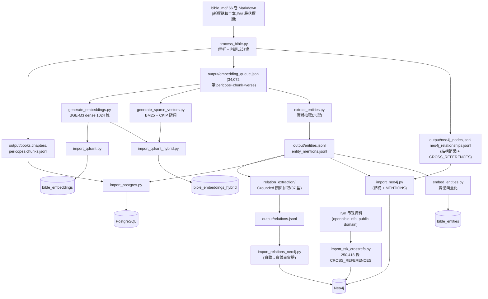

### 3.1 原始資料與前處理

**PDF → Markdown**(`convert_bible_pdf.py`,PyMuPDF):純**版面幾何啟發式**,不用 OCR / LLM — 以字級 span 的字體大小與 x 座標分類:`size≤8.5` 頁首尾丟棄、`size≥16` 書名/章號、`size=12 且 x≥85` 段落標題、`size≤9.5 且為數字` 節號;節號 `x<75` 且行右緣 `<300` 判為**詩體**(逐行保留),否則散文;粗體 `N:N` 格式判為註腳並依章聚合。

**Markdown 結構**:`# 書名` / `## 第 N 章` / `### 段落標題`(= pericope 邊界)/ `**N**` 節號;段落標題下方括號標註平行經文(如「(可1‧9-11;路3‧21-22)」),是交叉引用的第一來源。

`process_bible.py` + `bible_chunking/markdown_parser.py` 據此解析出 Book → Chapter → Pericope 三層與跨引用(`CrossRefParser` 正則 + `CROSS_REF_ABBREV` 中文縮寫表,引用一律升級解析到 pericope 級)。

### 3.2 階層式分塊(Hierarchical Chunking)

`bible_chunking/hierarchical_chunker.py`,tokenizer 用 **BGE-M3 自己的 tokenizer**(即切塊完全為 embedding 模型設計):

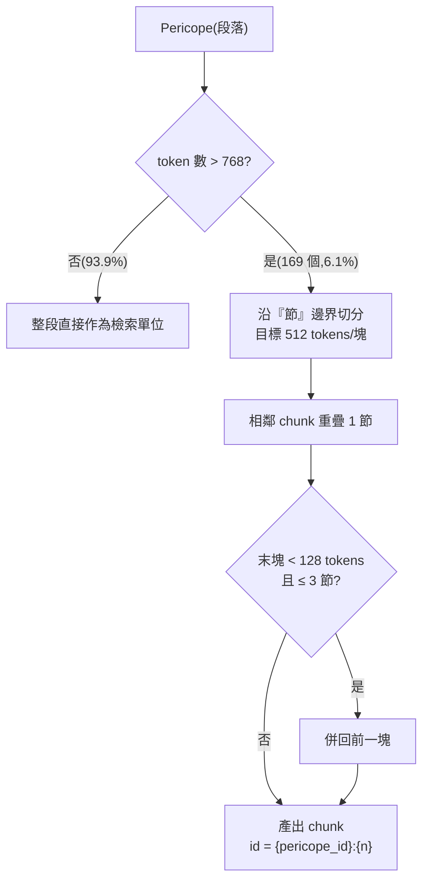

| 參數 | 值 | 說明 |
|------|-----|------|
| `max_chunk_tokens` | 768 | 觸發切分門檻 |
| `target_chunk_tokens` | 512 | 打包目標 |
| `min_chunk_tokens` | 128 | 末塊下限 |
| `overlap_verses` | 1 節 | 相鄰 chunk 重疊 |

實際結果:2,779 個 pericope 中僅 **169 個(6.1%)被切塊**,產出 **431 個 chunk**;被切塊者集中於舊約敘事書卷(利/士/撒上/創/民/書),佔全文字量 18.3%。每個檢索單位的 `content_for_embedding` 都帶定位前綴 `書名 第N章 段落標題 (X-Y節):`,讓向量自帶出處語境。

### 3.3 多粒度 embedding queue

`process_bible.py` 產出的 `embedding_queue.jsonl` 共 **34,072 筆**,是三種檢索粒度的聯集:

| 粒度 | 筆數 | 規則 |
|------|------|------|
| Pericope 級 | 2,610 | 未被切塊的 pericope 整段入列 |
| Chunk 級 | 431 | 被切塊的 pericope 只入 chunk 級 |
| Verse 級 | 31,031 | 全部經節逐節入列(細粒度精確檢索) |

> ⚠️ 這份佇列同時也是早期實體抽取的輸入 — 「抽取餵料 = embedding 佇列」正是 §5 粒度錯配因果鏈的結構性根因(M1)。

### 3.4 實體抽取管線

`scripts/extract_entities.py` + `scripts/entity_extraction/`,抽取六型實體:

| 類型 | 例子 | live 數量(Neo4j) |
|------|------|------|
| Person | 亞伯拉罕、摩西、耶穌 | 2,419 |
| Object | 約櫃、會幕 | 2,200 |
| Event | 出埃及、復活 | 1,714 |
| Place | 耶路撒冷、埃及 | 1,299 |
| Theme | 救贖、恩典、信心 | 987 |
| Group | 以色列人、法利賽人 | 505 |

抽取策略為 **grounded 雙軌管線**(規則優先、LLM 只分類不生成):

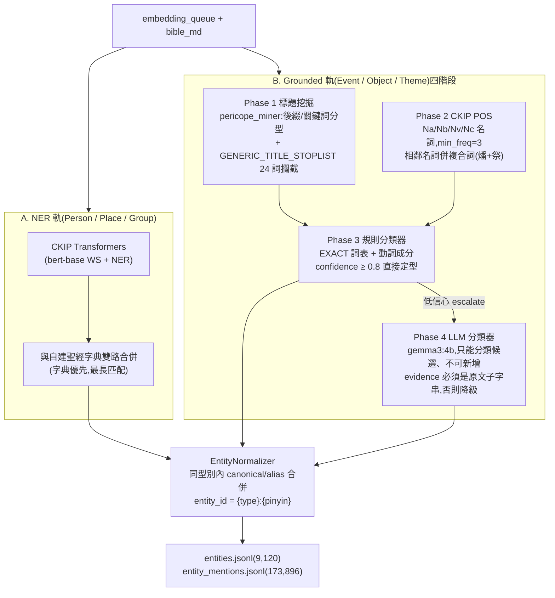

- **NER 軌**:CKIP 型別映射 PERSON→Person、GPE/LOC→Place、ORG/NORP→Group;自建字典(`entity_dict.py`)命中優先;mention 位置以 `text.find()` 字面比對定位;
- **Grounded 軌**:段落標題先分型(壇/器/櫃等後綴→Object;救贖/恩典等關鍵詞→Theme;日子/長子等泛名詞 STOPLIST 直接丟棄 — P0 後加入防再犯;其餘預設→Event),POS 候選補充,規則分類器高信心定型、低信心 escalate 給 LLM;
- **Grounding 約束**(防幻覺核心):LLM 只能對「提供的候選詞」分類、必須引用經文 evidence、post-hoc 驗證 evidence 是 grounding text 子字串,不合格降級。

產出 `entities.jsonl` **9,120** 實體、`entity_mentions.jsonl` **173,896 條** mention(含 pericope/chunk/verse 三種 source 粒度)。live 各庫在 P0 後略有差異(直接改圖:+18 curated Event、−16 泛名詞 Event、耶和華重標型別):Neo4j 9,124 / PG 9,122;PG `entity_mentions` live 為 173,768(較 JSONL 產出少 128,噪音清理所致)。

> 已知上游品質限制(P1 範疇):STOPWORDS 把「神/靈/主」等 33 個單字詞全濾掉;無共指消解(「岳父/他」抓不到);description 只取 100 字經文片段;pinyin id 有同音碰撞誤併風險。

### 3.5 關係抽取管線(Grounded RE)

`scripts/relation_extraction/`,為實體間補上**37 種語意關係邊**(schema 閉集,LLM 不能自由發明關係名),修復「Entity↔Entity 邊 = 0」的最大缺口:

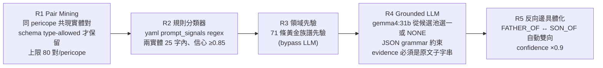

**37 種關係本體**(`config/relations/biblical_relations.yaml`,closed-set;每型定義 domain/range 型別、方向、inverse、prompt_signals、few-shot、分階段 confidence priors):

| 類別 | 關係 |
|------|------|
| Person×Person(13) | FATHER_OF, MOTHER_OF, SON_OF, DAUGHTER_OF, SIBLING_OF, SPOUSE_OF, ANCESTOR_OF, DESCENDANT_OF, TEACHER_OF, DISCIPLE_OF, ENEMY_OF, ALLY_OF, SUCCEEDED_BY |
| Person×Place(7) | BORN_IN, DIED_IN, RULED, VISITED, EXILED_TO, RETURNED_FROM, BUILT |
| Person×Object(4) | POSSESSED, RECEIVED, GAVE, DESTROYED |
| Person×Event(3) | PARTICIPATED_IN, INITIATED, VICTIM_OF |
| Person×Group(3) | MEMBER_OF, LEADER_OF, FOUNDED |
| Place×Place(2)/Event×Place(1) | LOCATED_IN, NEAR / OCCURRED_IN |
| Event×Event(2)/Group×Place(2) | PRECEDED_BY, CAUSED / ORIGINATED_FROM, SETTLED_IN |

- **Grounding 約束**:LLM 只能從該實體對的型別合法候選集選一個或回 NONE;`evidence_span` 必須是上下文子字串才接受(雙重 post-hoc 驗證)— 防幻覺;
- 支援 `--resume`(checkpoint)、`--no-llm`(僅規則+先驗);完整跑 10–20 小時離線;
- 產出:`relations.jsonl` **6,958 條**(rule 772 / prior 64 / LLM 5,370 / inverse 752)+ `relations_unclassified.jsonl` **77,953 條**(LLM 回 NONE 的對 — 後來成為 P0 事件層搶救的現成素材);
- 另有 `desc_generator.py`(gemma4:e4b)為 ~4,223 個空 description 的 Person/Place/Group 從 mentioning pericope titles 生成 ≤80 字 grounded description。

### 3.6 向量化

| 腳本 | 模型/方法 | 產出 |
|------|-----------|------|
| `generate_embeddings.py` | BGE-M3 dense,1024 維,normalize | `embeddings.jsonl`(34,072 筆) |
| `generate_sparse_vectors.py` | BM25(k1=1.5, b=0.75)+ CKIP 斷詞 | `sparse_vectors.jsonl` + `bm25_vocabulary.json`(query 端 IDF 詞表,backend 唯讀掛載) |
| `embed_entities.py` | BGE-M3;文字組合 `{name}({aliases})。{description}。常見於:{titles}` 截斷 200 字 | Qdrant `bible_entities` 9,122 points(UUID5 idempotent upsert) |

### 3.7 匯入三資料庫

| 腳本 | 目標 | 要點 |
|------|------|------|
| `import_postgres.py` | PG 6 表 | 權威資料;`embedding_sources` VIEW 統一嵌入來源 |
| `import_qdrant.py` | `bible_embeddings` | dense-only |
| `import_qdrant_hybrid.py` | `bible_embeddings_hybrid` | named vectors:dense + sparse |
| `import_neo4j.py` | 結構節點 + MENTIONS + 手工 CROSS_REFERENCES | P0 後含 verse→pericope remap 與誠實計數器(見 §5.2) |
| `import_relations_neo4j.py` | 實體↔實體事實邊 | APOC 動態邊型 MERGE(idempotent);邊帶 `confidence`/`evidence_span`/`source_pericope_id` |
| `import_tsk_crossrefs.py` | TSK 串珠 | 見 §3.8 |

### 3.8 TSK 串珠(Treasury of Scripture Knowledge)

P0 階段(2026-07-06)將串珠從 916 條手工邊擴充至 **250,418 條**:

- 資料源:openbible.info CC-BY(scrollmapper/bible_databases),public domain;
- 344,799 行原始資料 → 過濾負 votes(1,166)與自環(9,811)→ **250,358 條 unique pericope 對**(僅 7 條 unmapped);
- verse→pericope 映射用 `embedding_queue.jsonl` 反查表,31,102 節 100% 覆蓋;
- 每條邊帶 `votes`(TSK 社群投票數)與 `source: 'tsk'`,與手工 markdown 邊(視為最高可信 votes=999)區分 — 這個分權設計是後來 TSK 抑噪修復的基礎。

---

## 4. 知識圖譜架構

### 4.1 Schema 設計

圖譜由**三個子網路**構成:① 階層結構、② 實體網路、③ 跨段落串珠。

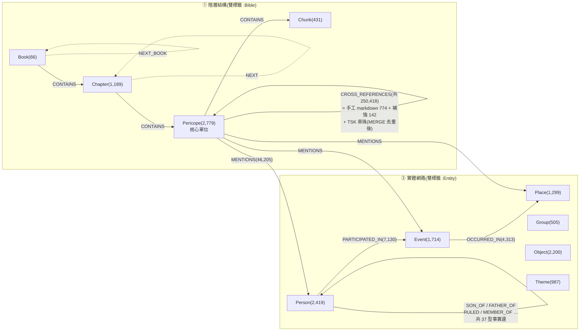

**設計要點**:

- **雙標籤**:階層節點 `(:Pericope:Bible)`,實體節點 `(:Person:Entity)` — 總稱標籤方便一次 MATCH 全結構,具體標籤供精確匹配;
- **ID 格式**:階層冒號分隔 `gen` → `gen:1` → `gen:1:0` → `gen:1:0:0`;verse 級 `gen:1:0:v:3` **不建節點**(只存在 Qdrant / PG),這是當初粒度設計的關鍵取捨(也是 mention 靜默丟棄 bug 的根源,見 §5);
- 實體節點屬性:`canonical_name`(非 `name`)、`aliases`(原生 LIST)、`description`、`mention_count`;
- **CROSS_REFERENCES 三來源**:markdown 原始標記(774 條,平行對觀)、人工補強清單(142 條,NT→OT 著名引用,`quotation`/`allusion` 分型)、TSK 串珠(250,358 條,帶 votes);
- 關係抽取事實邊帶 `confidence` / `evidence_span` / `source_pericope_id` / `extraction_phase`,可溯源、可按信心過濾(P0 共現回填邊標 `confidence: 0.35` 與 LLM 抽取邊區分)。

### 4.2 Live 規模(2026-07-06 直查)

| 項目 | 數值 |
|------|------|
| 總節點 | **13,589**(結構 4,465 + 實體 9,124) |
| 總關係 | **319,988** |
| MENTIONS | 46,205(Pericope 級 41,580+) |
| CROSS_REFERENCES | 250,418 |
| 語意關係邊(37 型) | 15,926(PARTICIPATED_IN 7,130 / OCCURRED_IN 4,313 / SON_OF 659 / FATHER_OF 647 / POSSESSED 551 / …) |
| 結構邊 | CONTAINS 4,399 / NEXT 2,975 / NEXT_BOOK 65 |

### 4.3 KG 品質 CI 三指標(現況)

| 指標 | P0 前 | **現況** |
|------|-------|----------|
| anchor coverage(實體有 Pericope 錨點) | 83.8% | **98.2%** |
| Event 有參與者 / 有地點 | 34.4% / 31.8% | **84.0% / 75.5%** |
| alias coverage | 35 節點 | 43+29 節點(~0.8%;量產待 P1 ER) |

> Event 完整度的邊型集合定義:參與者 = `(:Person|:Group)-[:PARTICIPATED_IN|INITIATED|VICTIM_OF]->(:Event)`、地點 = `(:Event)-[:OCCURRED_IN]->(:Place)`;2026-07-07 依此重算為 83.1–84.5% / 74.7%,表列值為 P0 執行當日快照(檢驗紀錄見 [records/2026-07-07_architecture_verification.md](records/2026-07-07_architecture_verification.md) §3)。

---

## 5. KG 品質演進史

本專案最有價值的工程經驗:**KG 建置品質、檢索排序機制、評估量尺三者共同決定可觀測效益**。以下是三輪證據鏈的演進脈絡(細節見 `docs/records/` 的 KG 優化系列紀錄與 `paper/record/`)。

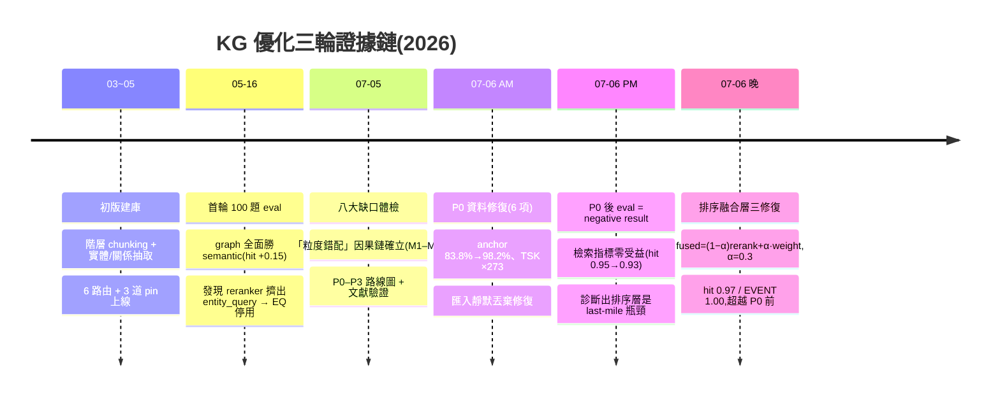

### 5.1 八大缺口與「粒度錯配」因果鏈(2026-07-05 體檢)

核心發現:**傷害 KG 品質的不是 chunk 參數(512/768/overlap 1),而是「為 BGE-M3 embedding 設計的粒度結構」被抽取、匯入、檢索三層無條件繼承**。六個影響機制(M1–M6)中最重的三傷:

| 缺口 | 量化證據 | 根因機制 |
|------|----------|----------|
| mention 大量流失 | verse 級 97,235 條(**55.9%**)匯入時靜默丟棄(無 Verse 節點,MATCH 落空不報錯、計數器照加) | M1 抽取餵料=embedding 佇列 + M2 匯入層粒度不匹配 |
| 失明實體 1,474 個(16%) | 零 Pericope 錨點 → 對 R3/R6 檢索不可見 | M2 |
| 被切塊 pericope 雙重失明 | 169 個(18.3% 文字量)的 NER 型實體只錨 Chunk/verse 層,而檢索與關係抽取都只認 Pericope 層 | M3 雙層錯位 |

另一批缺陷與 chunking 無關,屬**抽取管線缺功能**:aliases 空(0.38%)、無共指消解(「岳父/他」漏連)、重名分裂(878 名/1,900 節點跨型別分裂)、事件層空殼(96.2% Event 無時序邊)、關係匯入率僅 8.1%、噪音實體(連接詞「但」被當地名錨 685 源)。

### 5.2 P0:資料修補,不重抽(2026-07-06,六項全完成)

| 修復 | 成果 |
|------|------|
| verse mention 回填 | strip `:v:N` remap 回 pericope → **+5,853 條錨點**,失明實體 1,474→164 |
| 修匯入靜默丟棄 | verse remap + 誠實計數器(防再犯) |
| aliases 字典直灌 | 38 節點(字典可覆蓋上限) |
| 噪音 gate | 「但」錨點 759→26(發現 399 條「撒但/拿但業」子字串誤命中)、16 泛名詞 Event 刪除、耶和華 Group→Person |
| 未分類關係搶救 | 77,953 條中 Event 相關重分類 → +5,641 PARTICIPATED_IN、+3,419 OCCURRED_IN |
| TSK 串珠匯入 | CROSS_REFERENCES 916 → 250,418;檢索端同步改 seed_support + votes 排序 |

### 5.3 P0 後評估:negative result 與診斷(論文核心發現)

**建置指標全面達標,但 100 題檢索指標零受益甚至微降**(hit 0.95→0.93、EVENT −0.10)。逐題查證出三個機制:

1. **TSK votes 排序是雙面刃**:votes 高 = 神學主題強關聯 ≠ 同一事件敘事 — 主題彙總題受益(TOPIC),事件敘事題被主題串珠擠掉正解(EVENT);
2. **最終排序 100% 由 BGE-reranker 字面分數決定**:strategy weight 與 votes 只影響誰進候選池,不參與最終排序 → 建圖改善與副作用都無法正確透出(與 5 月「reranker 擠出 entity_query」是同一瓶頸的第二輪證據);
3. **benchmark 只問頭部實體**:P0 活化的 1,310 個長尾實體在這套量尺上讀數為零。

**決策:P1 全量重抽暫緩,先修排序層。**

### 5.4 排序融合層三修復(2026-07-06,全部完成)

1. **TSK 抑噪**:expand cap 30→10;TSK 邊 hop weight 降至 0.60/0.50(壓到 semantic 之下),手工邊維持 0.75/0.55;
2. **頭部 Event 補灌 + EQ 重啟**:動機是檢索端 54 個 EVENT_KEYWORDS 中 31 個在圖譜命中 0 個 Event 節點(「最後的晚餐」在圖裡叫「逾越節筵席」)— 11 個既有 Event 灌問法別名 + **18 個 curated Event 節點/56 條 MENTIONS 邊**(錨點全部 live 驗證、三庫同步),`RAG_USE_ENTITY_QUERY` 重新啟用;
3. **排序融合** `fused = (1−α)·rerank_score + α·strategy_weight`,α=0.3(消融定案);
4. 連鎖修復:graph 檢索 Cypher 級 chunk→pericope remap(修 chunk 雙席 bug + 164 個 chunk-only 實體重獲檢索可見性)、汰換舊 EQ-pin/graph-pin(融合下只剩誤傷)、新增 keyword-exact event pin(救「掃羅 vs 保羅歸主」表面形式斷裂)。

結果:**hit 0.97 / EVENT 1.00**,全面超越 P0 前;α 消融顯示互補結構 — hit 由離散修復(curated 資料+字典 pin)飽和,recall 長尾由連續融合補。

---

## 6. 線上 RAG 檢索架構

進入點 `POST /api/v1/query`(`backend/routers/query.py`)。

### 6.1 查詢管線七步

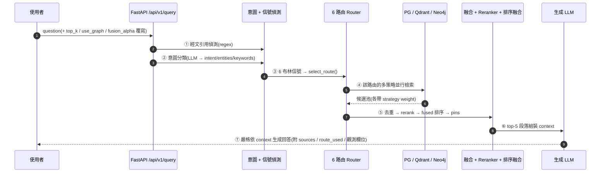

- `semantic_only` 模式跳過 ①②③(省一次 LLM 呼叫),直走純語意檢索 — 評估 baseline 用;
- `use_graph`(per-request)可覆寫 `.env` 的 `RAG_USE_GRAPH`,A/B 評估不需重啟容器;
- `retrieval_only` flag 跳過答案生成,供 quick eval 快速迴路;
- 回應含觀測欄位:`Source.strategy` / `Source.rerank_score`(fused 與 raw 並列)、`stats.fusion_alpha`、`route_used` / `strategies_used` / `strategy_errors`。

### 6.2 意圖分類與信號偵測

| 元件 | 方法 | 產出 |
|------|------|------|
| `verse_parser.py` | Regex 解析「羅馬書3:23」「創世記第1章」;書名表沿用建庫端 `BOOK_CONFIG`+縮寫表,長度降序貪婪匹配 | VerseRef(book/chapter/verse) |
| `intent_classifier.py` | LLM 回 JSON;intent ∈ {verse_lookup, topic, person, event, cross_reference},預設 topic;**偵測到經文引用時強制 verse_lookup** | intent + entities + keywords |
| `entity_dicts.py` | 人物/地名辭典(沿用抽取端 `entity_dict.py`)子字串比對、長名優先;事件為硬編碼 EVENT_KEYWORDS ~54 詞(登山寶訓/王國分裂/保羅歸主…);書卷需 ≥2 字防單字誤判;LLM entities 也再丟進字典合併 | 實體命中(無需 LLM) |
| `signal_detector.py` | 綜合上述 → 6 布林信號 → `select_route()` | 見下 |

**無查詢改寫**:query 原文直接進 embedding 與 reranker — 「現代問法 vs 古譯本詞彙」的落差因此全靠圖譜錨點與融合層補(§6.5)。

### 6.3 六路由決策樹

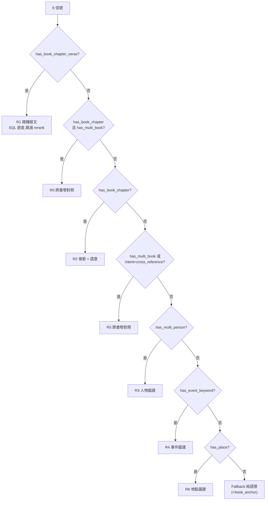

**各路策略組合與權重**(`backend/config.py:route_weights`;`use_graph=false` 時 Neo4j 策略全部閘道掉):

| 路由 | 策略組合(weight) |
|------|------------------|
| R1 | `verse_direct`(1.0);空則 fallback R2 |
| R2 | `sql_chapter`(0.9) + `semantic`(0.6) |
| R3 | `graph_person`(0.9) + `semantic`(0.7) + `entity_path` + `cross_ref_expand` + `entity_query`(0.6) + `sql`(0.5) + `book_anchor` |
| R4 | `graph_event`(0.85) + `semantic`(0.7) + `cross_ref_expand` + `entity_query`(0.6) + `sql`(0.5) + `book_anchor` |
| R5 | `cross_reference`(0.85) ∥ `sql_chapter`(0.85) ∥ `graph`(0.75) + `semantic`(0.65) + `entity_query`(0.6) + `sql`(0.4) + `book_anchor` |
| R6 | `graph_place`(0.85) + `semantic`(0.7) + `entity_path` + `cross_ref_expand` + `entity_query`(0.6) + `sql`(0.5) + `book_anchor` |
| Fallback | `semantic`/`hybrid` + `book_anchor`(若點名書卷) |

路由分布(100 題實測,2026-07-06 輪快照;逐輪可漂移一題級,如 07-07 輪 R4=19、R6=3,以當輪為準):R2=25、R3=21、R1=20、R4=18、R5=10、R6=4、fallback=2。

### 6.4 檢索策略清單

`backend/utils/retrieval/` 各 retriever:

| 策略 | 資料源 | 機制 |
|------|--------|------|
| `semantic` | Qdrant `bible_embeddings(_hybrid)` | BGE-M3 query 向量 → top-20;`HYBRID_SEARCH_ENABLED=true` 時走 dense+sparse RRF 融合 |
| `hybrid` | Qdrant `bible_embeddings_hybrid` | dense + BM25 sparse 雙路 prefetch(各 50)→ Qdrant RRF;sparse 不可用自動降級 dense-only |
| `verse_direct` | PostgreSQL | VerseRef 直查 verse range / 單節 / 整章 |
| `sql_chapter` / `sql_supplement` | PostgreSQL | 章直查 / 從候選命中章補抓同章段落 |
| `graph_person/event/place` | Neo4j | `find_entity_by_name`(canonical/alias CONTAINS,mention_count 降序)→ `MENTIONS` → Pericope;多人物另查**共同出現段落**(w=0.9);Event 錨點按書卷章節升序(先出敘事起點)並標 `keyword_exact`/`anchor_rank` 供 pin;Cypher 級 chunk→父 pericope remap(防同內容佔兩席) |
| `cross_ref_expand` | Neo4j | N-hop(≤2)`CROSS_REFERENCES` 展開;**seed_support(多 seed 交集)→ votes 降序**;2+ hop 只在 1-hop 補不滿時 fallback;hop 權重分權:手工邊(votes=999)0.75/0.55、TSK 邊 0.60/0.50(刻意壓在 semantic 0.7 之下);cap 10;seed 選擇 round-robin 跨策略防壟斷 |
| `entity_path` | Neo4j | 實體↔實體事實邊(37 型,排除結構邊)多跳推理(≤2 hop)→ MENTIONS → Pericope |
| `entity_query`(EQ) | Qdrant `bible_entities` + Neo4j | query 向量 → 實體比對(top-8,threshold 0.4)→ MENTIONS;**hub-aware 限流**(mention_count>50 的 hub 實體每實體只取 3 段、一般 5 段,防 topic 污染);supplement cap 5;橋接「現代提問詞 → 古譯本經文」 |
| `book_anchor` | Qdrant | 問題點名書卷時,book_filter 語意檢索保證該書卷有 seed |

> **內容水合模式**:Neo4j / Qdrant 只回傳 ID,全文一律由 PostgreSQL `get_content_by_id()` 補齊(ID 3 段=pericope、4 段=chunk、含 `v`=verse→取父 pericope);weight 是「策略先驗」而非相似度,`_apply_weights` 只升不降;每個 retriever 皆 try/except 包裹,失敗記入 `strategy_errors` 不中斷整體。

### 6.5 排序融合層(現行架構核心)

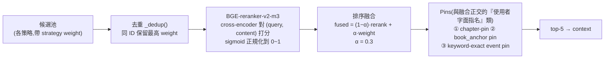

- **為什麼需要融合**:BGE-reranker 是字面 surface matcher — 現代問法詞彙(「最後的晚餐」「登山寶訓」)不存在於古譯本經文時,正解錨點 rerank score 可低到 0.001,純字面排序永不可見;融合讓「rr≈0.001 但 graph prior 0.85」的正解進 top-5。
- **實作**(`router.py:_fuse_and_rank`):fusion 開啟時先對**整個候選池** rerank(而非只取 top-k),再逐候選算 `fused_score` 重排取 top-5;α=0 即退化為純 reranker。量級直覺:graph 錨點(prior 0.85–0.9)會贏過 TSK 鄰居(0.5–0.6),除非後者 rerank 字面優勢超過 ~0.11。
- **α=0.3 的消融依據**:α=0 已飽和 hit(離散修復負責);α=0.3 貢獻尾部錨點覆蓋(EVENT recall +0.025、TOPIC mrr +0.133),代價 ndcg −0.02;因 top-5 全數進 context,recall 權重高於內部排位 → 定案 0.3。
- **Pin 階梯**(對 fused_score 外掛加分,階梯值避免互相衝突):

| Pin | 加分 | 觸發 | 模式 |
|-----|------|------|------|
| chapter-pin | +0.01 | 使用者指定「某書N章」→ 保證該章 ≥2 段存活(weight≥0.85 才合格) | 無條件 |
| entity_query-pin | +0.005 | 高信心 EQ 候選 | **僅 legacy**(fusion 下已由 weight 連續透出) |
| book_anchor-pin | +0.004 | 使用者點名書卷 | 無條件 |
| graph uncertainty pin | +0.003 | reranker top1<0.3 時 | **僅 legacy** |
| keyword-exact event pin | +0.002 | 詞典 event keyword 與 Event name/alias **完全相等** → pin 該事件第一錨點(`anchor_rank=0`);排除 hub(mc>25)、每事件 1 錨 | **僅 fusion**(救「掃羅 vs 保羅歸主」表面形式斷裂) |

- **Pins 的演進**(機制級教訓):舊 EQ-pin / graph uncertainty pin 是融合層之前的離散補救,融合上線後只剩誤傷 → 退役(legacy 路徑保留);現役三個 pin 都屬「使用者字面指名」邏輯,與連續融合正交。`RAG_RANK_FUSION_ENABLED=false` 可整層回退 legacy(含舊 pin 組)。
- R1(精確經文)跳過 rerank、融合與 pin,直接回傳;reranker 異常時 fallback 用 weight 排序。

### 6.6 回答生成

- `generator.py:_build_context()`:top-5 段落排版為 `[N] 書名 第N章 - 標題 (節數)\n內文`;
- SYSTEM_PROMPT 嚴格約束:只能用提供段落作答、必須引用書卷章節出處、不得加經文外知識或推論、繁體中文;
- LLM provider 可插拔(`backend/utils/llm/factory.py` singleton):`ollama` / `claude` / `openai` / `gemini`;現役 **Ollama gemma4:e4b-it-q8_0**,`temperature=0.1`、`max_tokens=10000`(.env);
- **非串流**:一次回傳完整 JSON envelope;`sources[]` 另以結構化形式回傳(`score`=fused 優先、`strategy`、`rerank_score`),供逐題查因與前端標註;
- 無檢索結果時直接回覆找不到,不硬答;`retrieval_only=true` 時跳過本步(quick eval 用)。

---

## 7. 部署架構

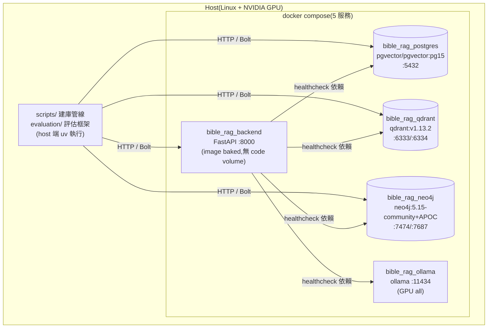

| 要點 | 說明 |
|------|------|
| 啟動順序 | backend `depends_on` 四服務 healthcheck 全綠才啟動 |
| 主機名覆寫 | compose 把容器內 host 覆寫為服務名;`.env` 的 localhost 僅供 host 端腳本 |
| **無 code volume** | 改 `backend/` 後必須 `docker compose up -d --build backend`,只 restart 跑舊 image |
| 唯一程式相關掛載 | 唯讀 `output/bm25_vocabulary.json`(BM25 詞表)+ `model_cache`(HF 模型快取) |
| 三套 pyproject.toml | `backend/`(容器)、`scripts/`(建庫)、`evaluation/`(評估)— 依賴不同步是常見 bug 源 |

---

## 8. 評估框架

### 8.1 Benchmark 與流程

- `ground_truth.json`:**100 題,5 題型各 20**(VERSE_LOOKUP / TOPIC / PERSON / EVENT / GENERAL);每題含 `reference`(標準出處)、`expected_answer_points`、`reference_answer`;
- `evaluation/run_eval.py`:收集(HTTP 打 backend)→ 批次指標 → dashboard;`--graph/--no-graph/--semantic` per-request 切換 A/B 模式,不需重啟容器;
- **quick 快速迴路** `quick_retrieval_eval.py`:retrieval-only(backend `retrieval_only` flag 跳過生成),100 題 ~15 分鐘(全管線 2.5h),指標與全管線 bit-exact;`--alpha` sweep、`--from-raw` 重算、`--compare` Δ 表 + hit 翻轉清單。

### 8.2 評估指標(13 項)

| 類別 | 指標 | 特性 |
|------|------|------|
| 檢索(自訂) | Hit Rate、Recall@k、Precision@k、F1@k、MRR、MAP@k、NDCG@k | 程式決定性計算,無 LLM,逐題可復現 |
| RAGAS | Faithfulness、Answer Relevancy、Context Recall、Answer Correctness | LLM judge(gemma4:26b) |
| LLM Judge | Answer Coverage(對 expected points 的純召回) | covered/partial/missing |
| 語意 | Semantic Similarity | 回答 vs 參考答案餘弦 |

已知評估陷阱(論文素材):RAGAS judge 單題雜訊 ±0.4;answer_relevancy 的 noncommittal 機制會把拒答硬扣 0(Claude 因誠實拒答被低估的假象);LLM-judge A/B 需防 position/length bias。

### 8.3 指標演進(100 題,graph 模式,三時點同一套決定性代碼)

| 指標 | P0 前(5/16) | P0 後 | **排序修復後(現況)** |
|------|------|------|------|
| hit_rate | 0.950 | 0.930 | **0.970** |
| recall@5 | 0.889 | 0.866 | **0.906** |
| mrr | 0.802 | 0.798 | 0.834 |
| ragas_context_recall | 0.791 | 0.777 | **0.830** |
| answer_coverage | 0.722 | 0.725 | **0.766** |
| ragas_answer_correctness | 0.587 | 0.596 | 0.617 |
| EVENT hit / ctx_recall | 0.90 / 0.608 | 0.80 / 0.546 | **1.00 / 0.728** |
| vs semantic 基線(hit) | +0.14 | +0.12 | **+0.16** |

分題型現況(修復後):VERSE 1.00 / TOPIC 1.00 / EVENT 1.00 / PERSON 0.95 / GENERAL 0.90(hit)。剩 3 題各屬需新架構的失敗家族:PERSON_004(跨章彙總,P3)、GENERAL_006/008(跨卷雙錨合取,正解串珠邊在圖裡但 seed 錯章到不了)。

---

## 9. 現況、限制與 Roadmap

### 9.1 系統開關現況(live `.env`)

| 開關 | 值 | 備註 |
|------|-----|------|
| `RAG_USE_GRAPH` | true | per-request 可覆寫 |
| `HYBRID_SEARCH_ENABLED` | true | dense+sparse RRF |
| `RAG_USE_CROSS_REF_EXPAND` / `_LIMIT` | true / 10 | TSK 抑噪後 cap |
| `RAG_USE_ENTITY_PATH` | true | ≤2 hop |
| `RAG_USE_ENTITY_QUERY` | true | 2026-05 停用 → 融合層上線後重啟 |
| `RAG_RANK_FUSION_ENABLED` / `_ALPHA` | true / 0.3 | false = 完整 legacy(含三舊 pin) |

### 9.2 殘餘限制

| # | 問題 | 對症層級 |
|---|------|----------|
| 1 | 164 個 chunk-only 失明實體(檢索端已 remap 恢復,圖譜層仍缺 Pericope MENTIONS) | P1 抽取解耦 |
| 2 | alias coverage ~0.8%(字典與 curated 已榨乾) | P1 ER merge 寫回 |
| 3 | 67,306 條未分類關係 | P1 LLM 重分類 |
| 4 | Event–Event 時序邊僅 45+277 候選 | P2 |
| 5 | 重名分裂(猶大/路得缺節點、以色列 Place/Group 分裂)、無共指消解 | P1 ER + coref |
| 6 | 跨章彙總題(PERSON_004)、跨卷雙錨題(GENERAL_006/008) | P3 / query decomposition |
| 7 | 檢索→答案傳導衰減(ctx_recall=1.0 的題 correctness 僅 0.17) | 生成端(answer 模型 A/B) |

### 9.3 Roadmap 狀態

| 階段 | 內容 | 狀態 |
|------|------|------|
| P0 資料修補 | 六項(回填/匯入修復/aliases/噪音/關係搶救/TSK) | ✅ 完成(2026-07-06) |
| 排序融合層 | TSK 抑噪 + Event 補灌 + fused 融合 + 連鎖修復 | ✅ 完成(2026-07-06) |
| P1 管線修復後全量重抽 | 抽取解耦、coref、gleanings、post-hoc ER、description 重生成 | ⏸ 暫緩 — **重啟前置:先改評估設計**(長尾敏感題/BRINK 缺陷注入),否則在現 100 題上讀數為零 |
| P2 事件層 | Event–Event 時序因果(ATOM/E²RAG 雙圖範式) | ⬜ 未開始 |
| P3 階層與檢索融合 | 分數融合 ✅ 已提前落地;Leiden 社群摘要 / RAPTOR 跨章彙總 ⬜ | ◐ 部分 |

**方法論主結論**(F1–F9 發現鏈,見 `paper/record/`):在頭部飽和的量尺上,排序層一天的修復勝過建圖層一週的重抽 — 優化順序應由「瓶頸所在層」而非「資料流上游優先」決定;評估量尺設計是所有後續優化的前置。

---

## 10. 文件索引

| 文件 | 內容 |
|------|------|
| [README.md](README.md) | **docs/ 文檔地圖**:現況文件/records/archive/reference 四類分類法 |
| [kg_optimization_progress.md](kg_optimization_progress.md) | **KG 優化單一入口**:P0–P3 狀態、指標演進、殘餘項 |
| [records/2026-07-05_kg_optimization_analysis.md](records/2026-07-05_kg_optimization_analysis.md) | 八大缺口體檢、粒度錯配因果鏈(M1–M6)、文獻驗證 |
| [records/2026-07-06_kg_p0_execution.md](records/2026-07-06_kg_p0_execution.md) | P0 六項修復執行紀錄與回滾方式 |
| [records/2026-07-06_kg_p0_eval_p1_decision.md](records/2026-07-06_kg_p0_eval_p1_decision.md) | P0 後 negative result 逐題診斷、P1 暫緩決策 |
| [records/2026-07-06_kg_fixes_execution.md](records/2026-07-06_kg_fixes_execution.md) | 排序融合層三修復 + α 消融 |
| [records/2026-07-07_architecture_verification.md](records/2026-07-07_architecture_verification.md) | 本文件的獨立檢驗(34 項宣稱)+ 特殊機制解說 + 論文引用彙整 |
| [build_database.md](build_database.md) | 建庫逐步指令(Step 1–10 含 curated 重放鏈) |
| [archive/2026-04-29_knowledge_graph_setup.md](archive/2026-04-29_knowledge_graph_setup.md) | KG 設計原理(pericope 單位、跨書卷)— P0 前快照 |
| [archive/2026-05-17_architecture_snapshot.md](archive/2026-05-17_architecture_snapshot.md) | 2026-05-17 架構快照(融合層之前,原 bible_rag_latest.md) |
| [archive/2026-02-27_database_architecture_report.md](archive/2026-02-27_database_architecture_report.md) | 初版三庫整合分析(2026-02 快照) |
| [reference/](reference/) | 評估參考資料(指標方法論筆記、100 題人讀版;題庫以根目錄 `ground_truth.json` 為準) |
| `paper/record/2026-07-06_kg_optimization_findings.md` | 論文發現要點 F1–F9 |
