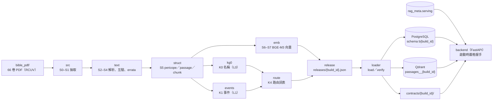
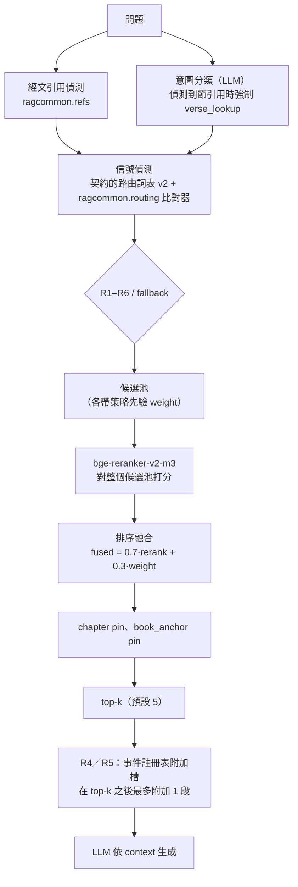
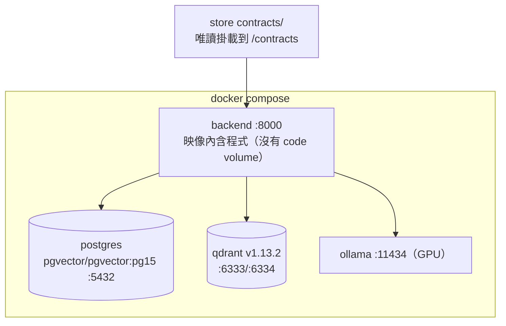

# Bible RAG 系統架構

> **文件日期**：2026-10-08。描述分支 `rebuild/r2`（在 R1 重建之上實作 R2）上的系統。
> **數字來源**：store `/mnt/ollama-data/bible_rag_store/` 的層檔案與 release 逐檔計數，每個數字都標明出自哪個 build 或哪一層版本。R1 build 是 `b20261008_6daa4f31`；R2 build 是 `b20261008_e05d3e55`（2026-10-08 由本分支建置、載入並通過 verify，尚未 promote）。
> **相關文件**：操作手冊 [rebuild_pipeline.md](rebuild_pipeline.md)；現況與交接 [records/2026-10-08_rebuild_handoff.md](records/2026-10-08_rebuild_handoff.md)；設計書與稽核報告在 store 的 `reference/DESIGN.md`（v1.1）、`reference/REPORT.md`。

---

## 目錄

1. [系統概觀](#1-系統概觀)
2. [語料](#2-語料)
3. [資料層（ragdata）](#3-資料層ragdata)
4. [release 與 build](#4-release-與-build)
5. [載入、服務與握手](#5-載入服務與握手)
6. [線上檢索](#6-線上檢索)
7. [KG 的範圍](#7-kg-的範圍)
8. [部署](#8-部署)
9. [評估](#9-評估)
10. [舊結果的適用範圍](#10-舊結果的適用範圍)
11. [版本現況](#11-版本現況)
12. [文件索引](#12-文件索引)

---

## 1. 系統概觀

Bible RAG 是繁體中文聖經問答系統。所有資料都從 66 卷 PDF 重建：

- `ragdata` 把 PDF 建成 7 個內容定址的資料層：src、text、struct、emb、kg0、events、route。
- 7 層組成一份 release，以 `build_id` 命名。
- 一個 loader 把 release 投影到三處：PostgreSQL schema `b{build_id}`、Qdrant collection `passages__{build_id}`、契約目錄 `contracts/{build_id}/`。
- `rag_meta.serving` 決定 backend 服務哪個 build；backend 啟動時與三處做嚴格握手，不符就不服務。

線上檢索是 BGE-M3 dense 檢索加 cross-encoder 重排與排序融合，依 R1–R6 路由組合候選。圖譜衍生的訊號只剩事件註冊表附加槽，它讀靜態契約檔。服務端沒有 Neo4j。

```mermaid
flowchart LR
    PDF["bible_pdf/<br/>66 卷 PDF（RCUV）"] --> SRC["src<br/>S0–S1 抽取"]
    SRC --> TEXT["text<br/>S2–S4 解析、互驗、errata"]
    TEXT --> STRUCT["struct<br/>S5 pericope／passage／chunk"]
    STRUCT --> EMB["emb<br/>S6–S7 BGE-M3 向量"]
    STRUCT --> KG0["kg0<br/>K0 名稱（L0）"]
    STRUCT --> EV["events<br/>K1 事件（L1）"]
    KG0 --> ROUTE["route<br/>K4 路由詞表"]
    EV --> ROUTE
    EMB & ROUTE --> REL["release<br/>releases/{build_id}.json"]
    REL --> LOAD["loader<br/>load／verify"]
    LOAD --> PG[("PostgreSQL<br/>schema b{build_id}")]
    LOAD --> QD[("Qdrant<br/>passages__{build_id}")]
    LOAD --> CT["contracts/{build_id}/"]
    META[("rag_meta.serving")] --> BE["backend（FastAPI）<br/>啟動時嚴格握手"]
    PG & QD & CT --> BE
```

圖中只畫主要依賴：struct、kg0、events、route 也都讀 text 層，release 收全部 7 層。

| 元件 | 技術 |
|------|------|
| 資料管線 | `ragdata/`（在 `scripts/.venv` 執行）；共用程式在 `packages/ragcommon/`（ids、books、refs、versification、encoder、routing） |
| PDF 抽取 | `mutool` 1.23.10；以 `pdftotext` 24.02.0 互驗 |
| 結構化資料 | PostgreSQL 15（`pgvector/pgvector:pg15` 映像；R1 起不使用向量欄位） |
| 向量檢索 | Qdrant v1.13.2，只有 dense |
| 嵌入 | BAAI/bge-m3，1024 維 |
| 重排 | BAAI/bge-reranker-v2-m3（cross-encoder） |
| 生成 LLM | 可切換：Ollama、Claude、OpenAI、Gemini；live `.env` 用 Ollama `gemma4:e4b-it-q8_0` |
| Backend | FastAPI + uvicorn，Docker 容器 |
| 評估 | `evaluation/`：檢索指標、faithfulness、coverage、RAGAS |

---

## 2. 語料

- **版本**：`bible_pdf/` 的 66 卷 PDF 是**和合本修訂版（RCUV）上帝版**。PDF 版權頁寫「新標點和合本」，但內文是 RCUV（稽核 REPORT §2.2，G04）。舊文件與論文寫「新標點和合本」，以此更正。
- **舊管線的缺陷**：舊管線經 `convert_bible_pdf.py` 轉成 `bible_md/` 再解析。稽核（REPORT G01、G02）查出以下問題：
  - 缺經文 268 節、4,446 字，另有 67 節只少了「（細拉）」；
  - 116 篇詩篇篇題全部沒有收錄；
  - 有 10 個幽靈節；
  - `bible_md/` 另有 39 行沒有紀錄的人工修改。
- **重建後**：全部直接從 PDF 抽取，上述缺損都已補回。`bible_md/` 只用來做 G-DIFF 對帳（唯讀副本在 store 的 `reference/bible_md/`），與它的差異 100% 可歸類。
- **errata**：PDF 中 25 處 Big5 E04x 誤字全部更正。`text_pdf` 保留 PDF 原字，`text` 用正字。裁決記在 `config/registries/errata.yaml`；其中無法判定字形的 6 處由 Kay 選定。

---

## 3. 資料層（ragdata）

每層都依內容定址：`{layer}@{sha12}`，同樣的輸入建出同樣的位元組。每層要先通過自己的 build 閘門才寫入 store，寫入後再用全部 required 閘門驗一次。逐層的輸入、閘門與指令見 [rebuild_pipeline.md](rebuild_pipeline.md) §3。

下表數字出自 release `b20261008_6daa4f31` 的各層（R1）。R2 build `b20261008_e05d3e55` 沿用其中 src、text、struct、emb、kg0 五層的同一版本，只換掉 events 與 route，數字列在表後。

| 層（版本） | 階段 | 內容與計數 |
|---|---|---|
| src（`src@6a2ece2277ff`） | S0–S1 | source manifest，與逐卷的 PDF 抽取結果 |
| text（`text@247eafe44b02`） | S2–S4 | 書 66、章 1,189；**unit 31,021**，其中 70 個是合併節；**slot 31,103**，含 30,951 present、141 merged、11 個缺號槽（omitted_variant）；詩篇篇題 116 與卷分隔 5（同在 chapter_texts，共 121）；標題 2,603；註腳 1,013；說話者 33；平行經文引用 987；errata 25 |
| struct（`struct@d8d432b4df15`） | S5 | pericope 2,610；passage 2,773，其中 169 個超過 768 token、要再切；chunk 433；verse_index 31,021；legacy id 對照 34,241 |
| emb（`emb@ae5525447eda`） | S6–S7 | 嵌入記錄 **34,058**：verse 31,021、未切的 passage 2,604、chunk 433；向量放在 `.vectors` 附件；附編碼指紋 |
| kg0（`kg0@14e68c8344b1`） | K0 | names 2,926、extra_spans 17,100、parallel_links 1,072 |
| events（`events@904becb6ccd9`） | K1 | 事件 33、錨點 178 個 passage（R1 的機械轉換版） |
| route（`route@5c397e2df007`） | K4 | 路由詞 348（R1 用 legacy 凍結詞表） |

R2 build `b20261008_e05d3e55` 的兩層：

| 層（版本） | 依賴 | 內容與計數 |
|---|---|---|
| events（`events@01401ecad19a`） | text、struct | 事件 **31**、錨點 179 個 passage；來源是人工註冊表 `config/registries/events.yaml`（v2） |
| route（`route@c31c88e4681e`） | text、kg0、events | 路由詞 3,298（可路由 3,253）：kg0 名稱 2,926、省略「‧」的寫法 219、書名 84、事件觸發詞 37、查詢別名 17、divine_refs 15；另有排除語境 28 條 |

**節的模型。**
- **unit**：PDF 的一個節號標籤。合併節（例如 `gen.24.29-30`）是一個 unit，涵蓋多個 slot。
- **slot**：節位。缺號槽（11 個）是本譯本從缺的節：其中 10 個舊管線曾當成有經文的幽靈節（如徒8:37），另一個是路17:36。查這些節時，backend 回「本譯本此節從缺」並附註腳。
- 扣掉缺號槽是 31,092 個節位。舊文件的「31,031 節」「31,102 節全覆蓋」都包含幽靈節，不能當不變量（REPORT G12）。

**嵌入文字**沿用舊格式字串（template `v1c`），只修正填進去的值：
- passage 與 chunk：`{書名} 第{章}章 {標題} ({verse_range}節)：{content}`；
- verse：`{書名} 第{章}章 {標題} 第{n}節：{經文}`。

verse 記錄指回它所屬的 passage。

**ids**：
- pericope 的 id 形如 `pc:act.9.1`，passage 形如 `ps:gen.1.1`，chunk 形如 `ck:gen.1.1~gen.1.22`，verse 記錄形如 `vs:gen.1.1`。
- 文法由 `ragcommon.ids` 定義，backend 與 evaluation 共用。

---

## 4. release 與 build

- `ragdata pipeline run` 依序建 text（含 src）、struct、emb、kg0、events、route，再組裝 release；加 `--load`、`--verify` 時接著載入並驗證。
- `releases/{build_id}.json` 記錄：
  - 各層版本與摘要；
  - 層間依賴；
  - 每個契約檔的 sha256；
  - 計數；
  - `kg_enabled`。
- release 檔唯讀，同內容重寫是 no-op。
- `build_id = b{YYYYMMDD}_{release_sha 前 8 碼}`；日期取 HEAD 的 commit 日期，可用 `--date` 固定。
- **決定性**：同一個 commit 跑兩次，build_id 相同、7 層全部重用，約 6 分鐘。
- release 的 `layers.identity` 與 `layers.relations` 是 null，`kg_enabled` 是 false：L2、L3 不建（§7）。
- **現有 build**：
  - R1：`b20261008_6daa4f31`。
  - R2：`b20261008_e05d3e55`。本分支的 `pipeline run --load --verify` 重用了 src、text、struct、emb、kg0 五層，只新建 events 與 route。這兩層不同，所以 release_sha 與 build_id 也不同。

---

## 5. 載入、服務與握手

### 5.1 一個 loader，三個投影

`ragdata load` 把一份 release 寫進新的命名空間。目標已存在就拒絕；同一份 release 已登記時標 `reused`，不重載。

| 投影 | 內容 |
|---|---|
| PostgreSQL schema `b{build_id}`（例如 `bb20261008_e05d3e55`） | 單一交易寫入 19 張表： text：books、chapters、verse_units、verse_slots、chapter_texts、headings、footnotes、speakers、parallel_refs； struct：pericopes、passages、chunks； KG：names、extra_spans、parallel_links、events、event_anchors； 另有 embedding_records 與 build_info。 並在 `rag_meta.builds` 登記一列。 R2 build 的 events 31 列、event_anchors 179 列；R1 build 是 33 與 178；其餘各表兩個 build 相同 |
| Qdrant `passages__{build_id}` | 34,058 個 dense 點（1024 維，兩個 build 相同），payload 帶 kind、passage_id、pericope_id、start_key／end_key 等 |
| `contracts/{build_id}/` | backend 讀的契約檔與 `manifest.json`（逐檔 sha256） |

**契約檔**：
- R1 build：`routing_lexicon.json`（v1）、`event_registry.json`、`event_registry.v1compat.json`、`encoder_fingerprint.json`、`books.json`、`verse_index.json`、`ref_aliases.json`、`legacy_ids.jsonl`。
- R2 build：`routing_lexicon.json` 改為 v2，`event_registry.json` 改為 variant R2，新增 `query_aliases.json`，不再有 v1compat。

**驗證**：`ragdata verify` 跑 G-PROJ C1–C6 與 G-SCHEMA.pg，從三處讀回，逐 id、逐欄位與 release 比對。C6 另要求凍結的 GT v2 指向本 release 的文字層。

**卸載**：`ragdata unload` 只刪該 build 的 schema、`rag_meta.builds` 列、collection 與契約目錄；正在服務的 build 一律拒絕。

### 5.2 promote 與 rag_meta.serving

- `ragdata promote --env {prod|staging} --build <id> --image <digest>` 把 (build_id, 映像 digest) 寫進 `rag_meta.serving`，並在同一交易附加一筆到 `rag_meta.serving_history`。
- `--rollback` 退回上一筆。
- prod 一律要加 `--yes-prod`。
- 操作細節見 [rebuild_pipeline.md](rebuild_pipeline.md) §6。

### 5.3 backend 啟動與握手

backend 只在啟動時讀一次 `rag_meta.serving` 中 `RAG_ENV` 那一列。`RAG_BUILD_ID` 只能核對，不能改選。啟動時檢查下列各項，任一項不符都算握手不符：

1. build 解得出來；設了 `RAG_BUILD_ID` 時要相等；
2. schema 的 `build_info` 指名這個 build；
3. Qdrant collection 存在，點數等於 `rag_meta.builds.points`；
4. 契約目錄的 manifest 指名這個 build，每個檔都符合 manifest 的 sha256；
5. 不是 KG build（backend 沒有 Neo4j driver）；
6. 編碼器探針等於契約的指紋，包括 tokenizer sha、probe ids sha、unk 數與句對模板；
7. 路由詞表（v2）、查詢別名表與事件註冊表（variant R2）都能解析。

結果：

- 任一項不符時，`/api/v1/health` 回 503 並列出不符項，backend 不服務資料。`STRICT_BUILD_CHECK=true`（預設）時啟動失敗。
- 事件註冊表的錨點不在 passages 裡時，也會啟動失敗。
- backend 不核對映像 digest。
- R2 映像拒絕 R1 build（詞表 v1、registry variant R1、沒有 `query_aliases.json`）；R1 映像也讀不了 v2 詞表。

---

## 6. 線上檢索

進入點是 `POST /api/v1/query`（`backend/routers/query.py`）。

```mermaid
flowchart TD
    Q["問題"] --> REF["經文引用偵測<br/>ragcommon.refs"]
    Q --> INT["意圖分類（LLM）<br/>偵測到節引用時強制 verse_lookup"]
    REF & INT --> SIG["信號偵測<br/>契約的路由詞表 v2 + ragcommon.routing 比對器"]
    SIG --> RT{"R1–R6 / fallback"}
    RT --> POOL["候選池<br/>（各帶策略先驗 weight）"]
    POOL --> RR["bge-reranker-v2-m3<br/>對整個候選池打分"]
    RR --> FUSE["排序融合<br/>fused = 0.7·rerank + 0.3·weight"]
    FUSE --> PIN["chapter pin、book_anchor pin"]
    PIN --> TOPK["top-k（預設 5）"]
    TOPK --> AUX["R4／R5：事件註冊表附加槽<br/>在 top-k 之後最多附加 1 段"]
    AUX --> GEN["LLM 依 context 生成"]
```

### 6.1 路由信號

- 書名、人名、地名、事件觸發詞都來自 serving build 的契約 `routing_lexicon.json`。R2 的詞表由 K4 從 PDF 各層編出：kg0 名稱與省略「‧」的寫法、divine_refs、查詢別名、事件觸發詞、書名。
- 查詢別名（`config/registries/query_aliases.yaml`，17 條）把使用者常用的舊拼法對到 RCUV 寫法，例如 古列→塞魯士、推羅→泰爾、死海→鹽海。它們只用於路由，不進 KG。
- 比對器只有 `ragcommon.routing` 一份，K4 閘門與 backend 共用：
  - 先遮住全書名；
  - 每個出現處都是候選，除非排除表在該語境否決它；
  - 由最長的先取，同長取最左，不與已取的重疊；
  - 每個命中帶回該詞的全部目標，比對器不在其中做選擇。
- 人物與地點依不同目標計數，型別由 K4 決定，backend 沒有自己的型別規則。
- R1 build 用的是 legacy 凍結詞表，來源是舊 `entity_dicts.py` 等檔案的凍結結果。

### 6.2 路由與候選組合

依序判斷：

| 路由 | 條件 | 候選組合（weight，`backend/config.py`） |
|---|---|---|
| R1 | 有「書＋章＋節」 | `verse_direct`（PG 直查，不重排）；查無結果時改走 R2 |
| R5 | 有章引用且點名多卷 | 同下方 R5 |
| R2 | 有「書＋章」、沒有節 | `sql_chapter`（0.9）＋ dense（0.6） |
| R5 | 點名多卷，或意圖是 cross_reference | dense（0.65）＋只有章的引用時加 `sql_chapter`（0.85）＋ `book_anchor` ＋ `sql_supplement`（0.4） |
| R3 | 兩個以上人物 | dense（0.7）＋ `book_anchor` ＋ `sql_supplement`（0.5） |
| R4 | 事件觸發詞 | 同 R3，另外啟用事件附加槽 |
| R6 | 地名 | 同 R3 |
| fallback | 以上皆無 | dense ＋ `book_anchor` |

- 舊的 Neo4j 策略隨 R1 全部移除，包括 graph_person／event／place、cross_ref_expand、entity_path、entity_query。所以 R3、R4、R6 的候選組合相同，只有 R4 會觸發事件附加槽。
- **dense**：BGE-M3 查詢向量搜尋 `passages__{build_id}`，取 top-20。命中 verse 記錄時改用它所屬的 passage，所以同一 passage 的 verse 與 passage 命中會去重成一個候選。內文由 PG 批次取回。
- **策略標籤**：路由的 dense 臂標成 `hybrid_hybrid`（verse 命中 0.70、其他 0.65）；semantic_only 基線與 book_anchor 標成 `semantic`。兩者搜尋同一個 collection。`hybrid_hybrid` 只是沿用舊標籤，讓 E0a 能逐位比對，沒有 sparse。
- **book_anchor**：問題點名書卷時，每卷各做一次限定該卷的 dense 搜尋。
- **sql_supplement**：從候選池的前三章補抓同章的 passage。

### 6.3 sparse／hybrid 已退役

- 舊系統宣稱 dense＋BM25 sparse 以 RRF 融合（collection `bible_embeddings_hybrid`，`HYBRID_SEARCH_ENABLED=true`），但實際上**從沒跑過**。backend 的 qdrant-client 限 `<1.9.0`（實裝 1.8.2），沒有 `query_points`；日誌顯示 541/541 次都退回 dense，標籤卻仍寫 hybrid（REPORT G28）。
- 所以 Rounds 0–3 全部是 dense-only。
- E0a 正式退役 sparse 臂：與 prod 比 500 題，路由相同的 497/497 題結果逐位相同。
- 服務路徑不再有 BM25 詞表、sparse 向量與 CKIP 斷詞。

### 6.4 重排、融合與 pin

- 融合開啟（`RAG_RANK_FUSION_ENABLED=true`）時，先對**整個候選池**重排，再依 `fused = (1−α)·rerank + α·weight`（α=0.3）排序。
- 多卷問題每卷最多保留一個 book_anchor。
- chapter pin：使用者點名「某書 N 章」時，保證該章至少 2 段留在 top-k。只有 weight ≥ 0.85 的候選合格；章範圍只取第一章。
- book_anchor pin：單卷問題無條件 pin 該卷的段落；多卷問題只 pin 排名中缺席的書卷，每卷一段。最多 2 段。
- R1 不重排、不融合、不 pin。reranker 失敗時改依 weight 排序，錯誤記在 `strategy_errors`。
- 舊的 EQ-pin、graph uncertainty pin、keyword-exact event pin 都隨 Neo4j 移除。

### 6.5 事件註冊表附加槽

觸發條件，全部成立才觸發：

- 路由是 R4 或 R5；
- top-k 已滿；
- `use_graph` 開啟，且 `graph_strategies` 含 `"event_registry"`（預設 `["event_registry"]`）；
- 問題原文（遮掉書名後）含有註冊表的觸發詞：先比 `pdf_terms`，再比外部別名。LLM 的 keywords 不能觸發。

行為：

- 觸發後，在 top-k **之後**附加最多 `RAG_EVENT_REGISTRY_SLOTS`（預設 1）個不在 top-k 的錨點 passage。
- 附加段標成 `strategy="event_registry"`，沒有 rerank 或 fused 分數。
- `retrieval_stats.event_registry_events` 回報觸發的事件 ev id。
- top-k 本身與關閉附加槽時逐位相同。
- 註冊表是契約檔 `event_registry.json`，不查 Neo4j。

依據：2026-10 的圖譜稽核發現，人工整理的事件錨點是唯一量得到價值的圖譜訊號；讓圖譜候選進池競爭，擠掉的 gold 和帶進來的一樣多。見 [records/2026-10-03_graph_auxiliary_review.md](records/2026-10-03_graph_auxiliary_review.md)。

### 6.6 生成與其他端點

- **生成**：top-k 段落排成 `[N] 書名 第N章 - 標題 (節)` 加經文。系統提示要求只依提供的段落作答、標出處、用繁體中文。無檢索結果時直接回覆找不到。
- **請求旗標**：
  - `retrieval_only`：跳過生成；
  - `include_context`：每個 source 附上生成器看到的區塊；
  - `semantic_only`：只走 dense 基線；
  - `use_graph`、`graph_strategies`、`fusion_alpha`：可對單一請求覆寫設定。
- **其他端點**：
  - `GET /api/v1/verse/{book_id}/{chapter}[/{verse}]`：查合併節時回整個 unit，查缺號槽時回「本譯本此節從缺」並附註腳；
  - `GET /api/v1/entity/{id}`：回 410（D-08）；
  - `GET /api/v1/health`：回報握手結果與編碼指紋。

### 6.7 刻意保留、尚未改的 legacy 行為

R1 與 R2 都保留這兩項：

- 章範圍只取第一章；
- 策略標籤 `hybrid_hybrid`。

R1 另保留 legacy 凍結詞表，R2 已把它換成 PDF 版詞表（§6.1）。其餘每項要在後續 release 各自用 A/B 量測後再改。

embedder 查詢端與 reranker 的 tokenizer 已在 E0b 修正，見 §10。

---

## 7. KG 的範圍

Kay 2026-10-08 決定：**P5 取消**，KG 只到 L0 與 L1。舊的身分層與關係層退役，不重建。

| 層 | 內容 | 狀態 |
|---|---|---|
| L0 名稱（kg0） | PDF 底線名稱正規化後的 names 2,926，另有 extra_spans、平行經文連結 | 已建；R2 的路由詞表以它為主體 |
| L0 結構 | 書、章、節、pericope、passage、chunk、平行經文 | 已建（text、struct 層） |
| L1 事件（events） | 人工註冊表：事件、以 pericope 宣告的錨點、PDF 觸發詞、外部別名 | 已建： R1：33 事件（機械轉換、內容凍結）； R2：31 事件（`events.yaml` v2；`ev0003`、`ev0014` 併入 `ev0002`「掃羅的轉變」） |
| L2 身分、L3 關係 | entities、mentions、規則關係 | **不建**（P5 取消） |

**退役的舊 KG**：
- 實體 9,124 個、MENTIONS、37 型語意邊、CROSS_REFERENCES 250,418 條（多數是 TSK 串珠），以及實體向量（`bible_entities`）。
- 稽核（REPORT G37、G50）指出：沒有身分層；語意邊的精確率約 0.25。

**現況**：
- 服務端不讀 Neo4j（D-09），`/api/v1/entity` 回 410（D-08）。
- compose 的 `neo4j` 服務只在 `--profile kg` 時啟動，只供 legacy 回滾使用；legacy 退役時一併移除。

---

## 8. 部署

```mermaid
flowchart TB
    subgraph COMPOSE["docker compose"]
        BE["backend :8000<br/>映像內含程式（沒有 code volume）"]
        PG[("postgres<br/>pgvector/pgvector:pg15 :5432")]
        QD[("qdrant v1.13.2<br/>:6333/:6334")]
        OL["ollama :11434（GPU）"]
    end
    STORE["store contracts/<br/>唯讀掛載到 /contracts"] --> BE
    BE --> PG & QD & OL
```

| 要點 | 說明 |
|---|---|
| 選 build | backend 依 `RAG_ENV` 讀 `rag_meta.serving`；契約目錄由 `${RAG_STORE}/contracts:/contracts:ro` 掛入（`CONTRACTS_ROOT=/contracts`） |
| 改程式 | 映像內含程式，改 `backend/` 後要重建映像。只 restart 會跑舊映像 |
| 建置快取 | `uv sync` 掛主機 `~/.cache/uv-bible-rag-backend`（`BACKEND_UV_CACHE_DIR`），uv 釘 0.12.0；主機頻寬約 50 KB/s，沒有快取建不起來 |
| 三套環境 | `backend/`（容器）、`scripts/`（ragdata 的執行環境）、`evaluation/` 各有 pyproject.toml |
| staging | `docker-compose.staging.yml` 的 `backend-r1`：:8002，restart `"no"`，握手不符就停在 exited |

2026-10-08 的容器：

- :8000 是線上 prod，仍是 legacy 映像 `bible_rag-backend:latest`，讀 `public` schema、`bible_embeddings*` 與 Neo4j；
- :8001 是 legacy 加 E0b 的對照臂；
- :8002 是 R1 staging。

Kay 的決定：R1 上線後 legacy 退役。容器、映像與回滾步驟見 [交接文件](records/2026-10-08_rebuild_handoff.md) §2 與 §4。

---

## 9. 評估

- **GT v1**：`ground_truth.json`，500 題，5 型各 100。原本的 100 題標 family `legacy_head`，2026-07-11 擴充到 500 題。v1 不再改動。
- **GT v2**：`ground_truth.v2.json`。
  - 同樣 500 題，引用對齊重建後的文字層：`gold_slots`、`omitted_slots`，節位宇集 `text@247eafe44b02`。
  - 凍結在 `config/gold/gt_v2_freeze.json`（sha `7280bb42…`）。
  - 新 build 只能用 GT v2 評估。
- **工具**：`evaluation/quick_retrieval_eval.py --gt v2`（只跑檢索）、`run_eval.py`（全管線）。
  - 每份結果的 meta 記 `data_build_id`、`gt_version`、`gt_sha` 與編碼指紋。
  - 兩臂 GT 不同時拒絕比較。
  - 計分程式的版本（metric_version）不同時，閘門拒絕比較。
  - 詳見 [evaluation/README.md](../evaluation/README.md)。
- **版本閘門**（預登記，看到結果後不改門檻）：
  - R1：G-NONINF 有三條：C1 是 Δvrec@6 非劣；C2 是 MRR 勝負，即 mean sign(ΔMRR) 的 CI 下界 > −δ_wl；C3 是受損切片 Δvrec@6 ≥ 0。G-ANS 是 200 題子集比 faithfulness strict。見 [evaluation/experiments/2026-10-08_r1/prereg.md](../evaluation/experiments/2026-10-08_r1/prereg.md)，結果見 §11。
  - R2：以 R1 臂為對照。見 [evaluation/experiments/2026-10-09_r2/prereg.md](../evaluation/experiments/2026-10-09_r2/prereg.md)。
    - G-NONINF 的 C1 與 R1 相同。
    - G-NONINF 的 C2 改為 ΔMRR 平均的非劣性（P1）：配對 bootstrap 95% CI 下界 > −max(0.02, 2·B_mrr)；勝負與 sign test 只報告。R1 的 mean sign 判準經診斷是定義錯誤，Kay 2026-10-08 裁決改用 P1（store `reports/r1eval/c2_diagnosis/README.md`）。
    - G-NONINF 的 C3 改為路由改變切片（hard）。
    - G-ANS 與 R1 相同。
    - 另加 G-HELDOUT（held-out 事件題）。

---

## 10. 舊結果的適用範圍

**論文的 Rounds 0–3** 都在下列條件下產生，不能和 R1、R2 的數字直接比較：

- **資料**：legacy 系列資料，今日凍結為擬 build `legacy-20261004`：`public` schema、`bible_embeddings*`、Neo4j。語料缺 268 節與 116 篇篇題，含 10 個幽靈節。
- **題庫**：GT v1。
- **編碼**：serving 端 tokenizer 有 bug（REPORT G28）。backend 用 transformers 5.0.0，沒有做 NFKC，全形標點變成 `<unk>`。
  - embedder：GT 500 題中 499 題的查詢 input_ids 與索引端不一致。
  - reranker：查詢與段落兩側都受影響（RCUV 經文的全形標點同樣變成 `<unk>`），句對分隔也不是標準的 `</s></s>`，只有一個 `</s>`。
- **檢索**：只有 dense（§6.3）。

E0b 修正了 embedder 查詢端與 reranker 的 tokenizer。500 題配對比較：

| 指標 | Δ | 95% CI |
|---|---|---|
| vrec@6 | −0.003 | [−0.013, +0.006] |
| MRR | +0.005 | [−0.012, +0.023] |

兩者的 CI 都包含 0：這是正確性修正，檢索結果沒有可量測的變化。見 [records/2026-10-07_e0_notes.md](records/2026-10-07_e0_notes.md)。

只有同一個 build、同一版 GT 的結果可以互相比較。legacy 架構（Neo4j GraphRAG、三資料庫、建庫 Step 0–10）不再適用。要查舊說明，legacy 版的本文件可用 `git show 2542102:docs/ARCHITECTURE.md` 取得，另見 `archive/` 與 `paper/record/`。

---

## 11. 版本現況

| 版本 | 內容 | 狀態（2026-10-08） |
|---|---|---|
| legacy（`legacy-20261004`） | 舊轉換器語料、`public` schema、`bible_embeddings*`、`bible_entities`、Neo4j | 仍是線上 prod（:8000）；R1 上線後退役 |
| R1 `b20261008_6daa4f31` | 全部資料從 PDF 重建；路由詞表是 legacy 凍結版；事件註冊表是機械轉換版（33 事件）；sparse 退役；embedder 查詢端與 reranker 的 tokenizer 已修正；不讀 Neo4j | staging（:8002）；評估完成（見下），C2 經 Kay 依揭露值接受；prod serving 列已寫入（store `reports/promote_prod_r1.json`） |
| R2 `b20261008_e05d3e55`（本分支） | 事件註冊表修正版（31 事件）；路由詞表改為 PDF 版加查詢別名（契約 v2）；其餘五層與 R1 相同 | 已建置、載入並通過 verify；尚未 promote；評估依 R2 預登記進行 |

R1 評估結果（2026-10-08，store `reports/r1eval/`）：

- **G-NONINF：依預登記 FAIL**，只有 C2 未過（`gate_retrieval.json`）。
  - C1 通過：Δvrec@6 +0.0092 [+0.0026, +0.0164]，門檻 −0.02。
  - C2 未過：mean sign(ΔMRR) +0.004 [−0.0200, +0.0260]，下界等於門檻 −0.0200，不算嚴格大於。只報告的 ΔMRR 是 +0.0028 [−0.0062, +0.0124]，勝 18 敗 16。
  - C3 通過：受損切片 64 題 Δvrec@6 +0.0169 [−0.0089, +0.0465]，門檻 ≥ 0。
  - C2 診斷：逐題歸因沒有 R1 的缺陷；判準本身是定義錯誤，而且這次下界落在門檻上是種子造成的。Kay 2026-10-08 裁決依揭露值接受（比照 E0b 的 D-23），紀錄上 C2 仍是 FAIL。見 `c2_diagnosis/README.md`。
- **G-ANS：PASS**（`gate_answer.json`）。Δstrict −0.0029 [−0.0175, +0.0126]，門檻 −0.0319；三份 n_invalid 都是 0。

---

## 12. 文件索引

| 文件 | 內容 |
|---|---|
| [README.md](README.md) | docs/ 文檔地圖 |
| [rebuild_pipeline.md](rebuild_pipeline.md) | 重建管線操作手冊：前置環境、`pipeline run`、各層閘門、推導檔、promote／回滾、unload、測試 |
| [records/2026-10-08_rebuild_handoff.md](records/2026-10-08_rebuild_handoff.md) | 重建交接：Kay 的決定、資料與服務現況、已驗證結果、下一步、陷阱 |
| [records/2026-10-07_e0_notes.md](records/2026-10-07_e0_notes.md) | E0a（sparse 退役）與 E0b（查詢端 tokenizer）紀錄 |
| [records/2026-10-03_graph_auxiliary_review.md](records/2026-10-03_graph_auxiliary_review.md) | 圖譜輔助化審查：附加槽的依據 |
| [../evaluation/README.md](../evaluation/README.md) | 評估框架、GT v1／v2、結果 meta |
| store `reference/DESIGN.md`、`reference/REPORT.md` | 重建設計書 v1.1（D 編號決策、閘門定義）與 2026-10-07 稽核報告 |
| [archive/](archive/) | 被取代的歷史架構快照 |
| `paper/record/` | 論文發現紀錄（Rounds 0–3，legacy 條件見 §10） |
