# Bible RAG 三資料庫架構完整分析報告

> **專案**: Bible RAG — 繁體中文聖經問答系統（多策略 RAG 架構）
> **版本**: 1.0
> **日期**: 2026-02-27
> **⚠️ 歷史快照（已被取代）**：本文為初版建庫時期數據（Neo4j 19,317 節點／58,031 關係、Qdrant 3,041 向量，尚無 TSK 串珠、37 型關係抽取與排序融合層），與現況差距巨大。現行三庫架構一律以 [../ARCHITECTURE.md](../ARCHITECTURE.md) 為準。

---

## 目錄

1. [系統概述](#第一章系統概述)
2. [PostgreSQL Schema](#第二章postgresql-schema)
3. [Neo4j 知識圖譜 Schema](#第三章neo4j-知識圖譜-schema)
4. [Qdrant 向量資料庫 Schema](#第四章qdrant-向量資料庫-schema)
5. [跨資料庫 ID 橋接機制](#第五章跨資料庫-id-橋接機制)
6. [欄位映射與差異分析](#第六章欄位映射與差異分析)
7. [6 路由資料庫使用分析](#第七章6-路由資料庫使用分析)
8. [資料建置 Pipeline](#第八章資料建置-pipeline)
9. [變更影響分析](#第九章變更影響分析)
10. [資料一致性驗證](#第十章資料一致性驗證)

---

## 第一章：系統概述

Bible RAG 系統採用 **三資料庫異質儲存架構**，各資料庫依其特性承擔不同的職責：

- **PostgreSQL** — 結構化資料的權威來源（Source of Truth），負責聖經階層結構與實體的完整儲存
- **Neo4j** — 知識圖譜引擎，負責實體間關係遍歷與交叉引用導航
- **Qdrant** — 向量檢索引擎，負責語義相似度搜尋（Dense + Sparse 混合檢索）

### 1.1 三資料庫角色定位圖

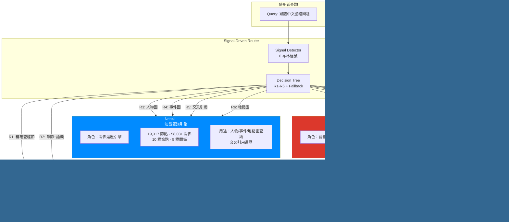

### 1.2 資料規模統計表

| 資料庫 | 元素 | 數量 | 說明 |
|--------|------|------|------|
| **PostgreSQL** | 表 | 6 | books, chapters, pericopes, chunks, entities, entity_mentions |
| | 記錄 | ~100,000 | 其中 entity_mentions 佔大部分 |
| **Neo4j** | 節點 | 19,317 | 10 種標籤（含雙標籤 Entity） |
| | 關係 | 58,031 | 5 種關係類型 |
| **Qdrant** | 向量 | 3,041 | pericope + chunk + verse 級別嵌入 |
| | 維度 | 1,024 | BGE-M3 模型輸出維度 |
| | 距離度量 | COSINE | 餘弦相似度 |

---

## 第二章：PostgreSQL Schema

PostgreSQL 作為系統的 **權威資料來源 (Source of Truth)**，儲存聖經的完整層級結構和所有文本內容。其他兩個資料庫（Neo4j、Qdrant）的查詢結果最終都會回到 PostgreSQL 進行 **ID 水合**（hydration），取得完整文本。

> **來源檔案**: `scripts/db/schema.sql`

### 2.1 ER 圖

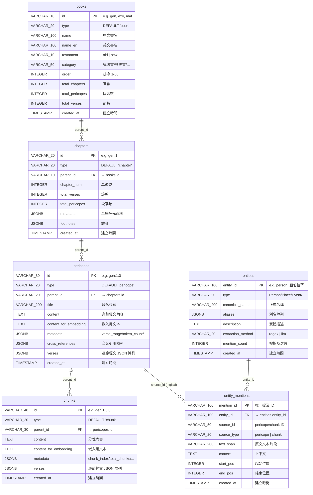

### 2.2 ID 格式層級說明

PostgreSQL 的 ID 設計遵循 **冒號分隔的階層格式**，從書卷 ID 逐步加深：

| 層級 | 格式 | 範例 | 說明 |
|------|------|------|------|
| Book | `{book_abbr}` | `gen` | 書卷縮寫（3 字母） |
| Chapter | `{book}:{chapter}` | `gen:1` | 書卷 + 章號 |
| Pericope | `{book}:{chapter}:{index}` | `gen:1:0` | 章內段落索引（0-based） |
| Chunk | `{book}:{chapter}:{index}:{chunk}` | `gen:1:0:0` | 段落內分塊索引 |
| Verse | `{book}:{chapter}:{index}:v:{verse}` | `gen:1:0:v:1` | 段落內經節號 |

### 2.3 索引清單

| 表 | 索引名稱 | 欄位 | 用途 |
|----|----------|------|------|
| books | idx_books_testament | testament | 舊約/新約篩選 |
| books | idx_books_category | category | 書卷類別篩選 |
| books | idx_books_order | "order" | 排序查詢 |
| chapters | idx_chapters_parent | parent_id | 按書卷查章 |
| chapters | idx_chapters_num | chapter_num | 按章號查詢 |
| pericopes | idx_pericopes_parent | parent_id | 按章查段落 |
| pericopes | idx_pericopes_title | title | 標題搜尋 |
| chunks | idx_chunks_parent | parent_id | 按段落查分塊 |
| entities | idx_entities_type | type | 按實體類型篩選 |
| entities | idx_entities_name | canonical_name | 名稱搜尋 |
| entities | idx_entities_mention_count | mention_count DESC | 熱門實體排序 |
| entity_mentions | idx_mentions_entity | entity_id | 按實體查提及 |
| entity_mentions | idx_mentions_source | source_id | 按來源查提及 |
| entity_mentions | idx_mentions_source_type | source_type | 按來源類型篩選 |

### 2.4 JSONB 欄位內容結構

#### `pericopes.verses` — 逐節經文陣列

```json
[
  {"num": "1", "text": "起初，神創造天地。"},
  {"num": "2", "text": "地是空虛混沌，淵面黑暗；..."}
]
```

#### `pericopes.metadata` — 段落元資料

```json
{
  "book_id": "gen",
  "book_name": "創世記",
  "chapter_num": 1,
  "verse_range": "1-5",
  "token_count": 342,
  "requires_chunking": false
}
```

#### `pericopes.cross_references` — 交叉引用陣列

```json
[
  {
    "ref_text": "約1:1-3",
    "ref_type": "parallel",
    "description": "道就是神",
    "source_verses": "1",
    "target_verses": "1-3"
  }
]
```

#### `entities.aliases` — 別名陣列（JSONB 格式）

```json
["亞伯蘭", "亞伯拉罕", "Abraham"]
```

> **關鍵差異**：在 PostgreSQL 中 `aliases` 是 JSONB 原生陣列；在 Neo4j 中則是 `JSON.stringify()` 後的字串。詳見[第六章](#第六章欄位映射與差異分析)。

### 2.5 View: `embedding_sources`

`embedding_sources` 是一個 **檢視（View）**，聯合 pericopes（不需分塊者）和 chunks，提供統一的嵌入來源：

```sql
CREATE VIEW embedding_sources AS
SELECT id, 'pericope' as source_type, content_for_embedding, metadata
FROM pericopes
WHERE (metadata->>'requires_chunking')::boolean = false
   OR metadata->>'requires_chunking' IS NULL
UNION ALL
SELECT id, 'chunk' as source_type, content_for_embedding, metadata
FROM chunks;
```

---

## 第三章：Neo4j 知識圖譜 Schema

Neo4j 作為 **知識圖譜引擎**，儲存聖經結構的圖形化表達以及實體間的關係網路。其設計採用 **反正規化**（denormalization）策略，將 `book_name`、`chapter_num` 等常用欄位冗餘存放在節點上，避免查詢時需要大量 JOIN。

> **來源**: Neo4j 資料庫即時查詢（APOC schema inspection）

### 3.1 圖譜 Schema 圖

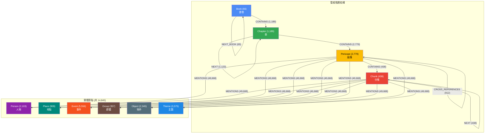

### 3.2 節點類型與屬性

#### 聖經階層節點（雙標籤：`Bible` + 具體類型）

| 節點類型 | 數量 | 標籤 | 核心屬性 |
|----------|------|------|----------|
| **Book** | 66 | `Book:Bible` | `id`(indexed), `name`, `name_en`, `testament`, `category`, `order`, `total_chapters`, `total_pericopes` |
| **Chapter** | 1,189 | `Chapter:Bible` | `id`(indexed), `book_id`, `book_name`, `chapter_num`, `total_verses`, `total_pericopes` |
| **Pericope** | 2,779 | `Pericope:Bible` | `id`(indexed), `title`, `book_id`, `book_name`, `chapter_id`, `chapter_num`, `verse_range`, `token_count`, `requires_chunking` |
| **Chunk** | 438 | `Chunk:Bible` | `id`(indexed), `pericope_id`, `pericope_title`, `chunk_index`, `total_chunks`, `verse_range`, `token_count`, `has_overlap` |

#### 實體節點（雙標籤：`Entity` + 具體類型）

| 節點類型 | 數量 | 標籤 | 屬性 |
|----------|------|------|------|
| **Person** | 2,103 | `Person:Entity` | `entity_id`(indexed), `canonical_name`, `aliases`(JSON 字串), `description`, `mention_count` |
| **Place** | 909 | `Place:Entity` | 同上 |
| **Event** | 5,556 | `Event:Entity` | 同上 |
| **Group** | 357 | `Group:Entity` | 同上 |
| **Object** | 2,345 | `Object:Entity` | 同上 |
| **Theme** | 3,575 | `Theme:Entity` | 同上 |

### 3.3 關係類型與屬性

| 關係類型 | 數量 | 方向 | 起點 → 終點 | 屬性 |
|----------|------|------|-------------|------|
| **CONTAINS** | 4,406 | 有向 | Book→Chapter, Chapter→Pericope, Pericope→Chunk | 無 |
| **NEXT** | 2,980 | 有向 | Chapter→Chapter, Pericope→Pericope, Chunk→Chunk | 無 |
| **NEXT_BOOK** | 65 | 有向 | Book→Book | 無 |
| **MENTIONS** | 49,668 | 有向 | Pericope/Chunk → Entity | `text_span`, `start_pos`, `end_pos` |
| **CROSS_REFERENCES** | 912 | 有向 | Pericope → Pericope | `ref_text`, `ref_type`, `source`, `description`, `source_verses`, `target_verses`, `verse_start`, `verse_end` |

### 3.4 反正規化設計說明

Neo4j 中的以下欄位是 **冗餘的反正規化欄位**，與 PostgreSQL 中的對應資料重複：

| 冗餘欄位 | 出現在節點 | 來源 | 理由 |
|----------|------------|------|------|
| `book_name` | Chapter, Pericope | `books.name` | 避免圖遍歷時回溯 Book 節點 |
| `book_id` | Chapter, Pericope | `books.id` | 快速識別書卷 |
| `chapter_num` | Chapter, Pericope | `chapters.chapter_num` | 避免遍歷 Chapter 節點 |
| `chapter_id` | Pericope | `chapters.id` | 直接定位章節 |
| `pericope_id` | Chunk | `pericopes.id` | 快速回溯父段落 |
| `pericope_title` | Chunk | `pericopes.title` | 顯示用途 |

---

## 第四章：Qdrant 向量資料庫 Schema

Qdrant 作為 **向量檢索引擎**，負責基於語義相似度的文本搜尋。系統支援兩種 collection：標準 Dense 向量 collection 與 Dense+Sparse 混合 collection。

> **來源檔案**: `backend/config.py`, `backend/database/qdrant_db.py`, `backend/database/qdrant_hybrid.py`, `scripts/import_qdrant.py`

### 4.1 Collection 結構圖

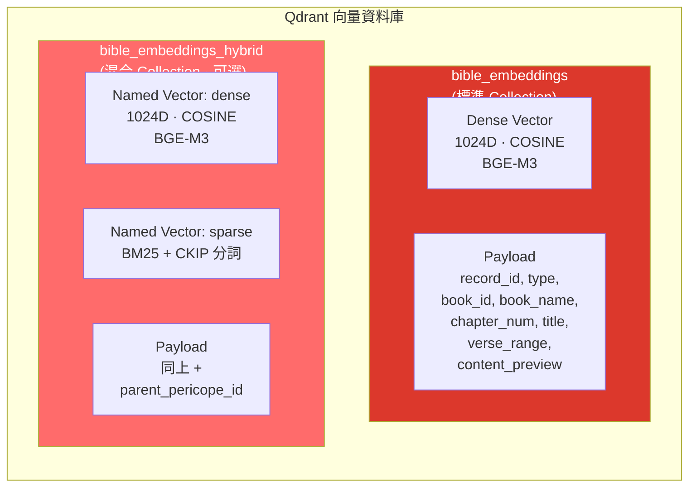

### 4.2 向量規格

| 項目 | 標準 Collection | 混合 Collection |
|------|----------------|-----------------|
| **Collection 名稱** | `bible_embeddings` | `bible_embeddings_hybrid` |
| **Dense 向量** | 1024D, COSINE | 1024D, COSINE (named: `dense`) |
| **Sparse 向量** | 無 | BM25 (named: `sparse`) |
| **嵌入模型** | BAAI/bge-m3 | BAAI/bge-m3 + BM25(CKIP 分詞) |
| **向量數量** | 3,041 | 3,041（啟用時） |
| **融合方法** | N/A | RRF (Reciprocal Rank Fusion) |

### 4.3 Payload 欄位完整列表

| 欄位 | 型別 | 說明 | 來源 |
|------|------|------|------|
| `record_id` | string | pericope/chunk/verse ID | `embeddings.jsonl` |
| `type` | string | `"pericope"` / `"chunk"` / `"verse"` | metadata |
| `book_id` | string | 書卷縮寫 e.g. `"gen"` | metadata |
| `book_name` | string | 中文書名 e.g. `"創世記"` | metadata |
| `chapter_num` | integer | 章號 | metadata |
| `title` | string | 段落標題 | metadata |
| `verse_range` | string | 經節範圍 e.g. `"1-5"` | metadata |
| `content_preview` | string | 前 200 字元預覽 | content_for_embedding |
| `parent_pericope_id` | string | 父段落 ID（僅 verse 級別） | 計算得出 |

### 4.4 混合檢索架構圖

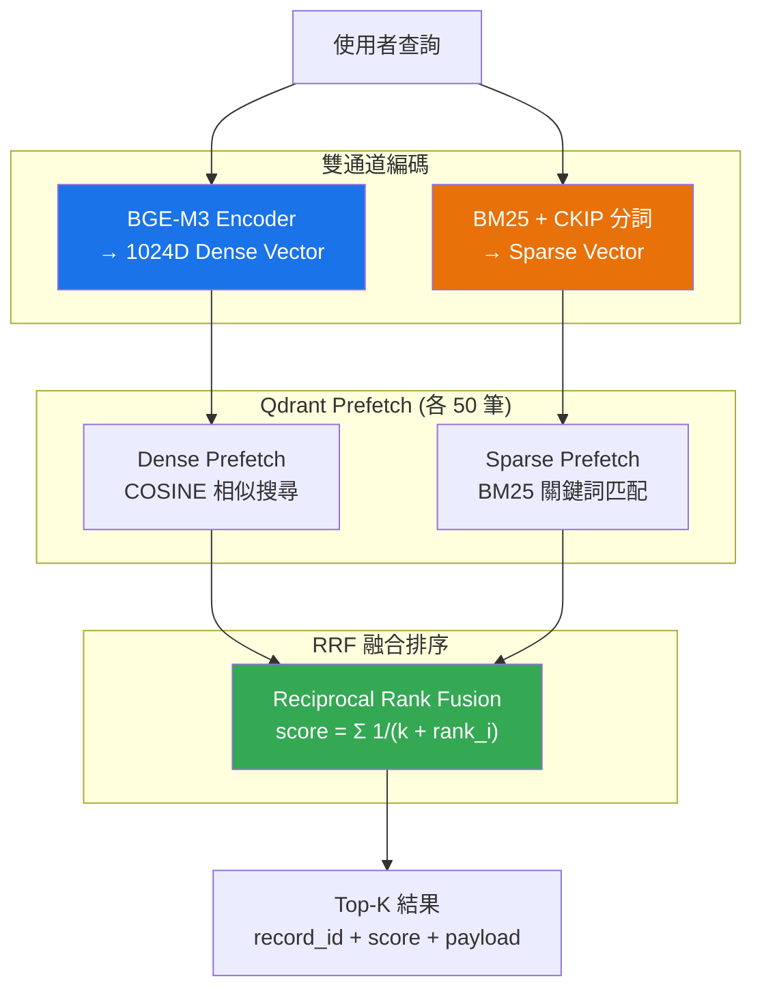

### 4.5 向量來源分布

系統中的 3,041 個向量來自三種層級：

| 來源類型 | 數量 | 說明 |
|----------|------|------|
| Pericope | ~2,341 | 不需分塊的段落（`requires_chunking = false`） |
| Chunk | ~438 | 長段落拆分的分塊 |
| Verse | ~262 | 經節級別嵌入（指向父段落） |

---

## 第五章：跨資料庫 ID 橋接機制

三個資料庫之間的 **ID 格式統一** 是整個系統的關鍵設計。所有資料庫都使用同一套 **冒號分隔的階層 ID**，讓查詢結果可以跨庫對應。

### 5.1 ID 格式統一標準圖

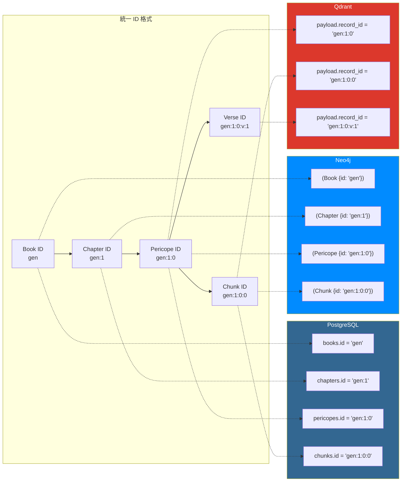

### 5.2 各 ID 格式在三庫中的對應

| ID 格式 | 部件數 | PostgreSQL | Neo4j | Qdrant |
|---------|--------|------------|-------|--------|
| `gen` | 1 | books.id | Book.id | — |
| `gen:1` | 2 | chapters.id | Chapter.id | — |
| `gen:1:0` | 3 | pericopes.id | Pericope.id | payload.record_id |
| `gen:1:0:0` | 4 (digit) | chunks.id | Chunk.id | payload.record_id |
| `gen:1:0:v:1` | 5 (v) | — (查父段落) | — | payload.record_id |

### 5.3 `get_content_by_id()` 水合機制

所有非 PostgreSQL 的查詢結果（Neo4j 圖遍歷、Qdrant 向量搜尋），最終都會調用 `postgres.get_content_by_id()` 來取得完整文本內容。此函式根據 ID 的 **部件數量** 判斷資料類型：

```
get_content_by_id(record_id) 的路由邏輯：

  parts = record_id.split(":")

  ┌─ len == 5 且 parts[3] == "v"  →  Verse ID  →  取父 Pericope
  ├─ len == 4                      →  Chunk ID  →  get_chunk_by_id()
  └─ len == 3                      →  Pericope ID → get_pericope_by_id()
```

> **來源**: `backend/database/postgres.py:213-228`

---

## 第六章：欄位映射與差異分析

### 6.1 聖經結構欄位映射表

| 概念欄位 | PostgreSQL | Neo4j | Qdrant (Payload) |
|----------|------------|-------|-------------------|
| **書卷 ID** | `books.id` | `Book.id` | — |
| **書卷中文名** | `books.name` | `Book.name`, `Chapter.book_name`, `Pericope.book_name` | `book_name` |
| **書卷英文名** | `books.name_en` | `Book.name_en` | — |
| **約別** | `books.testament` | `Book.testament` | — |
| **類別** | `books.category` | `Book.category` | — |
| **排序** | `books."order"` | `Book.order` | — |
| **章 ID** | `chapters.id` | `Chapter.id` | — |
| **章號** | `chapters.chapter_num` | `Chapter.chapter_num`, `Pericope.chapter_num` | `chapter_num` |
| **段落 ID** | `pericopes.id` | `Pericope.id` | `record_id` |
| **段落標題** | `pericopes.title` | `Pericope.title` | `title` |
| **經文內容** | `pericopes.content` | — (不存放) | `content_preview` (前 200 字) |
| **嵌入用文本** | `pericopes.content_for_embedding` | — | — (已嵌入為向量) |
| **經節範圍** | `pericopes.metadata->>'verse_range'` | `Pericope.verse_range` | `verse_range` |
| **Token 數** | `pericopes.metadata->>'token_count'` | `Pericope.token_count` | — |
| **是否需分塊** | `pericopes.metadata->>'requires_chunking'` | `Pericope.requires_chunking` | — |
| **分塊 ID** | `chunks.id` | `Chunk.id` | `record_id` |
| **分塊索引** | `chunks.metadata->>'chunk_index'` | `Chunk.chunk_index` | — |
| **分塊總數** | `chunks.metadata->>'total_chunks'` | `Chunk.total_chunks` | — |

### 6.2 實體欄位映射表

| 概念欄位 | PostgreSQL (entities) | Neo4j (Entity 節點) | Qdrant |
|----------|----------------------|---------------------|--------|
| **實體 ID** | `entity_id` (PK) | `entity_id` (indexed) | — |
| **類型** | `type` | 節點標籤 (Person/Place/...) | — |
| **正典名稱** | `canonical_name` | `canonical_name` | — |
| **別名** | `aliases` (JSONB 陣列) | `aliases` (JSON 字串) | — |
| **描述** | `description` | `description` | — |
| **提及次數** | `mention_count` | `mention_count` | — |
| **提取方法** | `extraction_method` | — (不存放) | — |

### 6.3 entity_mentions vs MENTIONS 映射表

| 概念 | PostgreSQL (entity_mentions 表) | Neo4j (MENTIONS 關係) |
|------|-------------------------------|----------------------|
| **結構** | 獨立的關聯表 | 圖的邊（關係） |
| **來源指向** | `source_id` + `source_type` | 起點節點 (Pericope/Chunk) |
| **目標指向** | `entity_id` (FK) | 終點節點 (Entity) |
| **文本片段** | `text_span` | `text_span` |
| **位置** | `start_pos`, `end_pos` | `start_pos`, `end_pos` |
| **上下文** | `context` | — (不存放) |
| **提及 ID** | `mention_id` (PK) | — (無唯一 ID) |
| **方向** | 邏輯方向（source → entity） | `(Pericope)-[:MENTIONS]->(Entity)` |

### 6.4 cross_references (JSONB) vs CROSS_REFERENCES (關係) 差異

| 面向 | PostgreSQL | Neo4j |
|------|-----------|-------|
| **儲存形式** | `pericopes.cross_references` JSONB 陣列 | `(Pericope)-[:CROSS_REFERENCES]->(Pericope)` 關係 |
| **數量** | 嵌入每個 pericope 記錄中 | 912 條獨立關係 |
| **屬性** | `ref_text`, `ref_type`, `description`, `source_verses`, `target_verses` | `ref_text`, `ref_type`, `source`, `description`, `source_verses`, `target_verses`, `verse_start`, `verse_end` |
| **遍歷能力** | 需解析 JSONB 再查詢 | 原生圖遍歷，支援多跳查詢 |
| **用途** | 靜態儲存，回傳給前端 | R5 路由的圖遍歷檢索 |

### 6.5 關鍵差異：aliases 格式

這是三庫間最容易造成混淆的差異：

| 資料庫 | aliases 儲存格式 | 範例 |
|--------|------------------|------|
| **PostgreSQL** | JSONB 原生陣列 | `["亞伯蘭", "亞伯拉罕"]` |
| **Neo4j** | `JSON.stringify()` 字串 | `'["亞伯蘭", "亞伯拉罕"]'` |

**原因**：Neo4j 的屬性不支援原生 JSON 陣列（僅支援 `LIST<STRING>`），但 import 腳本使用 `json.dumps()` 將陣列序列化為字串存入。查詢時 Neo4j 的 `any(a IN e.aliases WHERE ...)` 是對字串做操作，利用 `CONTAINS` 進行子字串匹配。

> **來源**: `scripts/import_neo4j.py:225` — `aliases=json.dumps(record.get("aliases", []))`

---

## 第七章：6 路由資料庫使用分析

系統的 6 路由架構是 Bible RAG 的核心設計。Signal Detector 偵測 6 個布林信號，Decision Tree 根據信號優先序選擇路由。

> **來源檔案**: `backend/utils/signal_detector.py`, `backend/utils/retrieval/router.py`

### 7.1 路由決策樹圖

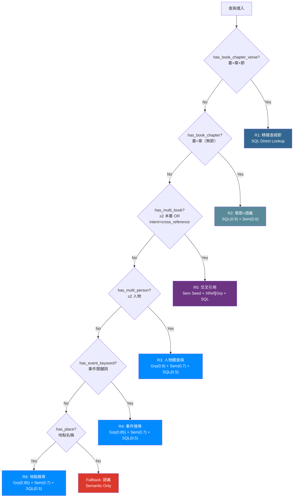

**優先序**: R1 > R2 > R5 > R3 > R4 > R6 > Fallback

### 7.2 路由 × 資料庫使用矩陣

| 路由 | 觸發條件 | PostgreSQL | Neo4j | Qdrant | 策略組合 |
|------|----------|:----------:|:-----:|:------:|----------|
| **R1** | 書+章+節 | **主要** | — | — | SQL Direct Lookup |
| **R2** | 書+章 | **主要**(0.9) | — | 次要(0.6) | SQL Chapter + Semantic |
| **R3** | ≥2 人物 | 補充(0.5) | **主要**(0.9) | 次要(0.7) | Graph(person) ∥ Semantic + SQL |
| **R4** | 事件關鍵詞 | 補充(0.5) | **主要**(0.85) | 次要(0.7) | Graph(event) ∥ Semantic + SQL |
| **R5** | ≥2 書 / 交叉引用 | 補充(0.4) | **主要**(0.85) | 種子(0.65) | Sem Seed → XRef(0.85) ∥ Graph(0.75) + SQL |
| **R6** | 地點名稱 | 補充(0.5) | **主要**(0.85) | 次要(0.7) | Graph(place) ∥ Semantic + SQL |
| **FB** | 無特殊信號 | — | — | **主要** | Semantic Only |

### 7.3 R3 路由資料流（人物圖查詢範例）

> 查詢範例：「亞伯拉罕和以撒之間有什麼關係？」

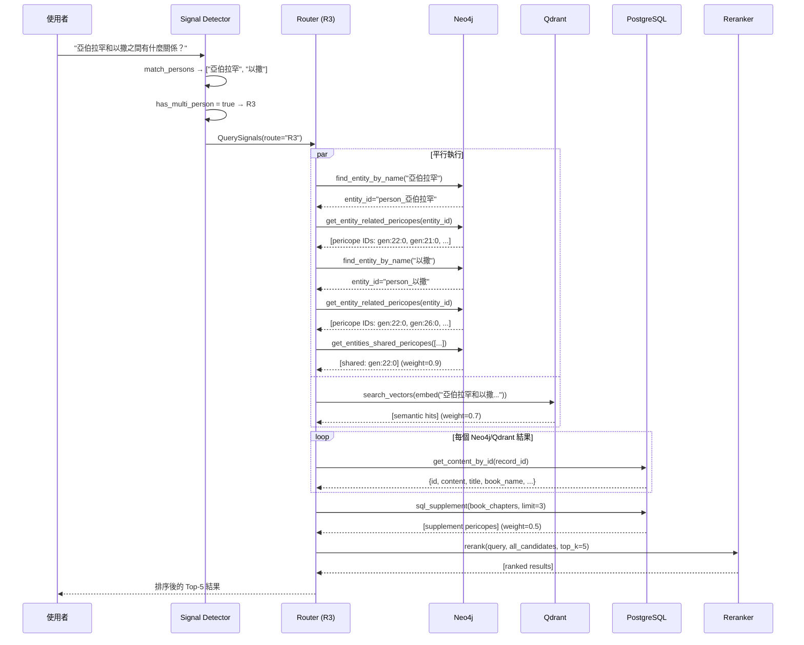

### 7.4 R5 路由資料流（交叉引用範例）

> 查詢範例：「創世記和約翰福音中關於創造的描述有何異同？」

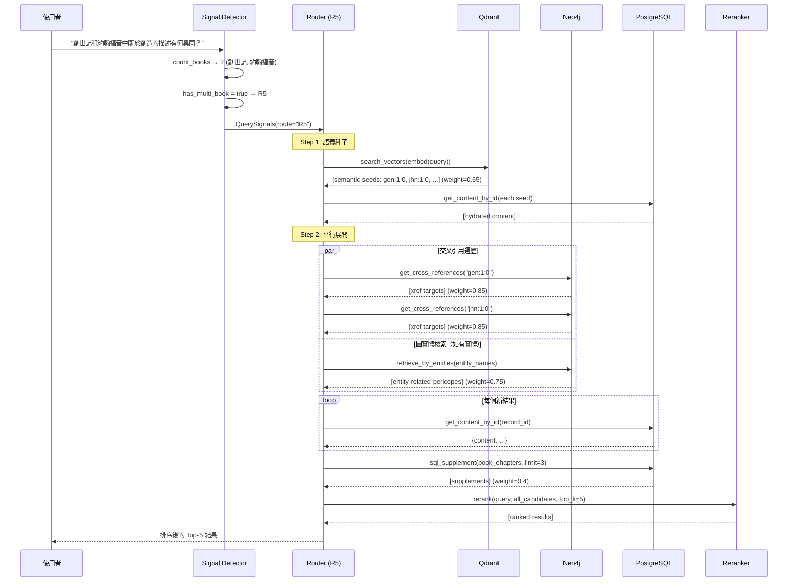

---

## 第八章：資料建置 Pipeline

### 8.1 端到端 Pipeline 圖

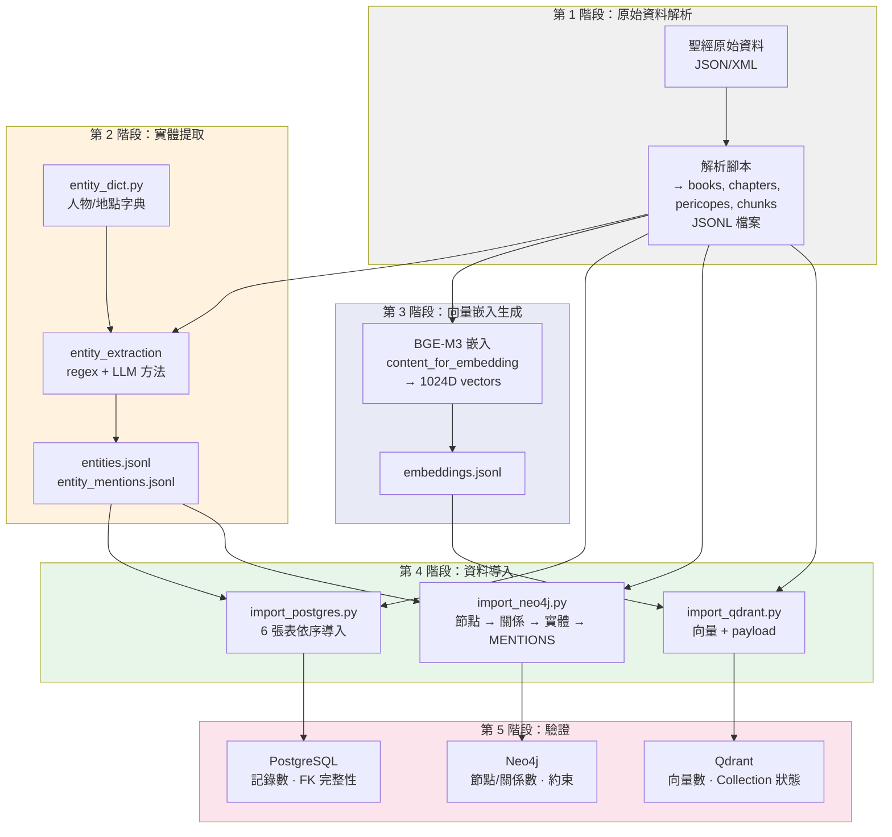

### 8.2 各階段說明

| 階段 | 腳本 | 輸入 | 輸出 | 說明 |
|------|------|------|------|------|
| **1. 解析** | `scripts/parse_bible.py` | 原始聖經資料 | `output/books.jsonl`, `chapters.jsonl`, `pericopes.jsonl`, `chunks.jsonl`, `neo4j_nodes.jsonl`, `neo4j_relationships.jsonl` | 產生所有結構化 JSONL |
| **2. 實體提取** | `scripts/entity_extraction/` | pericopes + chunks | `output/entities.jsonl`, `entity_mentions.jsonl` | regex + LLM 雙方法提取 |
| **3. 向量生成** | `scripts/generate_embeddings.py` | content_for_embedding | `output/embeddings.jsonl` | BGE-M3 模型嵌入 |
| **4a. PG 導入** | `scripts/import_postgres.py` | 全部 JSONL | PostgreSQL 6 表 | 依序：books → chapters → pericopes → chunks → entities → entity_mentions |
| **4b. Neo4j 導入** | `scripts/import_neo4j.py` | nodes/rels/entities/mentions JSONL | Neo4j 圖 | 依序：constraints → nodes → rels → entities → MENTIONS |
| **4c. Qdrant 導入** | `scripts/import_qdrant.py` | embeddings.jsonl + metadata | Qdrant collection | 建立 collection → 載入 metadata → batch upsert |
| **5. 驗證** | 各 import 腳本內建 | 資料庫查詢 | 統計報告 | 記錄數、狀態確認 |

---

## 第九章：變更影響分析

### 9.1 變更影響矩陣

| 變更類型 | PostgreSQL | Neo4j | Qdrant | 影響程度 |
|----------|:----------:|:-----:|:------:|----------|
| **新增書卷** | 新增 books 記錄 | 新增 Book 節點 + CONTAINS/NEXT_BOOK | — | 中 |
| **修改段落內容** | 更新 pericopes.content | — | 需重新嵌入 | 高 |
| **新增實體** | 新增 entities + entity_mentions | 新增 Entity 節點 + MENTIONS 關係 | — | 中 |
| **修改實體別名** | 更新 entities.aliases (JSONB) | 更新 Entity.aliases (字串) | — | 低 |
| **新增交叉引用** | 更新 pericopes.cross_references (JSONB) | 新增 CROSS_REFERENCES 關係 | — | 中 |
| **修改嵌入模型** | — | — | 全部向量需重建 | 極高 |
| **新增分塊** | 新增 chunks 記錄 | 新增 Chunk 節點 + CONTAINS/NEXT | 需嵌入新向量 | 高 |

### 9.2 變更影響流程圖

```mermaid
flowchart TB
    Change["資料變更"]

    Change -->|"經文內容修改"| ContentChange
    Change -->|"實體異動"| EntityChange
    Change -->|"交叉引用異動"| XRefChange
    Change -->|"結構異動(新書卷/章)"| StructChange

    subgraph ContentChange["經文內容變更"]
        CC1["1. 更新 PG pericopes.content"]
        CC2["2. 重新生成 content_for_embedding"]
        CC3["3. 重新 BGE-M3 嵌入"]
        CC4["4. 更新 Qdrant 向量"]
        CC1 --> CC2 --> CC3 --> CC4
    end

    subgraph EntityChange["實體變更"]
        EC1["1. 更新 PG entities 表"]
        EC2["2. 更新 PG entity_mentions 表"]
        EC3["3. 更新 Neo4j Entity 節點"]
        EC4["4. 更新 Neo4j MENTIONS 關係"]
        EC1 --> EC2
        EC1 --> EC3
        EC2 --> EC4
    end

    subgraph XRefChange["交叉引用變更"]
        XC1["1. 更新 PG pericopes.cross_references"]
        XC2["2. 更新 Neo4j CROSS_REFERENCES 關係"]
        XC1 --> XC2
    end

    subgraph StructChange["結構變更"]
        SC1["1. 更新 PG 階層表 (books/chapters/pericopes)"]
        SC2["2. 更新 Neo4j 階層節點 + CONTAINS/NEXT"]
        SC3["3. 如有新 pericope: 嵌入 → Qdrant"]
        SC1 --> SC2
        SC1 --> SC3
    end

    style ContentChange fill:#fff3e0,color:#333
    style EntityChange fill:#e8eaf6,color:#333
    style XRefChange fill:#e8f5e9,color:#333
    style StructChange fill:#fce4ec,color:#333
```

### 9.3 四條關鍵同步規則

#### 規則 1：經文內容修改 → 必須同步 Qdrant

```python
# 修改 PG 段落內容後，必須重新嵌入並更新 Qdrant
async def update_pericope_content(pericope_id: str, new_content: str):
    # Step 1: 更新 PostgreSQL
    await postgres.update_pericope(pericope_id, content=new_content)

    # Step 2: 重新生成嵌入文本
    new_embedding_text = generate_embedding_text(new_content)

    # Step 3: 重新嵌入
    vector = embedder.encode_query(new_embedding_text)

    # Step 4: 更新 Qdrant
    qdrant_client.upsert(collection_name="bible_embeddings", points=[...])
```

#### 規則 2：實體變更 → 必須同步 PG 與 Neo4j

```python
# 新增實體時，PG 和 Neo4j 都需要更新
async def add_entity(entity_data: dict):
    # Step 1: 插入 PG entities 表
    await postgres.insert_entity(entity_data)

    # Step 2: 插入 PG entity_mentions 表
    for mention in entity_data["mentions"]:
        await postgres.insert_mention(mention)

    # Step 3: 建立 Neo4j Entity 節點
    # 注意：aliases 需要 json.dumps() 轉為字串
    await neo4j.create_entity_node(
        entity_data, aliases=json.dumps(entity_data["aliases"])
    )

    # Step 4: 建立 Neo4j MENTIONS 關係
    for mention in entity_data["mentions"]:
        await neo4j.create_mentions_rel(mention)
```

#### 規則 3：交叉引用變更 → 必須同步 PG JSONB 與 Neo4j 關係

```python
# 新增交叉引用時，PG 的 JSONB 和 Neo4j 的關係都要更新
async def add_cross_reference(source_id: str, target_id: str, ref_data: dict):
    # Step 1: 更新 PG pericopes.cross_references JSONB
    current = await postgres.get_pericope_by_id(source_id)
    refs = current["cross_references"]
    refs.append(ref_data)
    await postgres.update_pericope(source_id, cross_references=refs)

    # Step 2: 建立 Neo4j CROSS_REFERENCES 關係
    await neo4j.create_cross_ref(source_id, target_id, ref_data)
```

#### 規則 4：aliases 格式必須一致

```python
# PG: JSONB 原生陣列
pg_aliases = ["亞伯蘭", "亞伯拉罕"]  # Python list → JSONB

# Neo4j: JSON 字串
neo4j_aliases = json.dumps(["亞伯蘭", "亞伯拉罕"])  # '["亞伯蘭", "亞伯拉罕"]'
```

### 9.4 無需同步的情況

| 場景 | 說明 |
|------|------|
| PostgreSQL 新增索引 | 僅影響 PG 查詢效能 |
| Neo4j 新增約束/索引 | 僅影響 Neo4j 查詢效能 |
| Qdrant 調整 HNSW 參數 | 僅影響向量搜尋效能 |
| 修改路由權重 (`config.py`) | 僅影響排序，不影響資料 |
| 修改 Reranker 模型 | 僅影響重排序結果 |
| 修改 `entity_dicts.py` 字典 | 僅影響信號偵測，不影響儲存資料 |

---

## 第十章：資料一致性驗證

### 10.1 一致性檢查流程圖

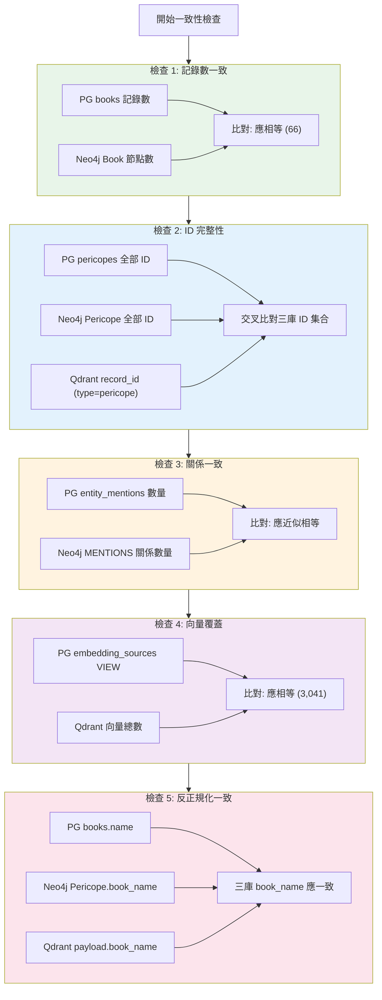

### 10.2 驗證查詢範例

#### 檢查 1：三庫記錄數比對

**PostgreSQL**:
```sql
-- 各表記錄數
SELECT 'books' AS table_name, COUNT(*) FROM books
UNION ALL SELECT 'chapters', COUNT(*) FROM chapters
UNION ALL SELECT 'pericopes', COUNT(*) FROM pericopes
UNION ALL SELECT 'chunks', COUNT(*) FROM chunks
UNION ALL SELECT 'entities', COUNT(*) FROM entities
UNION ALL SELECT 'entity_mentions', COUNT(*) FROM entity_mentions;
```

**Neo4j (Cypher)**:
```cypher
// 各節點類型數量
CALL db.labels() YIELD label
CALL apoc.cypher.run(
  'MATCH (n:`' + label + '`) RETURN count(n) as count', {}
) YIELD value
RETURN label, value.count AS count
ORDER BY count DESC

// 各關係類型數量
MATCH ()-[r]->()
RETURN type(r) AS rel_type, count(r) AS count
ORDER BY count DESC
```

**Qdrant (Python)**:
```python
from qdrant_client import QdrantClient
client = QdrantClient(host="localhost", port=6333)
info = client.get_collection("bible_embeddings")
print(f"Vectors: {info.points_count}")
```

#### 檢查 2：ID 交叉比對

```python
import asyncio
import asyncpg
from neo4j import AsyncGraphDatabase
from qdrant_client import QdrantClient

async def check_id_consistency():
    # PG pericope IDs
    pg_pool = await asyncpg.create_pool(dsn="postgresql://...")
    async with pg_pool.acquire() as conn:
        pg_ids = set(
            row["id"] for row in
            await conn.fetch("SELECT id FROM pericopes")
        )

    # Neo4j Pericope IDs
    neo4j_driver = AsyncGraphDatabase.driver("bolt://localhost:7687", auth=("neo4j", "..."))
    async with neo4j_driver.session() as session:
        result = await session.run("MATCH (p:Pericope) RETURN p.id AS id")
        neo4j_ids = set(record["id"] for record in await result.data())

    # Qdrant pericope record_ids
    client = QdrantClient(host="localhost", port=6333)
    # scroll all points
    qdrant_ids = set()
    offset = None
    while True:
        result = client.scroll("bible_embeddings", limit=1000, offset=offset,
                               scroll_filter={"must": [{"key": "type", "match": {"value": "pericope"}}]})
        for point in result[0]:
            qdrant_ids.add(point.payload["record_id"])
        offset = result[1]
        if offset is None:
            break

    # 比對
    print(f"PG: {len(pg_ids)}, Neo4j: {len(neo4j_ids)}, Qdrant: {len(qdrant_ids)}")
    print(f"PG - Neo4j: {pg_ids - neo4j_ids}")
    print(f"Neo4j - PG: {neo4j_ids - pg_ids}")
    print(f"PG - Qdrant: {pg_ids - qdrant_ids}")
```

#### 檢查 3：MENTIONS 數量比對

```sql
-- PostgreSQL
SELECT COUNT(*) FROM entity_mentions;
```

```cypher
// Neo4j
MATCH ()-[r:MENTIONS]->() RETURN count(r)
```

#### 檢查 4：aliases 格式一致性

```python
async def check_aliases_consistency():
    # PG: JSONB → Python list
    pg_entity = await postgres.get_entity("person_亞伯拉罕")
    pg_aliases = pg_entity["aliases"]  # 已是 list

    # Neo4j: 字串 → 需 json.loads
    neo4j_result = await neo4j_session.run(
        "MATCH (e:Person {entity_id: $eid}) RETURN e.aliases",
        eid="person_亞伯拉罕"
    )
    neo4j_aliases_str = (await neo4j_result.single())[0]
    neo4j_aliases = json.loads(neo4j_aliases_str)

    assert pg_aliases == neo4j_aliases, f"Mismatch: {pg_aliases} vs {neo4j_aliases}"
```

### 10.3 常見陷阱與解決方案

| 陷阱 | 症狀 | 解決方案 |
|------|------|----------|
| **Neo4j aliases 是字串非陣列** | `any(a IN e.aliases WHERE ...)` 比對失敗 | 使用 `CONTAINS` 子字串匹配，或 `apoc.convert.fromJsonList()` |
| **Qdrant 向量與 PG 內容不同步** | 語義搜尋返回過時結果 | 修改 PG 內容後立即重新嵌入並 upsert Qdrant |
| **ID 水合失敗（null content）** | `get_content_by_id()` 返回 None | 確認 record_id 格式正確、PG 中確實存在該記錄 |
| **cross_references JSONB 與 Neo4j 不一致** | R5 路由遺漏交叉引用 | 新增交叉引用時務必同時更新 PG JSONB 和 Neo4j 關係 |
| **entity_mentions 部分匯入** | Neo4j MENTIONS 數量 < PG | 重新執行 `import_neo4j.py`（不加 `--skip-mentions`） |
| **Verse ID 水合回傳父段落** | 查詢經節但返回整個段落 | 這是預期行為：`gen:1:0:v:1` → `get_pericope_by_id("gen:1:0")` |
| **Book/Chapter 在 Qdrant 中無向量** | 書卷/章級別搜尋無語義結果 | 設計如此：僅 pericope/chunk/verse 有嵌入 |

---

## 附錄：關鍵檔案索引

| 檔案路徑 | 用途 |
|----------|------|
| `scripts/db/schema.sql` | PostgreSQL 完整 schema 定義 |
| `backend/database/postgres.py` | PG 非同步查詢函式（asyncpg） |
| `backend/database/neo4j_db.py` | Neo4j 非同步查詢函式 |
| `backend/database/qdrant_db.py` | Qdrant Dense 向量搜尋 |
| `backend/database/qdrant_hybrid.py` | Qdrant Dense+Sparse 混合搜尋 |
| `backend/config.py` | 三庫連線設定 + 嵌入模型 + 路由權重 |
| `backend/utils/retrieval/router.py` | 6 路由信號驅動分發器 |
| `backend/utils/retrieval/graph_retriever.py` | Neo4j 圖遍歷（人物/事件/地點） |
| `backend/utils/retrieval/semantic_retriever.py` | Qdrant 語義檢索 + PG 水合 |
| `backend/utils/retrieval/cross_ref_retriever.py` | 交叉引用遍歷 + PG 水合 |
| `backend/utils/signal_detector.py` | 6 信號偵測 + 決策樹路由選擇 |
| `backend/utils/entity_dicts.py` | 字典橋接模組（人物/地點/事件匹配） |
| `scripts/import_postgres.py` | PG 資料導入腳本 |
| `scripts/import_neo4j.py` | Neo4j 資料導入腳本 |
| `scripts/import_qdrant.py` | Qdrant 向量導入腳本 |
