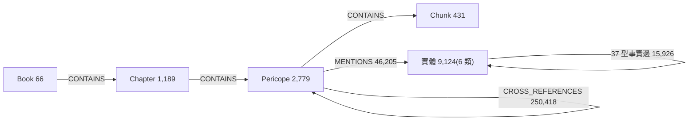
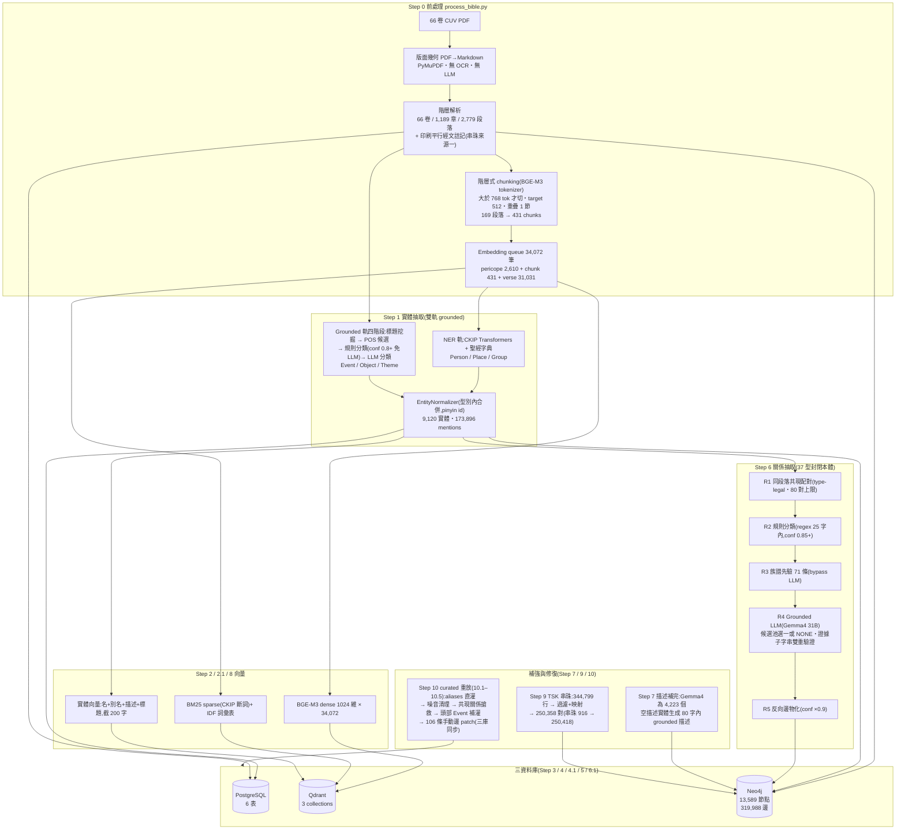
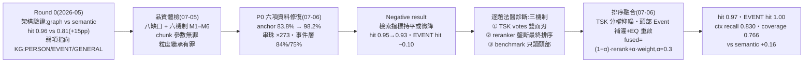

# 聖經知識圖譜建置誌

> Bible_RAG · Knowledge Graph Construction
> 整理 Bible_RAG 專案自和合本(CUV)PDF 到 Neo4j 知識圖譜的完整建置管線(Step 0–10)、各方法的文獻依據,以及三輪實驗證據鏈:架構驗證 → 品質體檢 → P0 修復的 negative result → 排序融合翻盤。數字以 2026-07-06 live 圖譜與論文 run-of-record 為準。整理日期:2026-08-27。

| Neo4j 節點 | Neo4j 關係 | 實體(6 類) | 串珠 CROSS_REFERENCES | 37 型事實邊 |
|---:|---:|---:|---:|---:|
| 13,589 | 319,988 | 9,124 | 250,418 | 15,926 |

**目錄**

1. [圖譜的形狀:三個子網與 Grounding 紀律](#1-圖譜的形狀三個子網與-grounding-紀律)
2. [建置管線 Step 0–10(含流程圖)](#2-建置管線-step-010)
3. [方法 × 文獻對照](#3-方法--文獻對照)
4. [實驗與成效:三輪證據鏈](#4-實驗與成效三輪證據鏈)
5. [現況與路線圖](#5-現況與路線圖)

---

## 1. 圖譜的形狀:三個子網與 Grounding 紀律

知識圖譜由**三個子網**組成,分別由不同管線建成:

- **語料階層網** — Book → Chapter → Pericope(段落)→ Chunk,由前處理(Step 0)決定性產生;
- **實體網** — 6 類實體(Person / Place / Group / Event / Object / Theme)+ 37 型封閉本體事實邊,由 Step 1(雙軌實體抽取)與 Step 6(grounded 關係抽取)建成;
- **串珠網** — Pericope 之間的 `CROSS_REFERENCES`,由印刷平行經文、手工 NT→OT 引用與 TSK 公版串珠三來源合併(Step 0 + Step 9)。

> **核心方法論 · Grounding(反幻覺紀律)**
> 整條管線貫徹單一紀律:**LLM 從不發明實體、關係型別或證據 — 它只「分類」規則階段提出的候選**;且每個 LLM 輸出都必須引用一段 evidence span,事後驗證確為原文的字面子字串,否則降級或丟棄。這是 KG 建構派典光譜的 schema-based 端(Bian, KG-construction survey, arXiv:2510.20345);structured-prompting 的選擇依據 CORE-KG(arXiv:2506.21607)與 Inside CORE-KG(arXiv:2510.26512)的噪音抑制實證。

圖譜 schema(live,2026-07-06)。雙標籤設計:階層節點 `(:Pericope:Bible)`、實體節點 `(:Person:Entity)`;刻意**不建 verse 節點**(verse 級 ID 只存在 Qdrant/PostgreSQL)— 這個設計期節約正是後來體檢揭露的「mention 靜默蒸發」缺陷(M2)的前提。另有 NEXT / NEXT_BOOK 順序邊(2,975 / 65)。

**實體型別分佈(live,2026-07-06)**

| 型別 | 例子 | 數量 |
|---|---|---:|
| Person | 亞伯拉罕、摩西、耶穌 | 2,419 |
| Object | 約櫃、會幕 | 2,200 |
| Event | 出埃及、復活 | 1,714 |
| Place | 耶路撒冷、埃及 | 1,299 |
| Theme | 救贖、恩典、信心 | 987 |
| Group | 以色列人、法利賽人 | 505 |

三資料庫分工:**PostgreSQL**(6 表,權威結構庫)、**Qdrant**(`bible_embeddings` dense、`bible_embeddings_hybrid` dense+sparse、`bible_entities` 實體向量)、**Neo4j**(圖譜本體)。圖譜服務下游 6 路由檢索(R3 graph_person、R4 graph_event、R5 cross-ref、R6 graph_place 直接吃圖)。所有邊 provenance-first:事實邊帶 confidence / evidence_span / source_pericope_id / extraction_phase,串珠邊帶 votes / source,回填邊有 flag — 全部 idempotent MERGE,可決定性重建與回滾。

---

## 2. 建置管線 Step 0–10

離線管線在 host 端 `scripts/` 環境執行(uv 管理);**每一站的中間產物都固化為 JSONL** 再進資料庫,因此每站可獨立檢視、獨立重跑。完整指令與重建 checklist 見 [`docs/build_database.md`](build_database.md)。

紅色警訊藏在左上:**embedding queue 兼作 NER 抽取餵料**(queue → NER 軌那條邊)— 這一條接線決策把「為檢索設計的粒度」靜默帶進圖譜,即體檢認定的結構性根因 M1(§4.2)。

### 逐站說明

#### Step 0 · 前處理(`process_bible.py`)

- **PDF→Markdown**(`convert_bible_pdf.py`,PyMuPDF):純版面幾何規則 — 字級 ≤8.5pt 為頁眉頁腳、≥16pt 為書名/章號、12pt 且 x≥85 為段落標題、≤9.5pt 數字為節號、詩體/散文按座標判別 — 無 OCR、無 LLM,決定性且可稽核。
- **Pericope 為核心單位**:採釋經學既有的詮釋單位(段落),三個理由 — 語意完整(故事不從中間切斷)、embedding 合身(中位 388 字,P90 = 931)、可解釋性(回「以撒娶妻」比回節區間可讀)。CUV 段落標題下的印刷平行經文註記被保留,升格為 pericope 級 → 串珠網第一來源(774 條)。
- **階層式 chunking**:tokenizer 用 BGE-M3 自己的;≤768 tokens(93.9%)整段保留,超過者按**節界**切、target 512、相鄰重疊 1 節、尾塊 <128 tokens 併回前塊。僅 169 段落(6.1%)被切 → 431 chunks;被切段落集中在舊約敘事書卷,佔全文字量 18.3%。
- **Embedding queue**:34,072 筆 = pericope 2,610 + chunk 431 + verse 31,031,每筆帶定位前綴「書卷、第 N 章、段落標題(X–Y 節):」。

**引用**:BGE-M3(Chen et al., Findings ACL 2024)— chunking 參數與 tokenizer 皆為它設計。

#### Step 1 · 實體抽取 — 雙軌 grounded(`extract_entities.py`)

- **NER 軌**(Person/Place/Group):CKIP Transformers(BERT-base 中文斷詞 + NER;PERSON→Person、GPE/LOC→Place、ORG/NORP→Group),與人工聖經實體字典以「字典優先、最長匹配」合併;mention 位置用 `text.find()` 字面比對(無共指消解 — 後果在體檢中量化)。
- **Grounded 軌**(Event/Object/Theme)四階段:① pericope 標題挖掘(後綴/關鍵詞啟發式 + 24 詞泛名詞 stoplist,stoplist 為體檢後加入的防護);② POS 候選挖掘(CKIP 詞性,Na/Nb/Nv/Nc 名詞、頻次 ≥3、相鄰名詞複合);③ 規則分類器(exact lexicon + 動詞成分,conf ≥0.8 直接定案免 LLM);④ **LLM 分類**(Gemma 3 4B)— 只能標註「提供的」候選、必附 evidence,事後驗證為 grounding 文本子字串,失敗降級。
- **EntityNormalizer**:同型別內合併 canonical/aliases,`entity_id = {type}:{pinyin}`(無聲調 lazy_pinyin — 同音碰撞風險,列為 limitation)。

產出:`entities.jsonl` 9,120 實體、`entity_mentions.jsonl` 173,896 mentions(帶 pericope/chunk/verse 來源粒度)。

**引用**:CKIP Transformers(ckiplab)、Gemma 3(arXiv:2503.19786)。原始 run 的 LLM 是 4B — 體檢列為缺口之一;現行 `.env` 已改指 Gemma 4 31B 供重建。

#### Step 2–2.1 · 向量生成(`generate_embeddings.py` / `generate_sparse_vectors.py`)

- BGE-M3 dense 1024 維(normalize)× 34,072 筆;BM25 sparse(k₁=1.5, b=0.75)以 CKIP 斷詞,query 端 IDF 詞彙表(`bm25_vocabulary.json`)輸出給線上服務做 hybrid 檢索。

**引用**:BGE-M3(Findings ACL 2024)、BM25(Robertson & Zaragoza 2009)。

#### Step 3–5 · 三庫匯入(`import_postgres.py` / `import_qdrant.py` / `import_qdrant_hybrid.py` / `import_neo4j.py`)

- PostgreSQL 6 表(books 66 / chapters 1,189 / pericopes 2,779 / chunks 431 / entities / mentions);Qdrant 兩個語料 collection(dense、dense+sparse 各 34,072 points);Neo4j 匯入結構節點 + 實體節點 + MENTIONS,全部 idempotent MERGE。
- ⚠ 匯入層是體檢找到**全管線最傷的缺陷**所在:verse 級 mention 沒有對應節點,`MATCH` 落空 → `MERGE` 靜默不執行,計數器卻照加(「173,896 imported」假象,實際丟 55.9%)。P0 後 importer 重寫:內建 verse→pericope remap + 誠實計數器,此缺陷類型對未來重建已根除。

#### Step 6–6.1 · Grounded 關係抽取 — 37 型封閉本體(`scripts/relation_extraction/` + `import_relations_neo4j.py`)

- **封閉本體**(`config/relations/biblical_relations.yaml`):37 型,每型宣告 domain/range、方向、inverse、regex 觸發訊號、few-shot 與分階段 confidence priors。封閉 schema 防 LLM 發明關係名;型別檢查在任何模型呼叫前先剪枝候選空間。型別分佈:Person×Person 13(father_of、spouse_of…)、Person×Place 7、Person×Object 4、Person×Event 3、Person×Group 3、Place×Place 2、Event×Place 1、Event×Event 2、Group×Place 2。
- **五階段**:R1 同 pericope 共現配對(type-legal 才留,80 對/段落上限)→ R2 規則分類(兩實體 25 字內的 regex 觸發,conf ≥0.85 定案)→ R3 領域先驗(71 條黃金族譜,bypass LLM,64 條以 prior 邊進圖)→ R4 grounded LLM(Gemma 4 31B,JSON grammar 約束,從該對的合法候選集**選一個或答 NONE**;`evidence_span` 過子字串雙重驗證,否則整對拒絕)→ R5 反向邊物化(father_of↔son_of 雙向,conf ×0.9)。
- 全程 10–20 小時離線,checkpoint 可續跑(⚠ checkpoint 記「已嘗試」而非「已成功」)。

產出:6,958 條進圖(rule 772 / prior 64 / LLM 5,370 / inverse 752)+ 77,953 條 unclassified 留檔含 provenance — 這堆「被拒件」後來成為 P0 事件層搶救的現成素材。每條邊帶 confidence / evidence_span / source_pericope_id / extraction_phase。

**引用**:evidence 錨定動機 — TCR-QF(arXiv:2501.15378,triple 脫離上下文的資訊損失);Gemma 4(DeepMind 2026)。

#### Step 7 · 實體描述補完(`relation_extraction/desc_generator.py`)

- 約 4,223 個 Person/Place/Group 描述空白(NER 不產描述);以較小的 Gemma 4(原始 run E4B;現行 `.env` 26B)從 mentioning pericope 標題生成 ≤80 字 grounded 描述,寫回 Neo4j。
- ⚠ 描述只寫在 Neo4j、未固化 JSONL — 重灌鏈中唯一無法跳過的 LLM 步驟(重跑措辭必漂移)。

#### Step 8 · 實體向量化(`embed_entities.py`)

- 文字配方「`name(aliases)。description。常見於:titles`」截 200 字防 embedding collapse;UUID5 idempotent upsert 進 `bible_entities` collection(9,122 points)→ 檢索端 entity-query(EQ)策略用。

#### Step 9 · TSK 串珠匯入(`import_tsk_crossrefs.py`)

- 串珠網三來源(編輯成本遞減):① 774 條印刷平行經文(markdown 解析);② 142 條手工 NT→OT 名引用(typed quotation/allusion);③ **TSK**(Treasury of Scripture Knowledge,19 世紀公版串珠,帶社群投票數)。
- TSK 處理:344,799 原始行 → 濾負票 1,166、自環 9,811 → 以 embedding queue 反查表做 verse→pericope 映射(31,102 節全覆蓋,印刷節區間展開)→ 僅 7 行 unmapped → **250,358** unique pericope 對;merge 後 live 250,418。
- 每條 TSK 邊存 `votes`;手工邊哨兵值 999(最高信任)。這個 vote-provenance 讓後來的去噪可以「**按來源重加權而非刪資料**」(§4.4)。

**引用**:TSK via scrollmapper/bible_databases(public domain / openbible.info CC-BY);「重加權不刪除」哲學 — Less is More / DEG-RAG(arXiv:2510.14271)。

#### Step 10 · KG 修復與 curated 重放(重建後必跑;`backfill_*` / `cleanup_noise_entities.py`)

- P0 與排序層修復產生的 curated 資料不在 Step 1–9 的 JSONL 中,重建後須依序重放:**10.1** 字典 aliases 直灌(38 節點)→ **10.2** 噪音清理(「但」子字串誤命中 gate、16 泛名詞 Event 刪除、耶和華 Group→Person;三庫同步)→ **10.3** 未分類關係搶救(+5,641 PARTICIPATED_IN、+3,419 OCCURRED_IN,conf 0.35 標記共現回填)→ **10.4** 頭部 Event 補灌(11 節點灌問法別名 + 18 curated 節點/56 邊)→ **10.5** 手動圖邊 patch 重放(106 條 MENTIONS + 受難週/大使命節點,git-tracked 快照)。
- 順序有依據:10.2 先於 10.3(將刪節點不能收搶救邊);10.4/10.5 依賴 Step 8/3;10.5 最後(快照導出自 10.4 之後狀態)。每支腳本支援 `--dry-run`,備份在 `output/backups/`。

> **重建注意(組態即建庫結果的一部分)**
>
> - 從零:`process_bible.py` → 1 → 2/2.1 → 3 → 4/4.1 → 5 → 6 → 6.1 → 7 → 8 → 9 → 10.1–10.5 → 最後才起 backend(bind-mount 陷阱)。
> - 決定性 `.env` key:`ENTITY_EXTRACT_OLLAMA_MODEL=gemma4:31b`(漏設 fallback 到 gemma3:4b,小一個量級)、`DESC_OLLAMA_MODEL`、`HYBRID_SEARCH_ENABLED=true`。
> - 一致性:結構層/字典層/TSK/curated 層重建後逐字元一致;LLM 步驟(Step 1 Phase 4、Step 6 R4、Step 7,temp 0.1)必有漂移,集中在長尾實體與語意邊。

---

## 3. 方法 × 文獻對照

書目唯一權威在 `paper/latex/refs.tex`(42 條,全部經 arXiv API / live repo 驗證)。下面按「用在哪一層」分三組。

### A · 建構方法直接引用(設計決策 → 文獻依據)

| 設計決策 | 文獻 | 提供什麼依據 |
|---|---|---|
| Grounding 紀律、schema-based 定位 | Bian, *LLM-empowered KG construction: a survey*(arXiv:2510.20345) | 建構派典光譜;本系統落在 schema-based 端 |
| Structured prompting 抑噪 | CORE-KG(arXiv:2506.21607)、Inside CORE-KG(arXiv:2510.26512) | dup −33.28% / noise −38.37%;ablation:coref 主導去重、結構化 prompt 主導去噪 |
| NER 軌 | CKIP Transformers(ckiplab, 2020) | 中文斷詞 + NER(BERT-base);也供 POS 候選挖掘與 BM25 斷詞 |
| 實體 LLM 分類器 | Gemma 3(arXiv:2503.19786) | 原始 run 4B;規模不足列為體檢缺口 #8 |
| 關係 LLM 分類器 | Gemma 4(Google DeepMind, 2026) | 31B,JSON grammar 約束下候選集選一或 NONE |
| evidence_span 子字串驗證 | TCR-QF(arXiv:2501.15378) | triple 脫離來源上下文的資訊損失 — 錨定證據的動機 |
| 串珠資料源 | Treasury of Scripture Knowledge(scrollmapper/bible_databases) | 公版 verse 級串珠 + 社群 votes |
| votes 分權去噪(不刪資料) | Less is More / DEG-RAG(arXiv:2510.14271) | KG 去噪應 re-weight 而非 remove 的哲學(該文 ER 縮 40% 反升效果) |
| Chunking 為 embedding 設計 | BGE-M3(Chen et al., Findings ACL 2024) | tokenizer、輸入範圍 — 512/768 參數的出處 |
| Sparse 檢索 | BM25(Robertson & Zaragoza, FnTIR 2009) | k₁=1.5、b=0.75 機率相關框架 |

### B · 品質體檢與歸因引用(§4.2 的證據底座)

| 歸因對象 | 文獻 | 關鍵數字 / 結論 |
|---|---|---|
| M4 無 coref 的結構性上限 | DocRED(Yao et al., ACL 2019) | 40.7% 關係事實需跨句證據、17.6% 需共指推理 |
| M5 粒度 → 抽取密度 | GraphRAG(Edge et al., arXiv:2404.16130) | 600 vs 2,400 token chunk → 實體引用近 2×;gleanings 多輪補抽配方 |
| M5 原子化抽取完整性 | ATOM(Lairgi et al., Findings EACL 2026) | atomic facts + dual-time → coverage +18%、一致性 +33% |
| M5 跨 chunk 關係漏失 | CrossAug(arXiv:2605.28004)、RAKG(arXiv:2504.09823) | chunk-local extraction 系統性漏跨 chunk 關係;RAKG 以回檢重組上下文繞開(MINE 95.91%) |
| M6 整本丟入的上界 | Lost in the Middle(Liu et al., TACL 2024) | 長上下文中段 −20pt — 被切段落中位 1,353 字遠低於此危險區 |
| M6 儲存單位 ≠ 抽取單位 | Neo4j LLM KG Builder(neo4j-labs) | 生產系統標準做法:抽取前重組 chunk(chunks_to_combine) |
| Coref 補救配方(P1) | LINK-KG(arXiv:2510.26486) | 三階段 LLM coref → dup −45.21%,文件越長效益越大 |
| 九套生產系統源碼調查 | GraphRAG、LightRAG、nano-graphrag、fast-graphrag、Neo4j Builder、LazyGraphRAG、KAG、iText2KG、RAPTOR | 四規律:index 期只做 exact-name 去重、近似 ER 放 post-hoc(字面距離+embedding 雙訊號);merge 時把被併 surface form 寫回 aliases;gleaning 僅 GraphRAG 系;主流用單一粒度抽取 — 本系統的三粒度混抽是 outlier |

### C · 實驗詮釋與路線圖引用

| 用途 | 文獻 | 提供什麼 |
|---|---|---|
| Negative result 的定位 | BRINK(arXiv:2508.08344)、Unbiased GraphRAG eval(arXiv:2506.06331)、When to use graphs(arXiv:2506.05690) | KG 缺邊→下游退化 benchmark 化;GraphRAG 增益去偏後大幅縮水;benchmark 依賴性 — 「頭部飽和讀不到建圖增益」的文獻同溫層 |
| 排序融合層理論 | Calibrated fusion(arXiv:2603.28886)、RRF(Cormack et al., SIGIR 2009) | 圖/向量異質分數校準融合;rank fusion 傳統 |
| P2 事件時序層範本 | E²RAG(arXiv:2506.05939)、DyG-RAG(arXiv:2507.13396)、ATOM | entity+event 雙圖、事件中心動態圖、dual-time |
| P3 跨章彙總範本 | RAPTOR(ICLR 2024)、Leiden(Traag et al., 2019)、GraphRAG communities | 遞迴摘要樹 / 社群偵測摘要 — PERSON_004 型彙總題的對症 |
| 記憶/多跳延伸 | HippoRAG2(ICML 2025)、ArchRAG(arXiv:2502.09891) | 非參數連續學習、屬性社群階層檢索 |
| 評估框架 | RAGAS(arXiv:2309.15217) | faithfulness / context recall / answer correctness 等 LLM-judge 指標 |

> **四個已查證的引用陷阱**
>
> 1. gleanings 出處是 GraphRAG **論文**(2404.16130),勿引官方 dataflow 文件頁(那頁只寫單輪)。
> 2. arXiv:2412.07189 的「chunk-size 消融」**不存在**(搜尋引擎合成幻覺);「chunk 越小抽越多」一律引 GraphRAG 600 vs 2,400。
> 3. overlap 大小的量化影響**無同行評審數字**;以 DocRED 40.7% 跨句作間接證據。
> 4. arXiv:2410.13070「semantic chunking 不值得」只測 retrieval 下游,**不可外推**到 KG 建構;pericope 切分屬結構感知,非其批判對象。

---

## 4. 實驗與成效:三輪證據鏈

三輪證據鏈:同一套 100 題、同一套決定性檢索計分。核心敘事 — **建圖大修在頭部 benchmark 上讀數為零,瓶頸在排序層;解鎖排序層之後,同一批圖資產全數兌現**。

### 4.1 Round 0(2026-05)— 架構驗證:signal-adaptive vs semantic-only

四組態交叉:{graph(6 路由 signal-adaptive), semantic-only} × {Claude Haiku 4.5(商用 API), Gemma 4 E4B(地端零成本)},100 題、temp 0.1、top-5。此時 entity-query 策略**停用中** — 更早的部署發現 cross-encoder reranker 以表面形式分數系統性擠掉實體錨點候選,這是排序層問題的第一輪證據。

| 指標 | Graph·Claude | Graph·Gemma | Sem·Claude | Sem·Gemma |
|---|---:|---:|---:|---:|
| Hit rate | **0.960** | 0.950 | 0.810 | 0.810 |
| Recall@5 | 0.886 | **0.889** | 0.758 | 0.758 |
| MRR | **0.805** | 0.802 | 0.647 | 0.647 |
| Faithfulness | **0.957** | 0.951 | 0.899 | 0.903 |
| Context recall | **0.797** | 0.791 | 0.680 | 0.677 |
| Answer coverage | **0.750** | 0.722 | 0.618 | 0.628 |

三發現:① **signal-adaptive 檢索是主要品質槓桿**(hit +15pp、recall +13pp、MRR +16pp,且模型無關 — 兩個 answer 模型增益幾乎相同,把因果隔離到檢索架構);② **地端小模型 ≈ 商用 API**(7 指標中 6 個差距 <4pp)— 投資前緣在檢索基建不在模型規模;③ **難題型指向 KG**:VERSE/TOPIC 已被 SQL 與語意檢索解決,PERSON(coverage .635)/EVENT(.613)/GENERAL(.601)落後,且 PERSON 是唯一 graph 輸 semantic 的類別(hit 0.95 vs 1.00)→ 引出體檢。

### 4.2 KG 品質體檢(2026-07-05)— 八缺口與六機制

假說「KG 品質問題可追溯到 chunking 設計」,以 live Cypher、JSONL 重算、逐行讀碼三方驗證。假說成立,但**必須精確化**:傷害不來自 chunk 參數(512/768、1 節重疊皆屬合理),而來自「**為 embedding 設計的粒度結構,被抽取、匯入、檢索三層無條件繼承**」。

| # | 缺口 | Live 證據 | 機制 |
|---|---|---|---|
| 1 | aliases 幾乎全空 | 9,122 個實體僅 35 個(0.38%)有別名;字典↔圖譜命名不一致使 alias fallback 形同死碼 | 管線缺件 |
| 2 | mention 靜默蒸發 | 173,896 條 mention 中 97,235 條(55.9%)為 verse 級;匯入 MATCH 落空 → MERGE 靜默不執行,計數器仍報全數成功 | M1+M2 |
| 3 | 檢索失明實體 | 1,474 個實體(16%)無 pericope 錨點(1,030 零錨 + 444 chunk-only);圖檢索器只認 (Pericope)-[:MENTIONS] | M2、M3 |
| 4 | 重名跨型分裂 | 878 個名字裂成 1,900 節點,全屬跨型別(約櫃 = Group/Object/Person/Place 四節點);aliases 全空使合併機制失效 | 缺件 × M5 |
| 5 | 事件層空殼 | 1,712 個 Event:96.2% 無時序/因果邊、67.9% 無地點、65.6% 無參與者 | 缺件 × M3 |
| 6 | 關係進圖率 8.1% | 85,439 候選對 → 6,958 進圖;77,953 unclassified 留檔(含 provenance) | 管線缺件 |
| 7 | 噪音實體 | 連接詞「但」被錨成地名(數百來源,其中 399 條為撒但/拿但業等子字串誤命中)、「耶和華」型別為 Group、「日子」Event 413 mentions | 管線缺件 |
| 8 | 上游抽取品質 | 4B 分類器;33 個單字停用詞濾掉「神/靈/主」;描述為 100 字片段(NER 型 46% 全無)污染實體向量 — 5 月 EQ 被擠出的上游共因 | 管線缺件 |

**六機制(M1–M6)**:M1 抽取餵料 = embedding queue(結構性根因);M2 匯入層粒度不匹配 → 55.9% mention 蒸發(離線重算證明 100% 可救:strip verse 後綴即回 pericope,可加 5,853 對錨點、救活 1,310/1,474 失明實體);M3 雙層錯位 → 被切的 169 段落(18.3% 文字,恰是舊約人物×事件主戰場)對檢索與關係抽取**雙重失明**;M4 chunk 邊界 × 無 coref(1 節重疊裝不下「岳父/他」的先行詞);M5 三粒度混抽 → 重複與漏抽不一致(去重鍵只有無聲調拼音,還會誤併同音);M6 512/768 從來不是抽取的約束 — 被切段落中位 1,353 字,整段餵 LLM 毫無問題,「儲存單位 ≠ 抽取單位」本是生產系統標準做法。結語:「**chunk 參數無罪;粒度繼承有罪**」。

### 4.3 P0 資料修復(2026-07-06)→ Negative Result

**P0 六項修復(不重抽,天級工時)與建置端成果**

| 修復 | 成果 |
|---|---|
| verse mention 回填 | +5,853 pericope 錨點;失明實體 1,474 → 164;anchor coverage **83.8% → 98.2%**(與體檢離線精算完全吻合) |
| 匯入誠實化 | importer 重寫:verse remap + 誠實計數器(靜默丟棄類缺陷根除) |
| aliases 字典直灌 | 38 節點(字典覆蓋上限;量產 aliases 需 entity resolution) |
| 噪音 gate | 「但」錨點 759 → 26(逐條分類 1,882 mentions:44 地理/1,439 連接詞/399 子字串誤命中);16 泛名詞 Event 三庫刪除;耶和華 Group→Person |
| 未分類關係搶救 | 自 77,953 被拒件堆重分類:+5,641 PARTICIPATED_IN、+3,419 OCCURRED_IN(conf 0.35 標記);Event 有參與者 34.4%→**84.0%**、有地點 31.8%→**75.5%** |
| TSK 匯入 | CROSS_REFERENCES 916 → 250,418(**×273**);檢索端同步改 seed-support+votes 排序 |

**P0 negative result(100 題,graph 模式;eval 條件逐項驗證與 5 月基線相同,route 分佈逐題一致)**

| 指標 | P0 前(5/16) | P0 後 | Δ |
|---|---:|---:|---:|
| Hit rate | 0.9500 | 0.9300 | −0.0200 |
| Recall@5 | 0.8892 | 0.8658 | −0.0234 |
| NDCG@5 | 0.8563 | 0.8496 | −0.0067 |
| MRR | 0.8020 | 0.7978 | −0.0042 |
| Context recall(RAGAS) | 0.7908 | 0.7767 | −0.0141 |
| Answer coverage | 0.7223 | 0.7253 | +0.0030 |
| EVENT hit rate | 0.90 | 0.80 | −0.10 |
| EVENT context recall | 0.608 | 0.546 | −0.062 |

anchor coverage +14.4pt、串珠 ×273 之後,**所有決定性檢索指標持平或微降** — 論文的核心 negative result。逐題法醫追出三個機制(全部驗證而非推測):

1. **TSK votes 雙面刃**:高票 = 主題/神學強關聯 ≠ 同事件敘事。五個法醫案例 — 保羅歸主(徒 9/22/26)被宣教主題鏈(徒 13/28、羅 1)擠掉、復活清晨被登山變像(「人子復活」預言鏈)擠掉、客西馬尼被羅 8/弗 6 禱告主題鏈擠掉…;但同一機制讓 TOPIC 題受益(coverage +0.031,登山寶訓正確補到平原寶訓)→ 修法必須是分來源重加權,不是回滾。
2. **Reranker 壟斷最終排序**:當時最終排序字面上就是 `sorted(passages, key=rerank_score)` — 策略先驗與 votes 只決定「誰進 pool」,從不決定名次。建圖改善進了 pool 也浮不上來;建圖副作用(表面形式吻合的主題噪音)卻直接擠掉正解。與 5 月 EQ 被擠出是**同一瓶頸的兩輪獨立證據**。
3. **Benchmark 只讀頭部**:回填救活的 1,310 個實體全是長尾(原本只在 verse 級被抽到);100 題問的是頭部實體(以利亞、大衛、摩西),其 pericope 錨點本來就充足 — **在這把尺上,建置端數量早已飽和**。這是 BRINK / Unbiased eval / GraphRAG-Bench 所報 benchmark 依賴性的部署級實例。

**決策**:P1 全量重抽(coref、gleanings、ER,週級)暫緩 — 其增益集中在這把尺讀不到的長尾,且排序層未解鎖前任何建圖投資都會被 reranker 吸收;改排三個天級、可評估驗證的排序層修復。(P1 作為圖資產的價值主張不變;失效的是「效果可在此 benchmark 觀測」的宣稱。)

### 4.4 排序融合修復(2026-07-06)— 翻盤

三修復 + 三連鎖修復:

- **修復 1 · TSK 按 provenance 分權抑噪**:擴張上限 30→10;TSK 邊(votes<999)降權至 0.60/0.50 — 刻意低於 semantic 先驗 0.7;手工邊維持 0.75/0.55。資料留著,優先權降級。
- **修復 2 · 頭部 Event 補灌 + EQ 重啟**:稽核發現 54 個字典事件關鍵詞中 31 個 zero-match(圖譜叫「逾越節的筵席」,使用者問「最後的晚餐」)→ 11 個既有 Event 灌問法別名、新增 18 個 curated Event 節點/56 條逐一 live 驗證的 MENTIONS 邊,三庫同步;然後重啟 entity-query。這是 P1 alias/ER 計畫的手工頭部版(天級,非週級)。
- **修復 3 · 線性排序融合**:最終排序改為 `fused = (1−α)·rerank_score + α·strategy_weight`,α=0.3(消融定案),per-request 可覆寫。
- **連鎖修復**(全量重評後逐題回歸追出):(a) 圖/EQ 檢索器在 Cypher 內做 chunk→pericope remap — 修掉 `exo:29:0` 與其 chunk 佔雙席的 bug,副作用是 164 個 chunk-only 實體恢復檢索可見;(b) 汰換舊 EQ pin 與 graph-uncertainty pin(融合模式下只會把 s≈0.002 的噪音推上第 1 名);(c) 新增 keyword-exact event pin — 徒 9 通篇只叫「掃羅」,問「保羅歸主」時一切表面訊號全滅(rerank 0.074、第 7 名),只有字典→實體橋能釘住錨點。

**指標演進 — 三時點(100 題,graph 模式,同一套決定性計分;Δ = 融合後 − P0 後)**

| 指標 | P0 前(5/16) | P0 後 | 融合後 | Δ |
|---|---:|---:|---:|---:|
| Hit rate | 0.9500 | 0.9300 | **0.9700** | +0.0400 |
| Recall@5 | 0.8892 | 0.8658 | **0.9058** | +0.0400 |
| NDCG@5 | 0.8563 | 0.8496 | 0.8653 | +0.0157 |
| MRR | 0.8020 | 0.7978 | 0.8335 | +0.0357 |
| Context recall(RAGAS) | 0.7908 | 0.7767 | **0.8297** | +0.0530 |
| Answer coverage | 0.7223 | 0.7253 | **0.7664** | +0.0411 |
| Answer correctness(RAGAS) | 0.5874 | 0.5960 | 0.6173 | +0.0213 |
| Faithfulness(RAGAS) | 0.9513 | 0.9564 | 0.9495 | −0.0069 |
| EVENT hit / ctx recall | 0.90 / 0.608 | 0.80 / 0.546 | **1.00 / 0.728** | +0.20 / +0.182 |
| PERSON hit / ctx recall | 0.95 / 0.667 | 0.95 / 0.683 | 0.95 / 0.745 | 0 / +0.062 |
| TOPIC / VERSE hit | 1.00 | 1.00 | 1.00 | 0 |
| 領先 semantic 基線(hit) | +0.14 | +0.12 | **+0.16** | — |

四題 miss→hit 翻轉:兩題 P0 前就長期失敗(EVENT_008 王國分裂 ← aliases+EQ;EVENT_014 最後的晚餐 ← curated 節點+融合),兩題 TSK 受害(EVENT_017 ← TSK 降權;EVENT_019 ← keyword-exact pin);五個法醫案例全數回收。faithfulness 三時點持平 → 生成端增益全部來自更好的 context,不是生成漂移。兩個殘留具教育意義而非問題:GENERAL NDCG −0.08 是移除 pin 人工置頂的 artifact(正解均在 top-5);PERSON_004 為唯一 PERSON miss,typed 到彙總層(P3),排序修復設計上救不了。

**α 消融(retrieval-only 快速迴路;其餘修復全開)**

| 指標 | α=0(純 reranker) | α=0.3(部署值) |
|---|---:|---:|
| Overall hit | 0.97 | 0.97 |
| EVENT hit | 1.00 | 1.00 |
| EVENT recall@5 | 基準 | +0.025 |
| TOPIC MRR | 基準 | +0.133 |
| NDCG@5 | 基準 | −0.02 |

消融把修復分解成互補兩層:**離散修復(curated 資料+字典 pin)決定「答案出不出現」** — α=0 時 hit 已飽和 0.97、EVENT 已 1.00;**連續融合收尾部** — 最後晚餐的多福音平行錨點 rerank 分數僅 ≈0.01–0.02,只有融合撈得回(EVENT recall +0.025),TOPIC MRR +0.133,代價 NDCG −0.02。top-5 全數進生成上下文 → recall 重於內部排位 → 定案 α=0.3。兩機制在不同層替代 reranker 的表面形式壟斷,互補不冗餘 — 這是 negative result 的建設性反面:**同一批在 §4.3 讀數為零的圖資產,排序層開始傳導後全數兌現**。

### 4.5 之後的工作(KG 建置範圍外,簡記)

2026-07-11 起 ground truth 擴充至 500 題(19 個診斷家族),評估量尺經節級化(verse_recall / anchor_coverage,修檢索灌水),主指標定案為 coverage + faithfulness 守門;book_anchor 多書卷檢索與 intent classifier 修復陸續上線。500 題首評 anchor_coverage 0.626 / coverage 0.674,低分題歸因:檢索 53% / 生成 29% / 評分 18% — 戰場已從圖譜建置移到檢索與生成端。

---

## 5. 現況與路線圖

| 階段 | 內容 | 狀態 |
|---|---|---|
| P0 資料修補 | 六項修復(不重抽) | ✅ 全部完成(commit 7ae55d7) |
| 排序層三修復 | TSK 分權、頭部 Event+EQ、線性融合(+三連鎖) | ✅ 全部完成(commit 046040a) |
| P1 全量重抽 | 抽取/embedding 解耦、coref(LINK-KG 配方)、gleanings(nano-graphrag 迴圈)、post-hoc ER(merge 寫回 aliases+型別多數決)、描述重生成、模型升級 | ⏸ 暫緩 — 重啟條件:先改評估設計(長尾敏感題、BRINK 式缺陷注入),否則在現 benchmark 上讀數仍為零 |
| P2 事件時序層 | Event–Event 時序/因果(ATOM dual-time、E²RAG 雙圖)— 目前僅 45 邊 + 277 候選;參與者/地點基礎 P0 已備妥 | ⬜ 未開始 |
| P3 階層彙總 | Leiden 社群摘要 / RAPTOR 跨章樹(PERSON_004 型對症);分數融合部分已提前落地 | ◐ 部分提前 |

主要殘餘:164 個 chunk-only 實體(檢索端已由 remap 恢復,圖譜層仍缺 Pericope 錨)、alias 覆蓋率仍 ~0.8%(字典與 curated 已榨乾,量產靠 ER)、67,306 條未分類關係(Object-Person 20,690 / Group-Person 17,640…)、重名跨型分裂待 ER、PERSON_004 跨章彙總題待 P3。

---

**資料來源**:`docs/build_database.md`(Step 1–10 權威指令)、`docs/kg_optimization_progress.md`(狀態總覽)、`paper/latex/sec2_preprocessing.tex / sec3_kg.tex / sec6_experiments.tex / refs.tex`(方法、實驗 run-of-record 與書目)、`docs/records/2026-07-05 ~ 07-06` 執行紀錄。圖譜數字時點:2026-07-06 live(Neo4j 13,589 節點 / 319,988 邊)。
