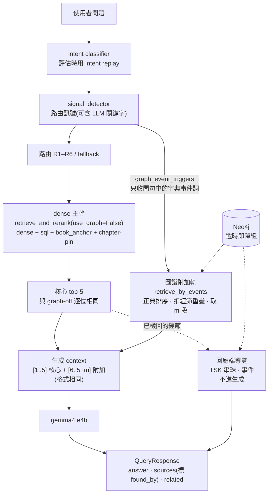

# 圖譜輔助化審查：graph 與 no_graph 比較、數據品質、架構與改造方案

> **日期**：2026-10-03
> **範圍**：Round 3 的 `results_graph`（圖譜全開，S1）對 `results_no_graph`（S0）；10-03 同一行程只跑檢索的 gate A/B（S0、S1、S2，S2 是目前線上預設，只開 graph_event）；以及 k 對齊對照 run。本報告回答 Kay 的四個問題：(1) 兩組結果與回答比較起來怎樣（§2）；(2) 實驗數據能信到什麼程度（§3）；(3) 目前架構哪裡讓圖譜幫不上忙（§4）；(4) 怎麼讓圖譜變成「輔助」（§5、§6）。
> **資料**：
> - `evaluation/results_graph/`、`evaluation/results_no_graph/`：2026-09-28 到 09-30，500 題。answer 模型 gemma4:e4b，judge gemma4:26b，RAGAS 0.4.3，top_k 5。跑的時候 HEAD 推定是 b2c27d9。
> - `evaluation/results_quick/gate_{default,all,nograph}_20261003.json`、`aux_nograph_k7_20261003.json`：目前都是 untracked，處理方式見 §6。
> - 程式碼以 HEAD 2b951e6（分支 feat/graph-strategy-gating）為準，文中的「檔案:行號」都對應這個版本。
> **腳本與中間檔**：`/tmp/claude-1001/-home-kenzx0521-Bible-RAG/d30bf42a-829c-4841-a402-489c7e3f7a43/scratchpad/`，索引在附錄 B。**/tmp 會在重開機或清理時消失**，歸檔步驟見 §6 第 1 步。
> **方法**：
> - 第一階段做了 6 組量測：compare、answers、dataquality、architecture、simulate、research。每組都由一位獨立驗證者對抗驗證：驗證者自己寫腳本重算，不 import 原分析的程式。
> - 第二階段有 3 份設計提案（no_harm、unique_value、measurement）和 2 位評審（rigor、engineering）。本報告以兩位評審的建議為主軸整合。
> - 定稿前又經兩位批判者審查；依其意見以主檢定重算了所有標題結論（`scratchpad/final/`）。
> - 全程唯讀，沒有打 backend，也沒有呼叫 LLM。唯一例外是 10-03 第一階段在背景跑的 aux_nograph_k7 run，它有打 backend，見 §3.3。
> **記號與檢定**：
> - **主檢定**是配對 sign-flip permutation 檢定（對每題差值的平均，雙尾，20 萬次）。它同時考慮方向與幅度；精確符號檢定只看方向，不一致的題很少時檢定力極低，所以只當輔助。
> - `*`：主檢定 p<0.05。`†`：95% 配對 bootstrap CI 不含 0，但主檢定 p≥0.05，也就是「依檢定而定」。方括號內一律是 95% 配對 percentile bootstrap CI（B=10000），用來報效應大小。
> - 需要時另列「W/L」（勝/負題數）與符號檢定 p。§2.3、§2.4 與 [C6] 中的顯著標記沒有用主檢定重算，一律寫成「bootstrap」。
> - 路由、題型、策略等子集都是**未校正的探索性比較**（約 30 個子集 × 12 個指標 [E5]）；只有 §2.1 的 coverage −0.034 做過 Holm 校正。
> - [A1]…[G] 是 `scratchpad/verified_facts.md` 的事實編號，都已套用驗證者的更正；本報告會把需要的數字直接寫出來。被本報告再更正的事實列在附錄 A。
> - [wf1:組/編號] 指 `wf1_results.json` 裡該組的主張或驗證者判定；[memory:名稱] 指先前 session 的實測紀錄（本輪未重跑）。

### 術語

| 術語 | 意思 |
|---|---|
| S0／S1／S2／S2' | no_graph／圖譜全開（Round 3、gate_all）／只開 graph_event（線上預設、gate_default）／S2 加上 W4 熱修 |
| aux 5+m、quota 4+1、dense@k | dense top-5 不動、後面附加 m 段圖譜段落（第一階段稱 S4）；保留第 5 槽給圖譜；graph-off 取 top-k |
| GD／GA | 附加候選取自 S2／S1 的圖譜槽 |
| 原100（legacy_head）、擴充 | 2026-07 以前的 100 題；2026-07 擴充的 400 題 |
| curated | 046040a 手工建的 18 個 Event 與別名、2026-05 的手動邊，以及靠它們得分的題 |
| R1–R6、fallback | R1 精確經節引用；R2 只有書卷加章；R3 兩個以上人名；R4 事件關鍵字；R5 多個書名；R6 地名；fallback 是其他（signal_detector.py:27-37、139-159） |
| rr、weight、fused、α | reranker 分數；策略先驗（dense 約 0.65–0.7、圖譜 0.75–0.9，config.py:84-90）；fused=(1−α)·rr+α·weight，α=0.3（router.py:307-324） |
| pin | chapter-pin、book_anchor pin、keyword-exact 事件 pin，都是先放到前面再截斷（router.py:205-217、259-265、940-985） |
| 注入段、被擠段、改標段 | 來源分類（§2.4）：圖譜帶進 top-5 而 no_graph 沒有的段落；在 no_graph top-5 但被擠出的段落；圖譜標籤但 dense 本來就有的段落 |
| rr 型入侵、先驗型 | 機制分類 [A5]：reranker 本身就會選的圖譜槽；只靠 0.85–0.9 先驗擠進來的圖譜槽 |
| touched（被改動題） | 某臂和比較臂的 context（或 top-5）不同的題 |
| hub 擴散、hub 事件 | 提摩太、保羅這類高頻人物用「有提到他」的段落佔滿 top-5；MENTIONS 極多、錨點分散的事件節點（例如受難週） |
| found_by | W1 要新增的欄位，記錄每一段被哪些策略找到 |
| phantom hit、干擾段落 | reranker 給字面與語意都無關的文件高分（Jacob 等，ReNeuIR@SIGIR 2025）；高分、相關但不含答案的段落（Cuconasu 等，SIGIR 2024） |

---

## 1. 結論摘要

1. **圖譜為什麼沒有明顯提升：三個原因疊在一起。**
   - **(a) 架構是零和替換。** 圖譜候選和 dense 候選進同一個池子，算同一個 fused 分數，一起截斷成 top-5；pin 還會再插到最前面（router.py:183-195、259-265）[D1]。所以圖譜每佔一格，就一定擠掉一格 dense 段落。
     - 兩個 run 都走 R3–R6 的 259 題裡，圖譜帶進新金經節的有 38 題，擠掉原有金經節的有 40 題，幾乎打平 [wf1:dataquality/K6]。
     - 注入段的金段落率 13.6–13.8%，被擠段 17.4–17.9%，注入的並沒有比較好；方向一致但不顯著 [A4]。
     - 圖譜槽中，rr 型入侵 45 個、先驗型 48 個，約各半；先驗型 92% 不含金經節 [A5]。
   - **(b) 錯錨集中在上游連結。** 傷害集中在人物路由：R3 vrec −0.046*（主檢定 p=0.046；但符號檢定 12/13 p=1.0、Wilcoxon p=0.10，依檢定而定）、anchor −0.045*（p=0.011）；擴充題的 PERSON anchor 0 勝 8 負（p=0.008，兩種檢定都成立）[A3]。根源有兩個：人名字典是純子字串比對，同名人物又全部展開，造成 99 題「假多人」[D4]；實體連結用 CONTAINS，第 1 名有 18% 是錯的 [D3]。現行的 graph_event 也有錯錨，因為事件錨點按中文碼位排序 [B5][D7]。
   - **(c) 稀釋加上題型飽和，而且上界本來就小。** 只有 203/499 題的 context 真的被改動 [A2]；no_graph 已經有 58% 題目 vrec=1 [F1]。把 Round 3 的圖譜槽附加在 top-5 後面（union），檢索端上界是全體 +1.6pp、擴充 +1.1pp；答案端的觀測 oracle 上界約 +0.021（499 題），扣掉雜訊的偏低估計在擴充題約為 0 [C7][wf1:compare/C9][wf1:simulate/C9]。
2. **全開對 no_graph：沒有任何指標顯著改善，擴充題有小幅傷害。**
   - 擴充題 anchor −0.012*、MRR −0.015*，兩種檢定都成立 [A1]。
   - context 被改的 151 題擴充題：anchor −0.032*、MRR −0.038*；coverage −0.034（主檢定 p=0.025，但和其他 4 個子集一起做 Holm 校正後 p=0.11）[A2]。
   - 拒答：只有 relevancy=0 這個定義接近顯著（不一致 11:3，McNemar p=0.057）；三套文字判準的結果分歧（§2.1）[A7][wf1:answers/C10]。
   - 成本：10-03 只跑檢索的 run 裡，全開的牆鐘時間約是 no_graph 的 2 倍 [A8]。
3. **線上預設 S2 是止血，不是加值。**
   - 對 S0：全體 vrec +0.0068*（p=0.020；符號檢定 14/5 p=0.064）；hit +0.008 只有 4 勝 0 負（p=0.125），不顯著；擴充題 vrec +0.002，不顯著。增益多半來自曾被手工調校過的 curated 事件，屬於樣本內 [B1][B2]。
   - 對 S1：全體 vrec +0.0103*（p=0.023）、MRR +0.0125*；擴充題 anchor +0.0115*、vrec +0.0096†（p=0.061）[B3]。**這是在選出 S2 的同一批題上重測**：b8ccda9 選「只留 graph_event」的依據就是 Round 3 這 500 題的離線模擬，所以不是樣本外證據；機制是去掉 graph_person 等策略的傷害。
   - 仍然有錯錨：EVENT_001 的第 1 名是以賽亞書 54 章 [B5]。答案端從來沒有量過 [B6]。
4. **圖譜可能的價值窄而具體，但都還沒有樣本外證據。**
   - curated 事件錨點：真實，但多屬樣本內 [B2][C3]。
   - 佐證訊號：dense top-5 中也被圖譜找到的段落，描述性的金段落率是 59% 對 34% [C6]。但 gate 和 Round 3 有 95% top-5 相同，不算獨立重現；真的把它做成重排特徵只有 +0.0027 [−0.0011,+0.0076]，不顯著 [C5]；而且 `_dedup` 已經隱性給了這個加分 [D2]。屬於值得驗證的假說（W11）。
   - 新約引舊約這類經節級的 TSK 互文 [D6]：也是假說，探索模擬的 18 組設定中只有 4 組顯著（§5.3 W9）。
5. **數據品質：檢索端可以量，答案端被生成雜訊淹沒。**
   - 檢索幾乎是決定性的：Round 3 和 10-03 gate 的同路由題有 95% top-5 逐位相同 [E3]。這個比較混了 commit、映像與 classifier 重抽，不是純 A/A，真正的 A/A 要在 W1 實測。
   - 所以檢索指標可以不扣生成雜訊、直接做配對檢定；但檢定力取決於不一致的題數，S2 等級的效應只有約 20 對不一致。
   - 答案端：296 題 context 完全相同，卻有 287 題答案不同 [E2]。
   - 憑證有遺失風險 [E11]，量尺也有幾個 bug [E6]。
6. **建議的架構：dense 主幹凍結，圖譜走附加側路，再加上回應端導覽。**
   - 推薦附加軌的理由是**結構性的，不是分數**：檢索端的 top-5 在結構上和 graph-off 相同，而且看得見圖譜做了什麼。§5.0 的選項表裡，沒有任何附加或配額方案在非 curated 的擴充題上有顯著增益；k 對齊模擬中，非 curated 擴充題只有 +0.0010（3 勝 1 負）[C3]，而且這個基線取自 k7 前綴，待重跑。
   - 答案端是否無害，結構保證不了：附加會讓 context 多約 20%，文獻指出小模型在加法串接下更容易幻覺 [C3][F3]。這要由 G3–G5 和 null 探針驗證。
   - 驗收一律和 k 對齊的 dense@(5+m) 比較；答案端只重新生成被改動的題，以題目為單位檢定，邊界與重複次數由檢定力決定（§5.3 W6）。
7. **與圖譜無關、應該先修的正確性問題。這些對分數的效應大多沒量過，不能當成「提升分數的槓桿」。**
   - D4：假多人路由。
   - D5：hybrid 實際上只跑 dense，BM25 從未生效。
   - E8：10.8% 的題目至少在一個組態的回答裡出現未解碼的 byte token（以回答計約 8.6%）；另有捏造引用。
   - E9：tokenizer bug。10-02 已在 120 題上實測，修好後檢索沒有變好，圖譜價值的 DiD +0.011，CI 含 0；α、先驗、pin 可能需要重校 [memory:project_tf5_tokenizer_bug]。
   - 決定性：sql_supplement 的 set 排序、事件詞的 set 排序、生成端沒有 seed。
   這些修好、凍結成 baseline v4 之後，再量圖譜的邊際價值。
8. **本週就開始的（§6，Phase 0 粗估 2–3 週）**：
   1. 先請 Kay 決定被刪憑證怎麼處理，在那之前不做 `git add -A`；保全憑證。
   2. 建評估工具。
   3. 重建一次 backend：決定性修正、可觀測性、Neo4j 降級、S2 熱修，以及附加軌的結構實作（都放在暫時旗標後面）。
   4. 跑 A/A、熱修 A/B，以及附加軌對 dense@6 的 retrieval-only 早期讀數；answer_replay 完成後，在現行映像上第一次量 S2 的答案端。

---

## 2. 兩組實驗比較

### 2.1 主表：S1（全開）減 S0（no_graph），Round 3

共 499 題，排除 VERSE_LOOKUP_035（ConnectTimeout，0 sources）。「context 被改」只計兩邊路由相同、top-5 sources 序列不同的題，共 195 題。不分路由時是 203 題（195 題加上 8 題路由不同且 context 不同）；其餘 296 題 context 逐字相同，其中同路由的是 292 題，另 4 題路由不同但 context 相同 [A2]。

**檢索指標**（決定性）

| 子集 | n | hit | verse_recall | anchor | MRR |
|---|---|---|---|---|---|
| 全體 | 499 | +0.002 [−0.012,+0.016] | −0.007 [−0.017,+0.003] | −0.005 [−0.016,+0.007] | −0.008 [−0.021,+0.006] |
| 原100 | 100 | +0.030 [−0.020,+0.080] | +0.002 [−0.029,+0.031] | +0.026 [−0.013,+0.070] | +0.020 [−0.025,+0.068] |
| 擴充 | 399 | −0.005 [−0.018,+0.008] | −0.009 [−0.020,+0.001] | **−0.012 [−0.023,−0.003]***（7/18，p=0.013） | **−0.015 [−0.027,−0.002]***（12/35，p=0.027） |
| context 被改 | 195 | +0.005 [−0.031,+0.041] | −0.017 [−0.044,+0.008] | −0.011 [−0.041,+0.019] | −0.019 [−0.053,+0.014] |
| 被改且屬原100 | 44 | +0.068 [−0.045,+0.182] | +0.005 [−0.068,+0.069] | +0.060 [−0.032,+0.158] | +0.045 [−0.056,+0.153] |
| 被改且屬擴充 | 151 | −0.013 [−0.046,+0.020] | −0.023 [−0.051,+0.003] | **−0.032 [−0.058,−0.006]***（7/17，p=0.017） | **−0.038 [−0.070,−0.008]***（11/32，p=0.020） |
| context 逐字相同 | 292 | 0 | 0 | 0 | 0 |

擴充題的 anchor 與 MRR 在符號檢定下也成立（p=0.043、0.001）；151 題子集的 anchor 符號檢定 p=0.064，MRR 0.002。

**答案指標與拒答**（受生成雜訊影響）

| 子集 | coverage | strict faithfulness | answer_correctness | 拒答（relevancy=0） | 拒答（聯集定義） |
|---|---|---|---|---|---|
| 全體 | −0.012 [−0.027,+0.002] | +0.001 [−0.008,+0.011] | −0.014 [−0.025,−0.002]* | +0.016 [+0.002,+0.032]†（11:3，McNemar p=0.057） | +0.010 [−0.008,+0.028] |
| 原100 | −0.006 [−0.052,+0.039] | +0.009 [−0.009,+0.034] | −0.002 [−0.032,+0.029] | +0.030 [−0.010,+0.080] | +0.010 [−0.030,+0.060] |
| 擴充 | −0.014 [−0.029,+0.001] | −0.001 [−0.011,+0.010] | −0.017 [−0.029,−0.005]* | +0.013 [−0.003,+0.028] | +0.010 [−0.010,+0.030] |
| context 被改 | −0.029 [−0.060,+0.002] | +0.002 [−0.014,+0.020] | −0.021 [−0.043,+0.001] | +0.026 [−0.005,+0.056] | +0.026 [−0.010,+0.067] |
| 被改且屬原100 | −0.011 [−0.106,+0.081] | +0.008 [−0.006,+0.023] | +0.022 [−0.037,+0.082] | +0.023 [−0.045,+0.114] | 0.000 [−0.091,+0.091] |
| 被改且屬擴充 | −0.034 [−0.063,−0.005]*（p=0.025；Holm 後 p=0.11） | −0.000 [−0.021,+0.024] | −0.033 [−0.055,−0.011]* | +0.026 [+0.000,+0.060] | +0.033 [−0.007,+0.079] |
| context 逐字相同 | −0.002 [−0.017,+0.014] | +0.001 [−0.010,+0.013] | −0.009 [−0.022,+0.004] | +0.010 [−0.003,+0.027] | 0.000 [−0.017,+0.017] |

S0 的基準值供參考：全體 hit 0.944、vrec 0.757、anchor 0.787、coverage 0.683、strict 0.979。擴充 vrec 0.775、coverage 0.670。

讀表要點：

- **全開造成小幅傷害，最可靠的證據是檢索端的 anchor 與 MRR**（決定性指標；擴充題的 anchor 與 MRR 在兩種檢定下都成立）[A1][A2]。答案端的 −0.034 做了 Holm 校正後 p=0.11，只能當提示 [A2]。
- **answer_correctness 不能當主指標。** 它和人工判斷方向一致的只有 29/47；coverage 是 40/47，而且沒有一次方向相反 [A6]。
- **拒答的結論取決於定義，目前只能說「方向偏多、證據不足」。**
  - relevancy=0：graph 23 題、no_graph 15 題，不一致 11:3，McNemar p=0.057（bootstrap CI 不含 0，主檢定 p=0.058）。
  - compare 的文字判準（首段出現「提供的經文／資料…並未／沒有／無法…」或「找不到相關的經文」，`scratchpad/compare/common.py`）：不一致 12:10；和 relevancy=0 取聯集是 13:8，都不顯著。
  - dataquality 驗證者的 regex：13:2（p=0.007），人工剔除 2 個誤判後約 11:2（p≈0.02）[wf1:dataquality/K10]。
  - answers 驗證者：嚴格 regex 下 graph 12 題、no_graph 14 題；放寬成「開頭 60 字內有否定詞、長度 <120–300 字」是 17–25 對 16–21，方向沒有可靠地反轉 [wf1:answers/C10]。
  - 人工確認 EVENT_020、GENERAL_018、GENERAL_048、PERSON_066 是金段落被擠掉後才拒答 [A7]。
- **成本**：以下是 10-03 gate 只跑檢索的牆鐘時間（quick_retrieval_eval.py:276 預設 concurrency 3），不含生成與 judge：全開 500 題 5795 秒，no_graph 2890 秒，約 2 倍；S2 是 3003 秒，多 3.9% [A8]。

### 2.2 依路由分解（兩組態路由相同的題；未校正、探索性）

| 路由 | n | vrec | anchor | coverage | strict | 拒答（rel=0） | 說明 |
|---|---|---|---|---|---|---|---|
| R1 | 90 | 0 | 0 | −0.008 | +0.019† | +0.011 | context 全同，strict 的差異是**假陽性** [E5]（4/0，p=0.125） |
| R2 | 87 | 0 | 0 | −0.011 | −0.011 | +0.023 | 檢索逐位相同 |
| R3 | 74 | −0.046 [−0.094,−0.004]*（12/13；p=0.046，符號檢定 1.0） | −0.045 [−0.086,−0.011]*（3/9，p=0.011） | −0.028 | +0.024 | +0.014 | 其中擴充 55 題：vrec −0.065*（p=0.016）、anchor −0.059*（1/7，p=0.016）[A3] |
| R4 | 87 | +0.006 | +0.026 | +0.006 | −0.002 | +0.011 | 事件路由，大致中性；擴充題 MRR −0.027†（p=0.063） |
| R5 | 83 | −0.003 | −0.009 | −0.028 | −0.022*（p=0.031） | +0.048†（4/0，p=0.125） | 拒答 9 題對 5 題 |
| R6 | 9 | −0.019 | −0.044 | −0.025 | +0.010 | 0 | 樣本太小 |
| fallback | 57 | 0 | 0 | −0.005 | −0.002 | −0.018 | 檢索逐位相同 |

另有 12 題兩組態路由不同，原因是 classifier 取樣雜訊，對全體 Δcoverage 的貢獻只有 −0.0002 [E4][wf1:dataquality/b]。

### 2.3 依策略分解（Round 3 全開，同路由 487 題）

| 策略 | 觸發題 | 注入段 | 注入段金段落率 | 被擠段金段落率 | 觸發題 Δvrec | 35 題普查中幫／害 |
|---|---|---|---|---|---|---|
| graph_person | 53 | 87 | 13.8% | 24.0% | −0.073（bootstrap 顯著；擴充 41 題 −0.097，同） | 4 ／ 7 |
| graph_event | 46 | 78 | **25.6%**（gate_all 28.6%） | 16.0% | +0.019 | 5 ／ 2 |
| entity_query | 45 | 52 | 11.5% | 20.5% | +0.015 | 5 ／ 1（都和其他策略同時出現） |
| graph（R5） | 35 | 61 | 6.6% | 14.1% | +0.004 | 1 ／ 2 |
| cross_ref_expand | 24 | 27 | 3.7% | 11.6% | +0.021 | 1 ／ 1 |
| entity_path | 14 | 15 | 13.3% | 19.4% | −0.061 | 1 ／ 1 |
| graph_place | 6 | 7 | 0% | 15.4% | −0.029 | — |
| 任一圖譜策略 | 180 | 327 | 13.8% | 18.0% | −0.018 | 11 ／ 13 |

graph_event 是唯一注入品質高於被擠段落的策略 [A4]。幫／害欄位已套用驗證者的更正，只計 24 題可歸因於檢索的極端題 [wf1:answers/C4]。

### 2.4 注入品質

- **段落四分類**（Round 3，同路由）[wf1:compare §2]：

  | 類別 | 定義 | 段數 | 金段落率 |
  |---|---|---|---|
  | kept | 非圖譜策略、兩邊都有 | 1492 | 40.8% |
  | 改標 | 圖譜標籤、但 dense 本來就有 | 226 | 59.3% |
  | 注入 | 圖譜策略帶進、no_graph 沒有 | 327 | 13.8% |
  | 被擠 | 在 no_graph top-5、不在 graph top-5 | 329 | 17.9% |

  這張表的差是 −4.1pp，沒有做群集檢定。用 gate_all 的口徑（注入 13.6% 對被擠 17.4%，180 題）做題目群集 bootstrap，差 −3.8pp [−9.4, +1.8]，不顯著 [A4][wf1:simulate/C10]。
- **機制：rr 型入侵和先驗型約各半，「注入為主」的說法不成立。**
  - 53 題可以從 fused 完整反解出 rr。圖譜槽中，rr 型入侵 45 個、先驗型 48 個；先驗型裡 44/48 不含金經節 [A5]。
  - 來源方面，在容器內重建 dense top-20 池後，注入段多半是池外的新候選：全開 95%（308/323），S2 87%（72/83）[wf1:architecture/C1]。
  - 這些入侵段落和問題共用人名或地名，屬於「相關但離題」的干擾段落，不是 phantom hit [A5]。
- **佐證訊號（描述性，bootstrap）**：dense top-5 中的段落如果也被圖譜找到，金段落率是 59% 對 34%，控制 rr 後 logit 係數 +0.79 [C6]。限制有三：gate 資料和 Round 3 有 95% top-5 相同，不算獨立重現；真的做成重排特徵只有 +0.0027 [−0.0011,+0.0076] [C5]；現行 `_dedup`（router.py:297-304）已經隱性給了約 +0.045 到 +0.075 的佐證加分 [C6][wf1:architecture/C2]。

### 2.5 目前線上預設 S2（只開 graph_event）

**同行程 retrieval-only A/B**（gate_*_20261003，500 題）：

| 對比 | 子集 | n | hit | vrec | anchor |
|---|---|---|---|---|---|
| S2 − S0 | 全體 | 500 | +0.008 [+0.002,+0.016]†（4/0，p=0.125） | **+0.007 [+0.001,+0.013]***（14/5，p=0.020；符號檢定 0.064） | +0.009 [+0.001,+0.018]*（10/4，p=0.048；符號檢定 0.18） |
| | 原100 | 100 | +0.040†（4/0） | +0.024 [+0.005,+0.048]*（9/2，p=0.030） | +0.039*（6/1，p=0.031） |
| | 擴充 | 400 | 0 | +0.002 [−0.002,+0.008]（5/3，p=0.42） | +0.001 [−0.005,+0.007] |
| | 排除 4 題手工調校題 | 496 | +0.000 | +0.0036 [−0.0007,+0.0090] | — |
| | top-5 被改的題 | 56 | +0.071† | +0.060* | +0.079* |
| | R4 | 88 | +0.045†（4/0） | +0.031*（12/3，p=0.028） | +0.041 |
| S2 − S1 | 全體 | 500 | 0 | **+0.010 [+0.001,+0.020]***（32/18，p=0.023；符號檢定 0.065） | +0.009*（20/10，p=0.026） |
| | 擴充 | 400 | 0 | +0.010 [+0.0002,+0.020]†（21/11，p=0.061） | +0.012*（17/7，p=0.025） |
| | 擴充 R3 | 55 | 0 | +0.057†（10/5，p=0.056） | +0.050†（7/2，p=0.073） |

S2 只改動 56–61 題的 top-5（同路由 56 題，含路由差異是 61 題）[B1]。sign-flip 檢定不受差值為 0 的題影響，所以「top-5 被改的 56 題」和全體的 p 相同。S2 − S1 的 MRR 是 +0.0125*（34/11，兩種檢定都成立；擴充 +0.0134*，27/8）。

**樣本內偏誤與機制**

- **hit 增益全是手工調校過的題。** 4 個 hit 增益（EVENT_008/011/014/019）都是曾被針對性調校 KG 的原100 題：046040a 的 18 個 curated Event 與別名注入，加上 EVENT_011 的 2026-05 手動邊 [B2][wf1:compare/C7]。
  - 14 個 vrec 勝題中，9 題是 legacy_head 事件 [wf1:simulate/C2]。
  - 擴充題的勝分有 64% 來自 curated anchor（GENERAL_065 +0.81、PERSON_085）[B2]。
- **S2 對 S1 的優勢也是樣本內重測。** 選 S2 用的是同一批 500 題（§3.2），擴充層本身只有邊緣證據（vrec p=0.061、anchor p=0.025）。
- **S2 的增益約一半靠先驗和 pin。**
  - 先驗壓到 0.70，或把 α 設為 0，S2 就從 +0.0068 掉到 +0.0030（不顯著）[B4]。
  - pin 共 12 次，其中 7 次是 gold，貢獻了 28% 的增益。好 pin 和壞 pin 的 rr 完全重疊，無法用 rr 下限分開 [B4]。
- **注入品質**：graph_event 注入 83 段，其中 26 段是金段落（31.3%）；被擠段 81–82 段，金段落都是 13 段（約 16%）。兩個數字的口徑不同：compare 只算 graph_event 有槽的 48 題，得 81；architecture 算 R3–R6 全部題，得 82。分開看，原100 是 18/29 對 7/29，擴充是 8/54 對 6/52，接近打平 [wf1:compare §4][wf1:architecture/C1]。
- **錯錨**：
  - EVENT_001（洪水）的第 1 名是 isa:54:0，dan:9/11 又靠先驗擠進第 4、5 名，vrec 0.70→0.44 [B5]。
  - graph_event 有 48/100 次是由 LLM 關鍵字觸發。這條路徑的槽位 gold 率是 0.273，字典觸發是 0.594 [B5]。
- **槽位數分層（事後分層、樣本內，只當探索）**：graph_event 佔 3 槽的 16 題 vrec +0.068 [+0.023,+0.122]（bootstrap）；佔 5 槽的 3 題平均 +0.033 [−0.258,+0.367]，其中 EVENT_014 +0.37（4 題 curated 題之一），EVENT_001 −0.26（`verify_answers/v_gate_slots.py`）。槽位數本身和結果相關，而且這裡把改標槽也算成 graph_event 槽，所以不能當「多槽有益」的證據。W6 保留 aux 5+2 臂，理由是探索。
- **答案端**：從來沒有量過 [B6]。能用 Round 3 答案當代理的只有 29 題，coverage +0.002 [−0.059,+0.064]，量不到效果 [wf1:simulate/C14]。

### 2.6 回答層面的逐題觀察

- **普查範圍**：「context 被改且 |Δcoverage| ≥0.25，或只有一邊拒答」的極端層共 35 題，全部做了人工判讀。
  - 其中 24 題可歸因於檢索：圖譜補到有用段落 11 題，擠掉金段落或注入錯錨 13 題，統計上分不出高下。
  - 另外 11 題的金段落兩邊都有，差異來自生成變異（至少 9 題）或量尺（至多 2 題）[A6][wf1:answers/C2]。
- **大幅擺動的比例**：|Δcov| ≥0.25 的比例，context 被改的題是 15.8%，相同的題是 8.4%，差 +7.3pp [1.5, 13.4]（bootstrap）。也就是說，約一半的大幅擺動光靠雜訊就能解釋 [wf1:answers §2]。
- **傷害型態**：
  1. 金段落被擠掉，10 題。
  2. 注入錯錨，3 題。
  3. hub 擴散。
- **和現行止血設定比較**：S2 保住了 11 題幫助中的 5 題。13 題傷害中，結構上排除了 11 題；剩下兩題都由 graph_event 造成。EVENT_001 仍在線上；EVENT_020 這次沒有出現，只是關鍵字取樣的運氣 [wf1:answers/C5]。
- **與圖譜無關的系統性問題**（graph 與 no_graph 共 1000 個回答）[E8][wf1:answers §8]：
  - byte token：亞<0xE6><0x8D><0xAB>人 = 亞捫。
  - 章節超出範圍的捏造引用，每個 run 4–5 題。
  - 用 [n] 區塊編號引用。
  - 硬湊答案，例如 VERSE_088 把「施比受更為有福」答成路 11。

**代表案例**

| question_id | 類型 | 一句話 |
|---|---|---|
| EVENT_QUESTION_008 | 幫助（但屬 curated 樣本內） | graph_event 補進王上 12:1-20（北方支派反叛）。no_graph 的 5 槽全是但以理書，答成「但以理書的國必分裂」。Δcov +1.00。 |
| PERSON_QUESTION_065 | 幫助（量尺漏判） | 稱謂共指題。entity_path 補進創 14，graph 正確答出羅得。no_graph 的 context 已有創 12:5「姪兒羅得」卻整題拒答。GT reference（創 13/19）兩邊都沒檢回，檢索指標看不見差異 [E6]。 |
| PERSON_QUESTION_044 | 傷害（上游字典 bug） | 問句裡的「約翰福音」被字典比對成施洗約翰。graph_person 塞進 4 段施洗約翰的經文，回答「只出現一次」，事實錯誤。coverage 只差 −0.25，低估了傷害 [D4]。 |
| EVENT_QUESTION_001 | 傷害（仍在線上 S2） | 「洪水」的錨點按中文碼位排序，isa:54:0 被 pin 到第 1 名，dan:9/11 以先驗擠進。vrec 0.70→0.44，回答缺了起因和結局 [B5][D7]。 |
| EVENT_QUESTION_020 | 拒答 | graph_event 由 LLM 關鍵字觸發，用凶惡園戶 3 段加撒種 2 段塞滿 5 槽，浪子的比喻被擠掉，graph 拒答，Δcov −1.00 [A7]。 |
| EVENT_QUESTION_075 | 雜訊 | 兩邊 context 逐字相同，graph 版卻捏造「馬太福音也有敵基督一詞」，Δcov −0.30。純粹是生成變異 [E2]。 |

補充：GENERAL_BIBLE_QUESTION_056、061、038 這 3 題新約引舊約的題，兩邊都答錯。但從已經檢回的金經節出發，TSK 票數最高的連結正好就是答案：太 21:13→耶 7:11 39 票，羅 4:7→詩 32:1-2 43 票，徒 15:16→摩 9:11-12 63 票 [D6]。這是 §5 W9 的動機。

---

## 3. 數據品質審查

### 3.1 可以相信的

- **兩個 run 設定對等。** judge、ragas、top_k、context_format 都相同。只有 VERSE_LOOKUP_035 一題是基礎設施失敗 [E1]。
- **自寫指標和存檔一致。** 重算存檔 sources 的指標，比對 3000/3000 一致；gate 的 id 對回段落後，4500/4500 一致 [wf1:compare §0]。
- **檢索指標幾乎是決定性的。**
  - Round 3 和 10-03 gate 的同路由題有 95% top-5 逐位相同；兩 run 共有的 1402 個槽位中，1380 個 fused 分數完全相同 [E3]。這個比較跨了 commit（b2c27d9 對 b8ccda9，後者改了 router.py）、映像（09 月對 10-02）與 classifier 重抽，不是純 A/A；W1 的基準要另外實測。
  - 所以檢索指標可以不扣生成雜訊、直接做配對檢定。但檢定力取決於不一致的題數：S2 對 S0 只有 14/5 對不一致，符號檢定 p=0.064，主檢定 p=0.020。效應更小或更集中時，就算檢索是決定性的也量不到。
  - 真實兩臂能量到的例子：全開對 S0 的擴充 MRR 12 勝 35 負，符號檢定 p=0.001，主檢定 p=0.027 [A1]。逐題取 max 的 oracle 構造上不會有負的題，只能當上界，不能當「量得出來」的證據。
- **全開在擴充題的檢索傷害**：anchor −0.012*、MRR −0.015*；151 題子集 anchor −0.032*、MRR −0.038* [A1][A2]。主檢定全部成立；符號檢定下，擴充題的 anchor、MRR 與 151 題的 MRR 也成立，151 題的 anchor 是 p=0.064。
- **S2 優於 S1**：全體 vrec、anchor、MRR 都顯著；擴充層 anchor 與 MRR 顯著，vrec 只有 bootstrap 顯著（p=0.061）[B3]。但這是樣本內重測，見 §3.2。
- **coverage 的方向可信**：和人工判斷一致 40/47，沒有一次相反 [A6]。嚴格誤判率約 5.7–8.6%；把「方向對但幅度誇大」也算進去的寬鬆誤判率最多約 29%（10/35），驗證者重判後更低 [wf1:answers/C8]。
- **三組態 strict faithfulness 都過守門**：≥0.97，彼此沒有差異 [wf1:dataquality 整體評估]。
- **byte token 汙染的規模**：三組態取聯集，54 題（10.8%）至少在一個組態出現；以回答計，graph 41/500、no_graph 44/500、semantic 44/500，合計 129/1500（8.6%）[E8]。

### 3.2 不能相信或無法證明的

- **「圖譜有正向貢獻」**：全體、原100、任何擴充 family 都不成立。原100 的增益是樣本內 [B2]。
- **「止血在樣本外也成立」**：擴充 400 題對止血決策不是樣本外。b8ccda9 的 commit 訊息寫明，「只留 graph_event」是用 Round 3 這 500 題的離線模擬選出來的；gate A/B 是在同一批題、近乎決定性的檢索上重測；擴充題在 07-11 建立後，也用在 bugA v2（07-14）與 intent 修正（07-31）的開發 [wf1:dataquality/c]。樣本外證據要等 W8 或新出的題。
- **「圖譜沒有任何價值」**：只能說「在這把量尺下沒有觀察到」。擴充題裡圖譜有機會補進新金經節的只有約 18 題 [wf1:dataquality/K5]。
- **答案端 0.01–0.02 的差異**：單次 run 的 MDE 約 0.022（全 499 題）到 0.04；每組態重複 5 次時，δ=0.02 仍需要約 619 題 [E2]。
- **任何 family 層級的結論**：n 只有 8–48，MDE 0.054–0.130 [E5][wf1:dataquality/c]。
- **S2 的答案品質**：沒有量過 [B6]。
- **擴充 151 題 coverage −0.034**：Holm 校正後 p=0.11 [A2]。
- **「圖譜導致拒答」**：只有 relevancy=0 定義接近顯著，文字判準結果分歧（§2.1）[A7][wf1:answers/C10]。
- **絕對分數的外部效度**：受到 tokenizer bug、judge 和生成器同屬 gemma 家族、GT 擴充題 70.8% 剛好 5 個要點等因素影響 [E6][E9][wf1:dataquality/h]。
- **已被推翻或更正的說法**：見附錄 A，不再引用。

### 3.3 問題表

| # | 問題 | 證據 | 對結論的影響 | 修法 | 優先級 |
|---|---|---|---|---|---|
| 1 | 生成不決定：temp 0.1、沒有 seed | config.py:69、ollama_client.py:29-32；296 題同 context 中 287 題答案不同；同 context 的 coverage 配對 sd 約 0.13 [E2] | 答案端 0.01–0.02 的效應偵測不到；用單次 run 逐題挑選，會把雜訊一起挑進來 [C1] | answer_replay：只重新生成被改動的題，context 雜湊相同就共用答案；用決定性探針決定重複次數 N；以題目為單位做檢定（W2） | P0 |
| 2 | 路由不決定：classifier temp 0.1 | intent_classifier.py:82；Round 3 有 12 題、5 次執行有 25 題出現不只一種路由 [E4] | 混進和圖譜無關的路由差；路由子集會偏 | 評估端用 intent replay；線上改 temp 0 加 seed，併入 v4（W1、W5） | P0（評估）／P1（線上） |
| 3 | 檢索跨行程不決定 | 同路由 top-5 只有 95% 相同（而且不是純 A/A），差異在 sql_supplement [E3]；router.py:352-364 先存 set 再轉 list，:729-733 取前 3 章；signal_detector.py:94、107、115 用 list(set(...))；entity_dicts.py:100 對 `set[str]` 的 EVENT_KEYWORDS（:23）按長度排序，等長的詞保留雜湊順序；Dockerfile、docker-compose.yml 都沒設 PYTHONHASHSEED | A/A 不可能達到 ≥99.5%；有多個事件詞的題，S2 或附加軌的結果會隨重啟改變 [評審 engineering]。這幾處是否就是全部的非決定來源，要等 A/A 實測 | 依出現順序去重（dict.fromkeys）；排序鍵改成 (−len, kw)（W1） | P0 |
| 4 | k 不對齊，比較方式構造上必然不降 | union ⊇ base；S4 對 S0@5 的 `*` 沒有資訊量 [C3] | 高估附加模式 | ab_compare 遇到不對齊就拋錯；對照組用獨立的 top_k 請求（W2） | P0 |
| 5 | 用策略標籤歸因會失真 | `_dedup` 在 router.py:297-304；全開時 41% 的圖譜標籤槽 dense 本來就有 [D2] | 高估圖譜貢獻 | 加 found_by 欄位（W1） | P0 |
| 6 | 來源資訊不足 | meta 沒有 commit、答案模型、策略、溫度；沒存候選池、intent、逐點 coverage [E10]；evaluator.py:164-184 | 無法證明兩臂只差圖譜；rr 只能反解 [A5] | 加 run manifest 與 debug_pool（W1） | P0 |
| 7 | 憑證可能遺失 | 40 個被追蹤的檔案在工作區被刪；gate 與 k7 檔 untracked；GN-41 只在 /tmp。k7 檔是 10-03 背景 run 寫的，有打 backend 和 classifier [E11][wf1:simulate/missed] | 止血與 STOP 兩個決策會無法追溯 | §6 第 1 步 | P0 |
| 8 | 樣本內調校與樣本內選擇 | S2 的 4 個 hit 增益全是手工調校題；擴充題勝分 64% 來自 curated anchor [B2]；S2 本身是在這 500 題上選出來的（§3.2） | S2 的「增益」與「優於 S1」都被高估 | 一律分層報告 curated；決策用的 held-out 要凍結且從未用於選擇 | P0（報告） |
| 9 | 稀釋與檢定力不足 | 只有 203/499 題被改 [A2]；要 80% 檢定力約需 341 題被改動 [C8] | 全體平均看不出效應 | 只看被改動的題，另建定向題集（W8） | P1 |
| 10 | 多重比較與檢定不一致 | 約 30 個子集 × 12 個指標；R1 strict 是假陽性 [E5]；bootstrap 與符號檢定常給出不同結論（§2） | 會出現假顯著 | 預先登記主檢定（sign-flip permutation）與不超過 6 個主比較，做 Holm 校正（W0、W2） | P1 |
| 11 | GT 解析 bug、reference 太窄、缺節 | GENERAL_043、EVENT_009、PERSON_055/065、5 題金經節含語料缺節 [E6] | 產生量尺假象；消歧與稱謂題看不見圖譜的影響 | GT v2（W5f） | P1 |
| 12 | 拒答結果隨定義改變 | relevancy=0 是 11:3、p=0.057；三套文字 regex 分別得到 12:10、13:2、12 對 14 題 [A7][wf1:answers/C10] | 結論會隨定義翻轉 | 預先登記精確的 regex 與人工複核規則（W6 G4） | P1 |
| 13 | byte token 汙染 | 54 題（10.8% 題目；8.6% 回答）；context 裡完全沒有 '<0x' [E8] | 使用者看得到亂碼；和組態無關 | 查根因，加守門解碼（W5b） | P1 |
| 14 | tokenizer bug | 線上是 transformers 5.0.0，全形逗號和問號變成 unk [E9]。10-02 已在 120 題、完整候選池上實測：全修後 no_graph vrec −0.017 [−0.045,+0.013]、graph −0.006，圖譜價值 DiD +0.011，CI 含 0 [memory:project_tf5_tokenizer_bug] | Round 0–3 的絕對數字都在這個編碼下取得；修了不會讓檢索變好；α、先驗、pin 可能是在 bug 分數下調出來的 | 對齊索引端的 5.3.0，修完重校 α、先驗、pin（W5e） | P1 |
| 15 | 基礎設施失敗被算進聚合 | VERSE_LOOKUP_035 [E1] | 聚合值偏移約 0.002 | 標成 invalid，不算進聚合（W1） | P1 |
| 16 | judge 與生成器同屬 gemma 家族 | gemma4:26b 評 gemma4:e4b [wf1:dataquality/h] | 若圖譜改變答案風格（例如拒答變多），配對比較無法完全抵消偏誤 | 抽 100 對答案換第二個 judge 重判 | P2 |
| 17 | 指標效度 | answer_correctness 和人工一致只有 29/47 [A6]；strict 有 90.6–91.6% 恰為 1；hit 太寬鬆 [E7] | 主指標選錯會誤判 | 維持既定作法：coverage 當主指標、strict 守門，檢索看 vrec 與 anchor | 已定案 |

---

## 4. 架構審查

### 4.1 目前管線與圖譜觸點

| # | 步驟 | 行為 | 檔案:行號 |
|---|---|---|---|
| 1 | 入口 | classify_intent → retrieve_and_rerank → generate_answer | routers/query.py:45、48、65 |
| 2 | intent LLM | temp 0.1；輸出 intent、entities、keywords | utils/intent_classifier.py:82 |
| 3 | 訊號偵測 | 書名、人名、地名、事件都用字典做純子字串比對。intent=event 且字典沒命中時，**直接拿 LLM keywords 當事件詞** | utils/signal_detector.py:85-115（104-106）；utils/entity_dicts.py:61-103（72、88、101 都是 `in` 比對） |
| 4 | 圖譜閘門 | `resolve_graph_strategies` 與 `_graph_on`；預設 RAG_GRAPH_STRATEGIES=["graph_event"] | utils/retrieval/router.py:64-80 |
| 5 | 各路由 | R1 992、R2 1025、R3 1069、R4 1199（graph_event 在 1230）、R5 1312（1421）、R6 1480、fallback 1597 | router.py |
| 6 | 候選池 | `_dedup` 同一 id 只留 weight 最高的那份，**來源標籤一起被覆寫** | router.py:297-304 |
| 7 | rerank、融合、截斷 | 對整池 rerank → fused=(1−α)·rr+α·weight，α=0.3 → `ranked[:k]` | router.py:183-195、307-324 |
| 8 | pins | chapter-pin（依 top_k 運作）→ book_anchor pin → keyword-exact 事件 pin（無條件放到前面再截斷） | router.py:205-217、259-265、940-985 |
| 9 | 圖譜事件檢索 | 依關鍵字順序查 Event，用 seen_ids 去重；標記 keyword_exact、anchor_rank；weight 0.85 | utils/retrieval/graph_retriever.py:75-120 |
| 10 | 事件錨點 | `ORDER BY p.book_name`（中文碼位）、`p.verse_range`（字串）、LIMIT 10 | database/neo4j_db.py:285-312（306） |
| 11 | 實體連結 | CONTAINS canonical 或 alias，按 mention_count 排序，不分 label | database/neo4j_db.py:53-74 |
| 12 | 生成 | 每個來源一個區塊 `[i] 書 第N章 - 標題 (節)`；溫度取自設定；沒有 seed | utils/generator.py:32-56、83-90；config.py:69；utils/llm/ollama_client.py:29-32 |
| 13 | 回應 | sources、IntentInfo（沒有 keywords）、RetrievalStats（pydantic，沒有 extra 設定，未宣告的鍵會被忽略；這推翻了事實清單 D9 的「原樣序列化」）、QueryResponse（沒有 KG 欄位） | routers/query.py:70-96；models/response.py:26-29、32-42、45-49 |

各圖譜策略的觸發方式、查詢與預設狀態：

| 策略 | 觸發 | 查詢特性 | 先驗 | 目前預設 |
|---|---|---|---|---|
| graph_event | R4 的 detected_events；R5 有事件詞時 | CONTAINS、碼位排序；有 keyword pin | 0.85 | **開** |
| graph_person | R3，字典判定 ≥2 人 | CONTAINS 連結；LIMIT 沒有 ORDER BY | 0.8–0.9 | 關 |
| graph（R5） | LLM 原始的 entity_names | 同上 | 0.75–0.9 | 關 |
| graph_place、entity_path、entity_query、cross_ref_expand、cross_reference | R3–R6 | 見 [D3][D6][D7] | 0.5–0.85 | 關 |

### 4.2 零和耦合與標籤失真

- **單一池、單一 fused 排序、單一截斷。** pin 是先放到前面再截斷，所以每多一段圖譜段落，就少一段 dense 段落 [D1]。
  - S2（R3–R6 全部題）：graph_event 的標籤槽中，改標 65 格（金段落率 0.662）、注入 83 格（0.313），被擠掉 82 格（0.159）[wf1:architecture/C1]。§2.5 的 81 段是只算 graph_event 有槽的 48 題。
  - S1：注入 323 格（0.136），被擠掉 322 格（0.174）。
- **錯錨進入 top-5 有三條路**：
  1. rr 型入侵；
  2. 0.85–0.9 對 semantic 0.65–0.7 的先驗，在 α=0.3 下約多 +0.045 到 +0.075 [wf1:architecture/C2]；
  3. 無條件的 pin。
- **`_dedup` 讓圖譜版本覆蓋 dense 版本。** 全開時 41% 的圖譜標籤槽（229/552）其實 dense 本來就有。現在的 `Source.strategy` 回答不了「這一段是不是只有圖譜找得到」這個問題 [D2]。

### 4.3 圖譜觸點的程式缺陷

都已核對到檔案:行號。

1. **事件錨點按碼位排序。** neo4j_db.py:306 用 `ORDER BY p.book_name`，以賽亞 < 但以理 < 創世記；次鍵 verse_range 是字串，所以 '10-12' 排在 '2-5' 前面。
   - 受難週 LIMIT 10 取到的全是約翰福音 18–19 章 [D7][wf1:architecture/C3]。
   - router.py:956 和 neo4j_db.py:288 的註解宣稱是「書卷章節升序」，和實際不符。
2. **LLM 關鍵字會觸發圖譜。** signal_detector.py:100-106 這條路徑的槽位 gold 率 0.273，字典觸發是 0.594；而且也能觸發無條件 pin，例如 PERSON_096 的「醫治」被 pin 成 act:28:0 [B5][wf1:architecture/C3]。
   - 不能直接刪掉 104-106：最多 48 題會離開 R4。這 48 題混了兩條路徑，100-102（LLM 關鍵字剛好對上字典）和 104-106（直接用 LLM 原始詞），log 沒記 keywords，無法拆開，所以 48 是上限。要做的是把「圖譜觸發」和「路由訊號」拆開 [wf1:architecture/C4]。
3. **實體連結用 CONTAINS、取前 3、不分 label。** GT 觸發的 94 個人名中，18% 的第 1 名就錯了，例如亞伯→亞伯拉罕、利未→馬太 [D3]。
4. **字典是純子字串比對**，不消耗已匹配的片段，也不遮掉書名；另有 7 個別名同時屬於多人。結果是 99 題「假多人」，Round 3 的 74 題 R3 中約有 26–30 題是被假命中送進去的 [D4]。
5. **cross_ref 的種子名單沒有 `hybrid_*`**（router.py:618-622），而 dense 的標籤是 `hybrid_{search_mode}`（hybrid_retriever.py:109）。所以 dense 永遠當不了種子 [D6]。
6. **多個查詢有 LIMIT 但沒有 ORDER BY。** 結果是固定的，但選出的子集任意、和問題無關 [D7]。
7. **graph 臂的順序不決定。** detected_events 由 list(set(...)) 產生（signal_detector.py:107），而 match_events_in_text 本身也從 set 迭代（entity_dicts.py:23、100）；retrieve_by_events 又依關鍵字順序用 seen_ids 去重（graph_retriever.py:83-100）。先處理的關鍵字決定共享段落的 keyword_exact 和 anchor_rank，進而影響 pin 的資格（router.py:963-969）[評審 engineering]。
8. **Neo4j 是硬依賴，而且沒有查詢逾時。** main.py:45 的 init_driver 失敗時，整個服務起不來；docker-compose.yml:29-30 的 neo4j 設成 service_healthy。各呼叫點本來就會接住 get_driver 的 RuntimeError，所以改成非硬依賴大約 5 行 [D8]。

### 4.4 上游問題：與圖譜無關、應該先修，但對分數的效應多半沒量過

| 問題 | 證據 | 影響範圍 | 根治方式 | 會不會改變基線 |
|---|---|---|---|---|
| D4 假多人路由 | 99 題；R3 中約 26–30 題由假命中觸發；書名造成的人名命中 136 次 [D4][wf1:architecture/C6] | 所有組態的路由（no_graph 一樣受影響）；也是錯人種子的源頭 | 最長優先並消耗已匹配片段、遮掉書名、同名別名只算 1 個「待消歧」人物 | 會 |
| D5 hybrid 實為 dense-only | pyproject.toml:10 把 qdrant-client 釘在 <1.9.0（容器內是 1.8.2）；qdrant_hybrid.py:22-34 用 hasattr 判斷後靜默降級；ARCHITECTURE.md:508-509 宣稱有 RRF [D5] | 所有路由的 dense 候選；BM25 從未生效；效應未量 | 升級 client，以預先登記的門檻做 BM25 A/B，決定去留 | 會 |
| E8 byte token | 54 題（10.8% 題目、8.6% 回答）；這些字在 context 裡是正常的 [E8] | 使用者看得到亂碼 | 先查 Ollama 和模型的 byte-fallback 根因；回傳處加守門解碼並計數 | 會（答案文字） |
| E8 捏造引用與 [n] 引用 | 章節超出範圍的引用每 run 4–5 題；也有用 [n] 區塊編號引用的 [E8] | 使用者看得到；strict faithfulness 不一定抓得到 | 生成後檢查引用的章節是否存在並計數；prompt 要求書卷章節格式（W5b） | 會（答案文字） |
| 語料瑕疵 | bible_md/加拉太書.md:300 把註腳「凶殺二字」併進經文 [E8]；5 題金經節含語料缺節 [E6] | 檢索與生成都會看到 | 修語料、重建索引；verse_coverage 扣缺節（W5f） | 會 |
| E9 tokenizer | 線上 transformers 5.0.0，索引端 5.3.0 [E9]；10-02 實測修好後檢索沒變好 [memory:project_tf5_tokenizer_bug] | reranker 和 embedder 的查詢端 | 對齊版本；修完重校 α、先驗、pin | 會 |
| E2/E4 生成與路由不決定 | 287/296 題答案不同；12–25 題路由不只一種 [E2][E4] | 所有答案端 A/B | 加 seed、classifier 溫度改 0；評估端用 intent replay | 會（路由） |
| E3 sql_supplement 與事件詞順序 | router.py:352-364、729-733；signal_detector.py:107；entity_dicts.py:100；沒設 PYTHONHASHSEED | 跨行程只有約 95% 相同 | 依出現順序去重、排序鍵加字串 | 只是去除隨機性 |
| E7 生成端失分 | vrec=1 的 290 題 coverage 只有 0.818 [E7] | 生成品質 | prompt 與引用規則（另案，見 2026-07-13 紀錄） | 會 |
| book_anchor 精確度偏低 | top-5 中 book_anchor 的 gold 率只有 0.097（62 格）[wf1:architecture §3.5] | 不屬於圖譜，但同樣是低精確度的注入 | 另案稽核 | 會 |

### 4.5 文件與程式不一致

- ARCHITECTURE.md:508-509 宣稱有 RRF hybrid，但實際上從未執行（D5）。
- ARCHITECTURE.md:512-513 寫錨點「按書卷章節升序」、種子「round-robin 跨策略」，兩者都與程式不符。
- `evaluation/README.md:3` 寫 judge 用 Claude API，實際上 Round 3 用的是 gemma4:26b。我核對過，原事實清單寫的 README.md:3 其實是 evaluation/README.md:3 [D11]。
- router.py:956、neo4j_db.py:288 的註解宣稱錨點按書卷章節升序。

---

## 5. 圖譜輔助化方案

### 5.0 輔助化選項與現有證據

檢索端數字都是 retrieval-only、在這 500 題上的樣本內結果；「非 curated」是排除附加段含 curated 錨點的題（`scratchpad/final/v18_tests.py`，與 v18 同法重算）。

| 選項 | 機制 | 檢索端證據 | 答案端 | 風險與成本 | 定位 |
|---|---|---|---|---|---|
| S2（現行） | 同池，只開 graph_event | 對 S0 全體 vrec +0.0068*、擴充 +0.0024（p=0.42）；4 個 hit 增益全是 curated，排除後 vrec +0.0036 不顯著 [B1][B2] | 未量 [B6] | 錯錨仍在；仍是零和 | 現況；W4 熱修 |
| S2'（W4） | S2 加正典排序、只吃字典事件詞 | 未量；預期去掉 EVENT_001 這類錯錨 | 未量 | 觸發題變少，部分勝題可能消失 | Phase 0 A/B |
| aux 5+1（GD） | top-5 不動，附加 1 段 graph_event | 對 dense@6：全體 +0.0083*（16/2，p=0.003）、原100 +0.0266*（10/1，p=0.005）、擴充 +0.0036（6/1，p=0.20）、非 curated 擴充 +0.0010（3/1，p=0.63）；16 勝中 8 題靠 curated [C3] | 未量 | context 在觸發題上多約 20% [C3]；小模型加法串接風險 [F3] | W6 主候選，理由是結構 |
| aux 5+2（GD） | 附加 2 段 | 對 dense@7：全體 +0.0094*（16/0）、擴充 +0.0041*（6/0，p=0.031）、非 curated 擴充 +0.0015（3/0，p=0.25）[C3] | 未量 | context 約為 m=1 的兩倍（推估，未實測） | W6 探索臂 |
| quota 4+1 | 保留第 5 槽給圖譜，context 長度不變 | 全體 +0.005~0.006*，擴充不顯著；對 S2 −0.0008 [−0.0028,+0.0012] [C4][wf1:simulate/v17] | 未量 | 第 5 名被換掉 | W6 對照臂 |
| 只當重排特徵 | 圖譜只替 dense 已取回的段落加權，不新增候選 | 預設 +0.0027 [−0.0011,+0.0076]、全開 +0.0007 [C5] | 未量 | 增益小；佐證效應可能是樣本內 [C6] | W11 安全網 |
| 題目層級閘門 | 依路由、觸發或 dense 不確定程度決定開不開圖譜 | 2-fold held-out 落在 −0.008~+0.004，從未顯著為正 [C1] | — | — | 否決 |
| 回應端導覽 | 圖譜結果只回給前端，不進生成 | 結構上不影響 QA 指標 [F5] | 不影響 | 連結錯誤會在 UI 上顯示錯人 [D3] | W7 |
| TSK 互文橋 | 從 top-1 經節附加 1 條跨約互文 | 18 組設定中 4 組顯著；其他擴充題 18/18 顯著為負；閘門在樣本內調出 | 未量 | 非目標題淨傷害 | W9 假說 |

aux 的 k 對齊數字都來自同一個基線：aux_nograph_k7 的前 5+m 名，而且只用 top-5 和 gate_nograph 一致的 482 題。chapter-pin 依 top_k 運作（router.py:205-217），這種基線不等於獨立的 top_k=6/7 請求，被排除的 18 題也不是隨機的。所以在 W2 用獨立請求重跑之前，這些數字不能當設計依據。

**這張表裡沒有任何附加或配額方案，在非 curated 的擴充題上有顯著增益。** 推薦 aux，是因為它在結構上不擠掉 top-5、能看見圖譜做了什麼，而且 curated 事件的增益可以解釋；不是因為分數。

### 5.1 設計原則

1. **dense 主幹凍結。** 核心 top-5 由 graph-off 的同一條程式路徑產生，所以在結構上和 no_graph 逐位相同。這只保證檢索端；答案端是否無害要另外驗證。
2. **圖譜只有三個出口：**
   - 附加段：最多 m 段，接在核心後面，依 keyword_exact、via_event_mc、anchor_rank 排序，不依 rr 排序 [C3][B4]。
   - 回應端導覽：不進生成器 [F5]。
   - 之後可能加的佐證特徵：不新增候選 [C5][C6]。
3. **只有高信心觸發才有資格。** 條件是：字典完全相等、命中唯一、不是書名、不是 hub 事件。LLM 關鍵字只能決定路由，不能觸發圖譜 [B5]。
4. **圖譜可以降級。** Neo4j 掛掉或逾時，系統就等於 graph-off [D8]。
5. **根治優先。** 修連結、排序、決定性與上游 bug，不靠調 α、先驗或 rr 門檻來掩蓋 [C2][B4][G]。
6. **每個改動都附可能失敗的預先登記驗收**，並先用現有資料試跑一次，確認在現狀下會得到預期的結果。要宣稱「圖譜有價值」，必須在樣本外的定向題集上，並和 k 對齊的對照比較 [C3][C8]。
7. **加法串接的已知風險。** 文獻中，固定預算內保留配額（KG-Infused、GraphRAG Local）和真正的加法串接是兩回事。後者在小模型上會變差：Han 等人的附錄 H 中，Llama-3.1-8B 串接後在 Null 題更容易幻覺；HybridRAG 串接後 recall 沒有增益，precision 從 0.84 降到 0.79 [F3]。gemma4:e4b 比 8B 還小，現有 500 題又沒有 null 層，所以 W6 要另加 null 探針。

### 5.2 目標架構

文字說明：

- **主幹**完全沿用現行 `retrieve_and_rerank(use_graph=False)`，不改。
- **附加軌**只在 R4、R5 且有字典事件詞時，呼叫既有的 `retrieve_by_events`（graph_retriever.py:75）。
  - 候選先扣掉和核心經節重疊的段落，再依 (keyword_exact 降冪, via_event_mc 升冪, anchor_rank 升冪) 排序，取 m 段。
  - 附加段當成普通的第 6、7 個區塊，格式和 generator.py:32-56 完全相同。這樣「附加臂」和「dense@6」的答案端比較就只差一段內容。
  - keyword pin 不刪，改成附加軌的第一優先。
- **導覽**只從已檢回的段落出發，不從問句字串去連結實體。

### 5.3 元件表

優先級：P0 本週；P1 下一階段；P2、P3 依序在後。工時見 §5.4。

| ID | 元件 | 角色 | 機制（摘要） | 落點 | 預期 | 風險 | 驗收（主要失敗條件） | 優先級 |
|---|---|---|---|---|---|---|---|---|
| W0 | 憑證保全與預先登記 | 讓決策可以追溯 | 依 Kay 的決定還原或封存 40 個被刪的檔案；commit gate 與 k7 檔；GN-41 移進 repo；建 prereg 範本；加 test_evidence_paths | git 操作；evaluation/tests/、evaluation/experiments/ | 止血和 STOP 兩個決策可追溯 | repo 變大 | 測試在現況下必須 FAIL、修復後 PASS；GN-41 的 sha256 必須相符 | P0 |
| W1 | 決定性與可觀測性 | 讓「圖譜只是輔助」可以被驗證 | sql_supplement、signals、事件字典改成穩定順序；found_by、candidate_pool、intent keywords；intent_override（受 RAG_EVAL_MODE 保護）；完整 meta | router.py:297-304、352-364、183-195；signal_detector.py:94、107、115；entity_dicts.py:100；response.py:26-42；query.py:45；evaluator.py:164-184 | 真正的 A/A 達到 ≥499/500；歸因不再看策略標籤 | 觀測程式本身改變了行為 | 同行程加 replay，觀測開關前後 500/500 逐位相同；跨行程 A/A ≥499/500 | P0 |
| W2 | 評估工具 | 讓驗收可以失敗、也可以信任 | paired.py（sign-flip permutation、符號檢定、McNemar、群集 bootstrap、Holm）；ab_compare 遇 k 不對齊就拋錯；answer_replay（context 雜湊共用答案、決定性探針、golden prompt 測試） | 新檔：evaluation/src/stats/paired.py、evaluation/ab_compare.py、evaluation/answer_replay.py；quick_retrieval_eval.py 加 --gt、--arms、--intent-replay | 杜絕 union 這類比較；答案端第一次能量 | judge 的時間成本還沒量 | 在現行映像上重現正對照；A/A 不得觸發；虛無模擬的 size ≤0.05 | P0 |
| W3 | Neo4j 降級 | 運維上的不傷害 | main.py:45 只接住 verify_connectivity 的失敗；compose 改成 service_started；每次呼叫加 asyncio.wait_for；**不做斷路器** | main.py:37-50；docker-compose.yml:29-30；圖譜呼叫點 | Neo4j 掛掉時退化成 graph-off | 逾時本身會成為新的非決定來源 | 停掉 Neo4j 後服務能啟動、請求全部回 200；正常狀態下逾時 ≤1% | P0 |
| W4 | S2 熱修 | 修好線上的錯錨 | Cypher 傳入 `$book_order` 做正典排序，LIMIT 的語意才正確；新增 graph_event_triggers，只收字典事件詞；保留 pin | neo4j_db.py:285-312；signal_detector.py:98-109；graph_retriever.py:75-120；router.py:1230、1421 | EVENT_001 這類錯錨消失 | 觸發率下降，部分勝題可能消失 | 非 gold pin ≤3 個；7 個 gold pin 至少保留 6 個；G1 | P0 |
| W5 | 上游根治套組，凍結 baseline v4 | 決定「核心」到底是什麼 | 字典（D4）、生成輸出守門（E8）、seed 與 classifier 溫度、BM25（D5）、tokenizer（E9）、GT v2 與語料、文件 | entity_dicts.py:61-103；ollama_client.py；pyproject.toml:10；qdrant_hybrid.py；reference_parser.py 等 | 基線變得正確、可重現；分數不一定變好 | 所有基線都會變，Round 0–3 不再能直接比較；α、先驗、pin 可能要重校 | 每一項都有預先登記的通過或不通過條件（見細則） | P1 |
| W6 | 雙軌：dense 核心加圖譜附加軌 | 圖譜不搶 top-5 | 核心照舊；附加軌只呼叫 retrieve_by_events；graph_mode 決策後只保留 2 種模式 | routers/query.py:48-65 呼叫點；stats 帶出 graph_event_triggers（router.py:145、282）；request.py、response.py | 檢索端 top-5 在結構上不會被擠；答案端是否無害待 G3–G5；非 curated 題的增益預期很小（Event 名稱 97.8% 等於段落標題 [G]，dense 多半也找得到） | context 變長約 20% [C3]；小模型加法串接下更易幻覺或拒答 [F3][A7] | G1–G6 與 null 探針 | P1 |
| W7 | 回應端導覽 | 最安全的輔助形式 | 先做 TSK 串珠（從最終 top-k 出發）和字典事件；人物要等 W12 通過才開 | response.py:45-49；query.py:65-96；neo4j_db.py | 對 QA 指標零影響；KG 事實送進生成器在 GN-41 上的增益是 0.000 [G]，所以只做導覽 | 連結錯誤會變成 UI 上的錯人 | sources 與 prompt 500/500 逐位相同；人工精確率 | P2 |
| W8 | 圖譜原生題集 GN-H | 讓「圖譜有沒有價值」量得出來 | 先做 60 題 pilot，盲出題；設 relation、curated、control、null 四層；有 GO/STOP 規則 | evaluation/benchmarks/gn_h/ | 被改動的題數達到可檢定的規模 | 出題成本高 | GO：推算所需題數 ≤1,000 等條件 | P2 |
| W9 | TSK 經節互文橋 | 補 dense 推不出來的新約引舊約關係 | 種子是核心 top-1 的經節；TSK 經節級資料匯入 PG；只取跨約、votes≥20 的 1 條 | 新檔 tsk_verse.py；匯入 PG 的腳本 | 只在互文家族有效（假說） | 閘門是在樣本內調的；沒閘門時淨傷害 | 在獨立 held-out 上主檢定顯著為正；非目標題用新題驗非劣 | P2 |
| W10 | 事件登錄表 | 慣用名對應多處經文的聚合 | 由獨立來源整理別名到錨點，再補 Event.aliases | data/event_gazetteer.yaml；entity_dicts.py:22-46 | 補 dense 完全漏掉的錨點；抽取的 1,694 個 Event 有 97.8% 名稱等於段落標題 [G]，這正是需要別名層的原因 | 可能和 BM25 的效果重疊；容易重演樣本內 | 登錄表先凍結，再由另一人出題；新別名層的 CI 下界 >0 | P3 |
| W11 | 佐證特徵 | 安全網 | 圖譜只能替 dense 已取回的段落加分 | router.py 各路由在 _dedup 前取交集，每路由 3–5 行 | 增益小，約 0 到 +0.003 [C5] | 佐證效應可能只是樣本內現象 | 在完整候選池與 held-out 上重現 C6，否則撤回 | P3 |
| W12 | 身分層修復與人物輔助 | 讓人物相關功能有可信的基礎 | 實體連結改完全相等、過濾 label、唯一命中，否則棄權；重建 MENTIONS；處理 168 個同音合併的 Person 節點 [G]；Theographic 只取 Validated 欄位 | neo4j_db.py:53-74；MENTIONS 重建腳本 | 只是解鎖 W7 人物區塊等功能，不保證檢索增益；GN-41 中 KG 覆蓋只有 9/104 答案組 [G] | 工程量大；授權是 CC-BY-SA | 94 個人名的第 1 名錯誤率 ≤5%，並報告棄權率 | P3（條件式） |

#### 驗收細則

每一條都必須「可能失敗」，在看到結果前登記，並先用現有資料試跑一次。

**W0 憑證保全**
- `evaluation/tests/test_evidence_paths.py` 會掃描 docs/records、paper/record、evaluation/README 裡引用的 `evaluation/results_*` 路徑，斷言每一個都在 `git ls-files` 中。它必須在目前狀態（40 個檔案被刪）下 FAIL，處置後 PASS。如果現在就 PASS，代表掃描規則漏抓了。若 Kay 選擇封存，測試改為檢查封存 tag 中存在這些路徑。
- repo 內 `gn_dev.json` 的 sha256 必須等於 `1f6301359bc9c69d12a7861d54db091f1e2c4ec0e9d2a1abb46f7ffd720ff818`。
- ab_compare 讀到帶 decision 的報告時，要檢查 prereg 的 commit 時間早於 run 的開始時間；否則自動降級為 exploratory。要用一個故意晚登記的假實驗，確認這個檢查真的會觸發。

**W1 決定性與可觀測性**
- **機制：**
  - router.py:352-364 改成 `dict.fromkeys` 保留候選出現的順序。
  - signal_detector.py:94、107、115 改成依出現順序去重；entity_dicts.py:100 的排序鍵改成 `(-len(kw), kw)`，否則等長事件詞仍會依 PYTHONHASHSEED 換順序。也可以在 Dockerfile 固定 PYTHONHASHSEED，但改排序鍵比較根本。
  - `_dedup` 合併成 `found_by:set`，weight 仍取最大值，暫不改變行為。
  - fusion 之後、截斷之前存下整個候選池：id、found_by、weight、rr、fused、anchor_rank、keyword_exact、pin 類型、最終名次。
  - RetrievalStats 必須明確宣告新欄位，因為 pydantic 會忽略沒宣告的鍵（models/response.py:32-42）。
  - IntentInfo 補 keywords 和 parse 成功旗標。
  - intent_override、debug_pool 只有在 `RAG_EVAL_MODE` 時才接受。
  - meta 補上：git HEAD 與 dirty 狀態、answer_model、溫度、seed、graph_strategies、α、hybrid 實際模式、transformers 與 qdrant-client 版本、映像 digest、GT 的 sha256、intent 檔的雜湊。
  - 0 sources 或連線錯誤的題標成 invalid，不算進聚合。
- **驗收：**
  - (a) 同一映像、同一行程、intent replay：debug_pool 開與關跑 500 題，top-5 id 序列與 context 區塊必須 500/500 逐位相同。任何 1 題不同，就代表「觀測」改變了行為。
  - (b) 修之前，先在現行映像上跑一次真正的 A/A（同一映像、兩個獨立行程、intent replay 的 S0@5），記下基準；95% 是 Round 3 對 gate 的數字，混了 commit 與映像差異，不能當基準。修好之後，同條件 A/A 的 top-5 逐位相同要 ≥499/500，每個例外都要查出根因。
  - (c) found_by 稽核只在 top-5 與 gate_all 相同的題上比對，避免非決定性造成假失敗：每一個「圖譜標籤但 dense 也有」的槽，found_by 都必須包含 dense。
  - (d) manifest 缺任何一個必要鍵，collector 就必須拒絕寫檔。這要先寫一個會失敗的單元測試。

**W2 評估工具**
- **檢索：**
  - 加法臂和 S0@5 比較時直接拋錯，除非加上 `--allow-unaligned` 並在報告標注「構造上不降」。
  - k 對齊的對照必須是獨立的 top_k=5+m 請求，不能拿 k7 結果的前綴。原因是 chapter-pin 依 top_k 運作（router.py:205-217），而 k7 的前 5 名和 gate_nograph 只有 482/500 一致 [C3]。
  - `load_ground_truth()` 在 quick_retrieval_eval.py 有兩個呼叫點（:135、:161）；函式本身（evaluation/src/data_loader.py:13）已經接受 path，加 `--gt` 要改兩處。
- **統計：**
  - 主檢定是配對 sign-flip permutation（對平均差，雙尾）；符號檢定與 McNemar 當輔助；bootstrap CI 用來報效應大小。報告每個結論時都寫明用的是哪一種。
  - 虛無模擬下的實際 size 要 ≤0.05，並報告實際值。精確符號檢定因為離散而偏保守，評審 rigor 算出 n=56 時約 0.044，n=60 時約 0.027；所以不要求落在 0.04–0.06，否則正確的實作也會失敗。
  - 門檻不能直接拿歷史點估計。
- **重現（工具自檢；以下都是樣本內校準，不是驗證）：** 在現行映像上，
  - (a) S2−S0 全體 Δvrec 點估計落在原本的 CI [+0.001, +0.013] 內，n_touched 落在 56–61±5；
  - (b) 已知傷害要量得出來：S1−S0 擴充 MRR 為負，主檢定與符號檢定都 p<0.05（現狀試跑 p=0.027、0.001）；
  - (c) S2−S1 全體 Δvrec 主檢定 p<0.05（現狀試跑 p=0.023）。這一項不用符號檢定當判準：32/18 的雙尾符號檢定是 p=0.065，照文字實作會失敗；
  - (d) 用獨立 top_k=6 請求重算 C3 的 GD m=1，點估計落在 [+0.0029, +0.0147] 內。
  任何一項不重現，都要先解釋差異。
- **answer_replay：**
  - 做法：
    - 從 generator.py:13-29 讀出 SYSTEM_PROMPT 和 CONTEXT_TEMPLATE。
    - 用 include_context 回傳的區塊重組 prompt，直接呼叫 Ollama 並加 seed。
    - 以 sha256(question+context+seed+model) 為鍵，快取生成結果和評分。
    - 只對 context 被改動的題重新生成。
    - 可以移植 GN-41 的 harness（run_exp.py、common.py、score.py）。
  - 決定性探針：50 題依路由分層，各跑 3 次，溫度 0、固定 seed。逐字相同率 ≥98% 就每臂生成 1 次，否則每臂 N 依 W6 G3 的檢定力計算決定（上限 5）。這個規則要在看任何 A/B 之前登記，之後不得更改。探針同時量生成與 judge 的耗時。
  - 答案端檢定一律以題目為單位：先對每題的多個 seed 取平均或拒答比例，再做配對檢定。**不能把（題 × seed）當成獨立樣本** [評審 rigor]。
  - 每個答案端檢定都要預先登記 MDE 與虛無結果的解讀。以 S2 為例：只改動 56–61 題，用每題 sd 0.158 [C8] 粗估，單次生成的 MDE 約 0.06；結果不顯著只能寫「量不到 ≥MDE 的效應」，不能寫「沒有傷害」。
  - golden 測試：20 題在 evaluation 端組出的 prompt，必須和 backend 的結果逐位相同。
  - A/A：S0 對 S0（不同 seed），coverage 的 CI 必須含 0，且 |mean| ≤0.01。兩臂 context 雜湊相同的題，每個指標的 Δ 都必須恰好是 0。
  - judge 抽查：30 題同一個答案重判 2 次，逐點判定一致率 ≥95%；沒達到就要把 judge 雜訊也算進 N。

**W3 Neo4j 降級**
- 停掉 neo4j 容器後：backend 必須能啟動，/health 回報 degraded（health.py 已經會這樣做）；跑 50 題 /query 必須全部回 200，附加軌為空，核心 top-5 和 graph-off 相同。
- 逾時預算的初值，取 W1 量到的圖譜呼叫 p99 × 1.5。正常狀態下跑 500 題，逾時要 ≤1%；超過就代表預算太緊，判定失敗。
- 評估時，有逾時的題要標記並另外列出。

**W4 S2 熱修**（實作在暫時旗標後面，同一映像就能 A/B；決策後刪掉舊路徑）
- **機制：**
  - 在 Cypher 傳入 `$book_order` map（由 BOOK_CONFIG 產生，backend 已可匯入：utils/verse_parser.py:17），改成 `ORDER BY $book_order[split(p.id,':')[0]], p.chapter_num, toInteger(split(p.verse_range,'-')[0])` 之後再 LIMIT。
    - 如果只在 Python 端排序，LIMIT 10 會先依碼位截出錯的子集 [評審 engineering]。
  - 新增 `signals.graph_event_triggers`：只收遮掉書名後的問句文字中的字典事件詞。graph_event 與 pin 只吃這個欄位；`detected_events` 仍照舊供路由使用，不刪 signal_detector.py:100-106。
  - pin 本身保留，不加 rr 下限 [B4]。
- **單元測試：** 洪水的 anchor_rank=0 必須落在創世記 6–9 章；受難週的 anchor_rank=0 必須屬於馬太福音；同一章內 '2-5' 必須排在 '10-12' 前面。
- **檢索 A/B**（S2' 對 S2，500 題，同一行程交錯執行、intent replay）：
  - EVENT_001 和 GENERAL_069 的第 1 名不得是 isa:54:0。
  - 非 gold pin 不得超過 3 個。舊版有 5 個，正典排序可修好 2 個，改成字典觸發會再去掉 PERSON_096 這種 LLM 路徑的 pin。
  - 舊版 7 個 gold pin 至少要保留 6 個。
  - G1（見 W6）：擴充題 Δanchor 的單尾 95% 下界 ≥ −0.005。
  - 「found_by 只含圖譜」的 graph_event 槽，其 gold 率和 S2 的 0.313 相比，cluster bootstrap 的差異下界 > −0.05。基準是 S2 的 0.313，不是全開的 25.6% [評審 rigor]。
  - 另外報告觸發題數下降多少：LLM 路徑原本最多 48 題。

**W5 上游根治套組**

每一項都先用 W2 的工具，對現狀單獨量出自己的效應，再併入 v4。這些是正確性修正；驗收不要求分數變好，只要求效應被量出來並記錄。

- **W5a 字典**
  - 機制：entity_dicts.py:61-103 改成最長優先並消耗已匹配片段、遮掉書名；同名別名命中時只算 1 個「待消歧」人物；LLM entities 回查字典也用同樣規則（signal_detector.py:88-92）。
  - 驗收：
    - 99 題假多人中，至少 90% 不再判為多人。
    - PERSON_053/055/057/058 這 4 題真同名題，仍須判為多人或待消歧，錯一題就失敗。
    - 書名造成的人名命中從 136 降到 0。
    - no_graph 修前和修後（intent replay），只看路由有變的題，Δvrec 和 Δanchor 的 CI 上界不得 <0。
- **W5b 生成輸出守門（byte token、引用）**
  - 機制：先比對、升級 Ollama 查 byte token 的根因；在回傳處加守門解碼，把連續的 `<0xHH>` 轉回 bytes 再解 UTF-8，解不出來就保留原樣，次數記進 stats。另外檢查回答中引用的章節是否存在（對照 BOOK_CONFIG），超出範圍的引用計數並記進 stats。
  - 驗收：
    - 離線重放 Round 3 三組態的 1,500 個回答，殘留的 `<0x` 必須為 0。
    - 解碼出的字出現在該題 context 的比例 ≥95%。驗證時是 79/80、85/86。
    - 新跑 500 題，含 `<0x[0-9A-F]{2}>` 的回答必須為 0。
    - 引用檢查在 Round 3 回答上，第一階段人工找到的捏造引用（每 run 4–5 題）必須全部被抓到。
- **W5c 決定性**
  - 機制：新增 llm_seed，放進 Ollama options；classifier 改成溫度 0 並加 seed（intent_classifier.py:82）。
  - 驗收：classifier 同樣 500 題跑兩次，路由不一致的題 ≤2。可比的基線是兩次執行之間的 12–15 題（Round 3 是 12，gate default 對 nograph 是 15）；25 是五次執行的聯集，不能拿來比。生成端照 W2 探針的規則判定。
- **W5d hybrid／BM25**
  - 機制：
    - pyproject.toml:10 升級 qdrant-client；server 是 v1.13.2。
    - 要確認 qdrant_db.py:77、entity_path_retriever.py:162 用的 `client.search` 在新版仍相容。
    - qdrant_hybrid.py:22-34 的靜默降級，改成啟動時明確失敗，或明確關掉 HYBRID。
    - 策略標籤要反映實際模式，router.py:618-622 的種子名單也要跟著改。
  - 驗收（預先登記）：
    - 500 題的 log 中，dense-only fallback 警告必須為 0。
    - BM25 的採用條件：全體 Δvrec 的 95% 下界 > −0.005，而且 surface_form、longtail_book、longtail_chapter、paraphrase 四個家族合併的 Δvrec 主檢定單側 p<0.05 為正。
    - 沒過就明確關掉 BM25。誠實關閉也算完成。
- **W5e tokenizer**
  - 機制：查詢端 transformers 對齊 5.3.0，或改用 `PreTrainedTokenizerFast(tokenizer_file=…)`。
  - 前例：10-02 在 120 題上全修過一次，檢索沒有變好，圖譜價值 DiD +0.011，CI 含 0；推測 α、先驗、pin 都是在 bug 分數下調出來的（未證實）[memory:project_tf5_tokenizer_bug]。S2 的增益約一半靠先驗與 pin [B4]，所以這一項會直接改變 W4、W6 的基準。
  - 驗收：單元測試中，'問，'、'答？' 不得出現 unk（id 3）；檢索 A/B 要報告效應，但不要求變好。修完之後，先重跑 S2 對 S0、S2' 對 S2 的檢索 A/B；要不要重校 α、先驗、pin，要預先登記，而且只在 dev 折上做。
- **W5f GT v2 與語料**
  - 機制：
    - reference_parser.py 要能處理「同章的裸數字」（例如 11:1, 10）。
    - 整卷的 reference 改寫成明確錨點，或標成 retrieval_unscorable。
    - verse_coverage.py 扣掉語料缺節。
    - 修 bible_md/加拉太書.md:300 的註腳混入，重建受影響的索引。
    - 新增 reference_extended 欄位，不覆寫原 reference。
    - v1 和 v2 都報。
  - 驗收：
    - `parse_reference('以賽亞書 11:1, 10')` 必須等於 {isa 11:1, isa 11:10}。
    - 用另一個手寫解析器對 500 題做 round-trip，除了 changelog 列明的題以外，不一致必須為 0。
    - 用 v2 重算後，每一題有變動的都必須出現在 changelog。
- **v4 凍結與協定校準（都是樣本內校準，不是驗證）：**
  - 檢索負對照：S1 對 S0 必須在 G1 失敗。依 A1 的擴充 Δanchor [−0.023, −0.003]，預期會失敗。
  - 答案端負對照：Round 3 的 S1 對 S0，在 touched 的 195 題上跑 G3、G4，必須失敗。現狀試跑：coverage 單尾下界 −0.055、relevancy=0 拒答單尾上界 +0.051（`scratchpad/final/g3_dry.py`）。
  - 正對照：W2 的 (b)、(c)。W5a 修好字典後，S1 被假命中送進 R3 的傷害會變小 [D4]，(b) 可能變弱。如果 v4 上不成立，先列出路由因 W5a 而改變的題，確認差異來自這些題，再改用備用正對照：GD m=1 對獨立 dense@6（現狀 16/2，主檢定 p=0.003）。
  - A/A：S2 對它自己的複本，任何主檢定都不得觸發。
  - 補充：S2 的擴充題 anchor 單尾下界約 −0.0037，會通過 −0.005 的邊界，所以這個邊界不算過嚴 [評審 rigor]。如果 v4 的修補讓上述任何一項不成立，要先解釋清楚才能繼續。

**W6 雙軌附加軌**（正式決策在 v4 上執行；Phase 0 先取早期讀數，見 §5.4）
- **實作走最簡版本：** 核心是 `retrieve_and_rerank(use_graph=False)`，原封不動；附加軌只呼叫 `retrieve_by_events(signals.graph_event_triggers)`。**不要**把 R3–R6 的圖譜段重構成一個大的 `_graph_lane` [評審 engineering]。
- **整合細節：**
  - 呼叫點在 routers/query.py:48-65：先取核心，再跑附加軌，把附加段接在 results 後面交給 generate_answer（query.py:65）。
  - signals 是 retrieve_and_rerank 內的區域變數（router.py:145），函式只回傳 (ranked, stats)（router.py:282）。把 graph_event_triggers 和 route 寫進 stats（RetrievalStats 要明確宣告），附加軌從 stats 讀；不要在外面重算 detect_signals，重算可能和原結果不一致。
  - 路由白名單：先只在 R4、R5 觸發，和現行 graph_event 的範圍相同（router.py:1230、1421），且 graph_event_triggers 非空。擴大到其他路由要另開一臂，並重跑 W6。
  - 附加段的 source 標 `found_by=graph_aux`。include_context 回傳的區塊由 build_context_blocks 對「核心＋附加」整串產生（generator.py:32-56），evaluation/src/context_blocks.py 不用改格式，但要能依 found_by 分開統計。
- **臂別**：全部 intent replay、同一行程交錯執行。
  - off，也就是 dense@5；
  - dense@6、dense@7，都是獨立請求；
  - S2'，即熱修後的同池注入；
  - aux 5+1；
  - aux 5+2：探索臂，唯一的支持是 §2.5 的事後槽位分層；
  - quota 4+1：context 長度不變，但結構保證降為「前 4 名不變」[F3]。
- **null 探針**：現有 500 題沒有不可答題，量不到 F3 預測的失敗模式。另加 ≥30 題 null／不可答題（取 W8 pilot 的 null 層，或另外出題），每臂量拒答率與幻覺（回答中出現 context 沒有的經節或事實）。aux 對 dense@(5+m) 描述性報告；幻覺題數的容許增加量在登記時由 Kay 確認，超過就淘汰該臂。
- **守門（預先登記；答案端以題目為單位，先對 N 個 seed 取平均）：**
  - **G1 檢索非劣**：擴充題 Δanchor 對 off 的單尾 95% 下界 ≥ −0.005。aux 臂在結構上必過，所以 G1 只約束 S2' 和 quota。
  - **G2 結構不變量**：aux 臂的 core_ids 和 off 的 top-5，500/500 逐位相同。有任何 1 題不同，就是實作 bug，不能做決策。
  - **G3 答案端 coverage 非劣**：
    - 母體是該臂和比較臂 context 不同的題（touched），不是全 500 題。現狀試跑：Round 3 的 S1 若以 499 題為母體，coverage 單尾下界 −0.025，會通過 −0.03；以 touched 的 195 題為母體，下界 −0.055，會失敗（`scratchpad/final/g3_dry.py`）。全 500 題母體會被未改動的題稀釋，連已知有害的 S1 都擋不下。
    - 比較對象：每個臂對 off；加法臂另外對 dense@(5+m)。
    - 邊界 δ 與重複次數 N 在登記前用檢定力決定：拿 Phase 0 探針量到的每題 sd 做模擬，要求 (i) A/A（只換 seed）在同一批 touched 題上 ≥80% 通過，(ii) S1（touched 195 題）≥80% 失敗；取同時滿足的最小 N 與 δ。δ 的候選範圍是 0.02–0.03，要和可能的增益同一量級（答案端觀測 oracle 上界約 +0.021 [wf1:compare/C9]）。
    - 粗估：Round 3 單次生成時，touched 題 Δcov 的每題 sd 是 0.22。aux m=1 只改動約 47–48 題，真效應為 0 的臂，單尾下界期望約 −0.053，在 δ=0.03 下約有 3/4 的機率被誤判失敗。所以單次生成一定不夠。
    - 如果 N≤5 內找不到可行組合，G3 改成只報告、不決策，決策紀錄要寫明「答案端無法證明非劣」。
  - **G4 拒答非劣**：
    - 母體同 G3。判準是 Δ拒答率的單尾 95% 上界 ≤ +X（建議 X=0.03，登記時由 Kay 確認），不是「單尾 p≥0.05」；後者在不一致對很少時一定會通過。
    - 拒答的定義預先登記兩個：relevancy=0；以及 `scratchpad/compare/common.py` 的 `_TEXT_REFUSAL` regex（只看首段）。另加人工複核規則：兩人判讀，只能剔除「引用經文中的否定句」這類誤判。
    - 現狀試跑：S1 在 touched 195 題上的 relevancy=0 拒答單尾上界是 +0.051，X=0.03 時會失敗，符合預期。X 和 N 一樣要通過 A/A 模擬；不可行時同 G3，只報告。
  - **G5 strict faithfulness**：≥0.97，母體是全 500 題。它恰為 1.0 的比例超過九成，只擋得住大幅退步。
  - **G6 成本**：p95 延遲和 context 字元數，都和同 k 的比較臂比。加法臂對 dense@(5+m)，以 touched 題的中位數計，比值 ≤1.10；quota 和 S2' 對 off。對 off 的成長只報告、不判定。這樣 aux 5+2 不會在構造上被淘汰，也不會構造上必過。
- **預設決策規則（預先登記）：**
  1. G1–G6 任一項不過，該臂淘汰（G3、G4 若判定為「只報告」，不在此列）；null 探針超過容許量也淘汰。
  2. **附加槽歸屬**（加法臂對 dense@(5+m)）：
     - 決策統計只用非 curated 題。curated 清單（18 個 curated Event 的錨點、手動邊相關題）在登記時凍結；curated 層另列，只描述，不進決策。
     - 檢索端 Δvrec 主檢定顯著為正 → 附加槽給圖譜。顯著為負，或答案端對 dense@(5+m) 的 G3、G4 不過 → 附加槽給 dense，或者不加。
     - 檢索端不顯著且答案端非劣 → 記錄為「圖譜附加段在非 curated 題上和 dense 第 6 段無法區分」。是否仍採用 aux，由 Kay 依結構安全、curated 事件的可解釋增益與可觀測性決定，並在紀錄中寫明這不是分數上的理由。
     - 現狀試跑（k7 前綴基線）：m=1 非 curated 擴充 +0.0010（3 勝 1 負，p=0.63），預期會落在「無法區分」這一格。
  3. **可能的結果是 off、S2'、quota 4+1、aux 5+m、dense@(5+m) 五種，沒有固定的偏好順序。** 先比預先登記的主指標（touched 題的 coverage，其次擴充題 Δvrec）；差異不顯著時，才用結構保證當平手規則（aux 保證前 5 名不變，quota 只保證前 4 名）。選 aux 的代價是 context 在觸發題上多約 20%（m=1），要在紀錄中寫出。
  4. aux 5+1 和 5+2 都存活時選 m=1，除非 5+2 對 5+1 的主檢定顯著為正。
  5. 程式只保留勝出的模式和 off，其餘模式與旗標全部移除。
  6. 這個決策只決定線上預設，**不構成**「圖譜有樣本外價值」的證據；那要等 W8。
- 用擴充子集做的檢索價值檢定只算探索，做之前要先算檢定力 [C8][評審 rigor]。

**W7 回應端導覽**
- 開關前後各跑 500 題，sources 和送給生成器的 payload 必須 500/500 逐位相同。
- p95 延遲增加 ≤100ms。
- 人工抽 100 條導覽內容，「相關且身分正確」比例的 95% CI 下界 ≥0.85。
- 不顯示沒有 evidence_span 的親屬邊 [D10]。
- 價值要用使用者研究或點擊紀錄來衡量，不用 RAGAS。repo 目前沒有前端 [D9][F5]。

**W8 GN-H**
- 60 題 pilot 的出題者不能看到系統輸出，也不拿這些題回頭補 KG。用 pilot 量出 S2' 或 aux 的改動率 r。null 層同時供 W6 的 null 探針使用。
- **GO 條件**，全部都要成立：
  - 340/r ≤ 1,000；
  - relation 層中 S0 vrec<1 的題 ≥40%；
  - closed-book 就能答出的題 ≤30%；
  - key-match 和兩位人工判讀的一致率，95% CI 下界 ≥0.90。
- 不符合就 STOP，並記錄「在可行規模下，圖譜的檢索端輔助價值無法證明」。
- test 集的 sha256 和 KG 快照雜湊，必須在任何候選評估之前 commit。
- GN-41 只能當 dev：它已經用在 STOP 決策上，而且 C0 hit 1.0，檢索已飽和 [G]。

**W9 TSK 經節互文橋**
- 資料：`output/cross_references_tsk.txt`，344,799 行。
  - 它不在映像裡：.dockerignore:9 排除了 output/。
  - 所以要先匯入 PG 表，不能只「載入記憶體」[評審 engineering]。
- 現有證據只能當假說：
  - 探索模擬共 18 組設定。互文家族 48 題的方向 18/18 都是正的，但只有 4/18 的 CI 不含 0；最好的一組是 +0.047 [+0.006,+0.100]，9 勝 1 負。
  - 其他擴充題 18/18 都顯著為負；全體沒有任何一組為正。這是我從 `value_first/sim_tsk_verse.json` 重算的結果。
  - 詞彙閘門是拿 GT 的問句文字調出來的，屬於樣本內 [評審 rigor 與 engineering]。
- 驗收（設定與閘門在看 held-out 前凍結）：
  - 互文 held-out 要從獨立來源出題（例如引用索引，不能用 TSK），dry-run 觸發 ≥80 題。
  - aux 5+1 對 dense@6：主檢定顯著為正，bootstrap 下界 >0。
  - 非目標題的非劣性必須用**新的**非目標題來驗，不能用調過閘門的 500 題，否則構造上必過：Δvrec 下界 ≥ −0.003，觸發率 ≤10%。
  - 答案端照 G3–G5。
  - 任一項不過，就只放進側欄，不進生成。

**W10–W12**
- **W10 事件登錄表**：登錄表先凍結（sha256），再由另一人出題。curated 層和新別名層分開報告；新別名層的點估計要 >0，CI 下界也要 >0，否則判定只在樣本內有效。
- **W11 佐證特徵**：必須在 W1 保存的完整候選池上做。在凍結的 held-out 上，同題內控制 rr 後，佐證的 logit 係數 95% CI 下界要 >0；否則撤回，只保留成診斷欄位。β 只在 dev 上用預先登記的 CV 選一次。
- **W12 身分層**：
  - GT 的 94 個人名中，第 1 名錯誤率 ≤5%（目前 18%），並報告棄權率。
  - 分層抽 200 對 MENTIONS 做稽核，精確率 95% CI 下界 ≥0.90。以利亞、馬利亞這類高風險名字必須納入抽樣。
  - 通過之後，才考慮把 graph_person 加進附加軌白名單，而且每次都要重跑 W6。

### 5.4 分階段 Roadmap、工時與最短路徑

| 階段 | 內容 | Exit criteria（全部成立才進下一階段） |
|---|---|---|
| **Phase 0：護欄、量尺、S2 熱修、附加軌早期讀數**（粗估 2–3 週，不改 dense 的檢索語意） | W0；W2 的評估端工具，先在現行映像上跑正對照；**一次** backend 重建，包含 W1、W3、W4 與 W6 的結構實作（都放在暫時旗標後）；重建後跑真正的 A/A、熱修 A/B、aux 5+1 對獨立 dense@6 的 retrieval-only 讀數；W2 的 answer_replay 與決定性探針；**第一次量 S2 的答案端**（只重生被改動的 56–61 題，預先登記 MDE，回應 B6）；文件修正（§4.5） | test_evidence_paths 先 FAIL 後 PASS，GN-41 sha256 相符；W2 正對照重現；觀測不變量 500/500；跨行程 A/A ≥499/500，例外都已查明根因；Neo4j 停機測試通過；W4 的通過或不通過已記錄，暫時旗標已移除；G2 結構不變量 500/500；探針結果、N 與 G3/G4 的 δ、X 已登記；S2 答案端報告已 commit |
| **Phase 1：上游根治，凍結 baseline v4** | W5a 到 W5f 逐項做，每一項先量自己的效應；全部完成後凍結 v4，記錄 commit、映像 digest、GT sha、intent 檔雜湊；做協定校準（檢索與答案端負對照、正對照、A/A）；在 v4 上重量 S2 的答案端 | 每項都有通過或不通過的紀錄（BM25 誠實關閉也算完成）；v4 的 manifest 已 commit；S1 在 G1、G3、G4 失敗，正對照成立，A/A 沒有觸發任何檢定。**v4 之後，任何改動核心的上游變更都要重跑 W6 的驗收** |
| **Phase 2：雙軌 A/B，決定線上預設** | W6 六臂比較加 null 探針；W7 的 TSK 串珠與事件側欄可以並行 | 結構不變量 100%；預設依規則決定，報告附上預先登記的檢定，沒通過的也要列；淘汰的模式已從程式移除；docs/records 有新紀錄 |
| **Phase 3：圖譜原生題集與獨有價值**（每項都有停損） | W8 pilot 判 GO/STOP；GO 之後依序評 W9 TSK 互文橋、W10 事件登錄表、W11 佐證特徵 | 每個候選都有三選一的判定：上線進附加軌、只放側欄、或否決，並附 prereg、manifest、ab_compare 報告；論文中 S2 的增益改寫為樣本內，圖譜定位改為「附屬索引與導覽」，除非 GN-H 上有樣本外的配對 CI 支持 |
| **Phase 4（條件式）：身分層** | W12；通過後才把人物區塊開進側欄，並考慮 graph_person 進附加軌 | 達到 W12 的門檻；沒達到就永久維持關閉 |

**粗估工時**（沒有實測依據，只供排程；不含等評估跑完的機器時間）：

| 項目 | 粗估 |
|---|---|
| W0 憑證保全（Kay 決定後） | 半天 |
| W2 檢索端工具（paired.py、ab_compare、--gt/--arms） | 1–2 天 |
| W2 answer_replay、golden 測試、探針 | 2–3 天 |
| 一次重建的程式：W1、W3、W4、W6 結構實作 | 3–5 天 |
| backend 重建（照 uv 快取流程，主機頻寬約 50 KB/s） | 半天到 1 天 |
| W5a–f | 每項 1–3 天，合計約 1.5–3.5 週 |
| W8 pilot 出題 | 人力另估 |

機器時間：500 題 retrieval-only 每臂約 50 分鐘（2890–3003 秒，concurrency 3 [A8]）；答案端的生成加 judge 耗時還沒量，要在 Phase 0 探針中一起測。

**到第一個「圖譜輔助」結果的最短路徑**：W0 → W2 檢索端工具 → 一次重建時把附加軌（只做 aux 5+1、R4/R5、found_by，旗標後）一起放進去 → 在現行映像上跑 off、獨立 dense@6、aux 5+1 三臂 retrieval-only，並檢查 G2 → answer_replay 完成後，量 S2 與 aux 5+1 的答案端（touched 題、預先登記 N 與 MDE）。檢索是決定性的 [E3]，所以這個早期讀數可信；但正式決策仍要在 v4 上做，因為 W5 會改動核心 top-5（字典、BM25、tokenizer），在現行映像上的決策可能翻轉。

### 5.5 不要做的事

1. **不讓 graph_person、graph、graph_place、entity_query、entity_path、cross_ref_expand 回到主池。** graph_person 觸發的題 Δvrec −0.097（bootstrap 顯著）；cross_ref_expand 注入段的金段落率只有約 3% [A3][A4]。
2. **不用 union ⊇ base 的比較當證據**，例如「附加後 vrec 上升」；也不拿 k7 結果的前綴當 dense@5 或 dense@6 的基線 [C3]。引用 C3 的 k 對齊數字時，一律註明「k7 前綴基線、482 題子集、待以獨立 top_k 請求重跑」。
3. **不用「dense 沒把握才開圖譜」當閘門**，這在驗證中 95% 的分折為負 [C1]。也不靠調 α、先驗或全域 rr 門檻來救全開，那只是在重建 S2 [C2]；pin 也不加 rr 下限 [B4]。
4. **不讓 LLM 原始關鍵字觸發圖譜** [B5]。但也**不要直接刪掉** signal_detector.py:104-106，那會改變最多 48 題的路由。
5. **不用策略標籤統計圖譜貢獻**，改用 found_by [D2]。
6. **不把 18 個 curated Event 和手動邊帶來的增益寫成 KG 管線的貢獻** [B2]。
7. **不在同一個基線世代中途更動上游**，包括字典、hybrid、tokenizer、classifier、Ollama、byte 解碼。改了就要重跑驗收；Round 0–3 的數字也不和 v4 之後的數字直接比較。
8. **統計上不要做的：**
   - 不把（題 × seed）當成獨立樣本。
   - 不在 family 層級（n=8–48）或事後挑選的子集上做決策 [E5]。
   - 不用 answer_correctness 當主指標 [A6]，也不用 hit 當檢索主指標 [E7]。
   - 不把門檻設成歷史點估計本身。
   - 不在全 500 題母體上做答案端非劣性判定；不用「p≥0.05」當非劣的證據。
   - 不把構造上 ≥0 的 oracle（逐題取 max、union）的 p 值當成「量得出來」的證據。
9. **不做生成後的 KG 驗證或糾正。** confidence 是查表常數，而且和精確率反向；親屬邊精確率只有 0.246 [D10]。現階段也不把親屬事實卡送進生成器。
10. **不對圖譜段落做 NLI 過濾再送進生成器**，因為這會連相關段落一起丟掉 [F4]。
11. **不另做「延伸參考」prompt 區塊。** 附加段就當一般的第 k+1 區塊，格式和 dense@(k+1) 相同。改 prompt 就必須同步 `evaluation/src/context_blocks.py` 和 judge，等於重演 2026-09 的量尺陷阱。
12. **工程上不要做的：**
    - 不把 R3–R6 的圖譜段重構成大型的 `_graph_lane`。
    - 不長期並存 4 種 graph_mode。
    - 不做有狀態的斷路器，它會成為新的非決定來源。
13. **不在身分層修好之前，於側欄或生成中使用人物連結的結果** [D3]。
14. **不把 TSK 平行記載當成 context 注入。** parallel_account 14 題中，有 10 題 dense top-7 的 vrec 已經是 1，探索模擬的增益是 0（unique_value 的 V4）。
15. **不把 GN-41 當 held-out**，它只能當 dev [G]。
16. **在 Kay 決定被刪憑證的處置之前，不執行 `git add -A` 或 `git commit -a`**，否則 40 個被刪的憑證會從 HEAD 永久消失 [E11]。
17. **不再引用附錄 A 列出的已推翻說法。**

---

## 6. 立即行動清單（本週，依序）

**1. 保全憑證**（不改程式，但有幾項需要 Kay 先決定）

- **a. 先請 Kay 決定被刪的 40 個追蹤檔要還原還是封存。** 這些刪除可能是有意的清理，所以不預設還原；在決定之前，禁止 `git add -A` 和 `git commit -a`。
  - 先確認數量：`git ls-files --deleted | wc -l`，應為 40。
  - 若還原：`git restore -- $(git ls-files --deleted)`。
  - 若封存：先打封存 tag（例如 `git tag archive/eval-evidence-2026-10 HEAD`）再刪，並同步更新 docs/records/2026-07-06、2026-07-13、2026-07-14、2026-09-10、paper/record、evaluation/README 中引用的路徑。
- **b. commit gate 與 k7 檔**，或移到持久的位置：`evaluation/results_quick/gate_{all,default,nograph}_20261003.json` 和 `aux_nograph_k7_20261003.json`。commit 訊息要寫明來源：
  - gate 檔是 10-03 止血決策的依據；b8ccda9 只存了摘要數字。
  - aux_k7 是 10-03 分析 session 在背景跑的 retrieval-only run（top_k=7、use_graph=false），有打 backend，也有呼叫 intent classifier。
- **c. 把 41 題停損集收進 repo：**
  - `mkdir -p evaluation/benchmarks/gn_dev41 && cp -a /tmp/claude-1001/-home-kenzx0521-Bible-RAG/43186eab-322f-4570-b0a4-d721a3ecf63e/scratchpad/gn/. evaluation/benchmarks/gn_dev41/`
  - 核對 `sha256sum evaluation/benchmarks/gn_dev41/gn_dev.json` 等於 `1f6301359bc9c69d12a7861d54db091f1e2c4ec0e9d2a1abb46f7ffd720ff818`。
  - 整包 33 MB，其中 run/、author-*/ 佔大部分。如果只收 gn_dev.json、sha256、stats/、audit/，不到 1 MB。
  - README 要註明 dev-only，已用於 STOP 決策。
- **d. 歸檔本次分析的 scratchpad**（總共 30 MB，其中網頁快照和 log 約 20 MB）。至少要把 `verified_facts.md`、`wf1_results.json`，以及各子目錄（含 `final/`）的 `.py`、`.sh`、`.json`、`.txt` 歸檔到 `evaluation/analysis/2026-10-03_graph_aux/` 或 repo 外的持久目錄；可以排除 `verify_research/web/`、`lit/*.html`、`lit/*.pdf`、`*.log`。本報告引用的事實編號和腳本都在這裡。
- **e.** 新增 `evaluation/tests/test_evidence_paths.py`，確認它在步驟 a 處置之前 FAIL、之後 PASS。另外新增 `evaluation/experiments/README.md` 作為預先登記範本。

**2. 評估端工具**（不動 backend）
- 建 `evaluation/src/stats/paired.py` 和 `evaluation/ab_compare.py`：主檢定用 sign-flip permutation，k 不對齊時拋錯、做 Holm 校正、報告實際 size。
- `quick_retrieval_eval.py` 加上 `--gt`、`--arms`。`load_ground_truth()` 在 :135 和 :161 兩處呼叫，都要改；函式本身（evaluation/src/data_loader.py:13）已經接受 path。
- 在現行映像上跑 W2 的正對照 (a)–(d)。其中 (d) 要用獨立的 `--top-k 6 --no-use-graph` 請求。

**3. 一次 backend 重建**（照 uv 快取流程，因為主機頻寬約 50 KB/s）
- W1：sql_supplement、signals 與事件字典的穩定排序、found_by、candidate_pool、IntentInfo.keywords、intent_override（受 RAG_EVAL_MODE 保護）、meta 與 GIT_COMMIT。RetrievalStats 的新欄位要明確宣告。
- W3：Neo4j 非硬依賴，加逐次呼叫的逾時。
- W4：正典排序與字典觸發，放在暫時旗標後面。
- W6 結構實作：aux 5+1，只在 R4/R5，stats 帶出 graph_event_triggers，附加段標 found_by=graph_aux，放在旗標後面、預設關。
- 重建前，先在現行映像上跑一次真正的 A/A，當 W1 (b) 的基準。

**4. 重建後驗收**
- 依序跑：觀測不變量（同行程、replay，500/500）→ 跨行程 A/A（≥499/500）→ Neo4j 停機測試。
- 接著跑 S2' 對 S2 的 retrieval-only A/B（W4 的驗收），依結果決定，然後刪掉舊路徑和暫時旗標。
- 再跑 off、獨立 dense@6、aux 5+1 三臂 retrieval-only，檢查 G2，記下附加軌的早期讀數（不做決策）。

**5. answer_replay 與決定性探針**
- 50 題 × 3 次，事先登記 N 的判定規則；跑 golden prompt 測試；同時量出生成與 judge 的耗時。
- 用探針量到的 sd 做 G3、G4 的檢定力模擬，登記 δ、X 與 N。
- 在現行映像上第一次量 S2 的答案端（被改動的 56–61 題），預先登記 MDE（單次生成約 0.06）與虛無結果的解讀。

**6. 文件修正**
- 修 ARCHITECTURE.md:508-509、512-513，evaluation/README.md:3，router.py:956 和 neo4j_db.py:288 的註解。只改文字，不改行為。

**7. 請 Kay 決定**
- (i) 40 個被刪的檔案要還原還是封存（第 1a 步，最先決定）。
- (ii) Phase 1 要不要納入 D5（BM25）和 E9（tokenizer）。本報告建議納入，理由是它們是正確性 bug，不是因為會提升分數：E9 在 10-02 已實測，修了檢索沒變好。納入的代價是 α、先驗、pin 可能要重校，S2 的檢索 A/B 要重跑。
- (iii) 非劣性邊界：檢索 −0.005；答案端 δ（建議 0.02–0.03）與拒答 X（建議 0.03）的候選值，最後由檢定力模擬定案；不可行時接受「答案端只報告」。
- (iv) 若 W6 判定「圖譜附加段和 dense 第 6 段無法區分」，是否仍以結構理由採用 aux。
- (v) null 探針的幻覺容許量。
- (vi) GN-H 由誰出題，以及出題人力。
- (vii) scratchpad 和 GN-41 要歸檔到 repo 內，還是 repo 外。

---

## 7. 附錄

### 附錄 A：已被更正或推翻的舊說法

| 舊說法 | 出處 | 更正 | 依據 |
|---|---|---|---|
| 「注入為主、先驗為輔」 | 先前的診斷 | 可反解的槽位中，rr 型入侵 45 個、先驗型 48 個，約各半；先驗型有 92% 不含金經節 | [A5][wf1:dataquality/K18] |
| 「附加後 union vrec 上升，代表附加模式有效」 | 第一階段的 simulate、research、architecture | union ⊇ base，Δ 構造上必然 ≥0。k 對齊比較中 GD m=1 全體 +0.0083*，但擴充題 +0.0036 不顯著，非 curated 擴充只有 +0.0010，16 個勝題中 8 題靠 curated anchor。這個基線取自 k7 前綴、482 題子集，待用獨立 top_k 請求重跑 | [C3][wf1:simulate/C6]、final/v18_tests.py |
| 「題目層級 oracle 上限 ≤0.009」 | 第一階段的 compare | 雜訊相減的結果是偏低的估計，不是上限；觀測 oracle 才是上界，約 +0.021（499 題）。改用開放路由的雜訊地板相減後，擴充題的偏低估計約為 0 | [C7][wf1:compare/C9][wf1:simulate/C9] |
| 「圖譜可證明的貢獻 ≤1pp」 | 事實清單 C7、本報告初稿 | 和自己的上界數字衝突：檢索端 union 上界全體 +1.6pp、擴充 +1.1pp；max-oracle 擴充 +0.8pp；答案端觀測上界約 +0.021 | [C7]、v2_oracle.txt |
| 「這份 benchmark 結構上量不出（檢索端的）輔助價值」 | 第一階段的 dataquality | 只對答案端成立。但檢索端「量得出來」的證據不能用 oracle（逐題取 max 構造上沒有負的題，13 勝 0 負必然顯著），要看真實兩臂：例如全開對 S0 的擴充 MRR 12/35，符號檢定 p=0.001、主檢定 p=0.027 | [E3][A1] |
| 「任何圖譜改動都無法被證明或否證」 | 提案 measurement 的論點 | 應改為「答案端量不出，檢索端可以量」。A1 的擴充 anchor／MRR、A2 的 151 題 MRR 在兩種檢定下都成立；B1、B3 的部分結論依檢定而定（§2.5） | [評審 rigor]、final/tests.py |
| 「檢索端可以用符號檢定，檢定力也夠」 | 事實清單 E3 | 檢定力取決於不一致的題數。S2 對 S0 只有 14/5，符號檢定 p=0.064；S2 對 S1 是 32/18，p=0.065 | final/tests.py |
| 「止血決定在樣本外也站得住」 | 事實清單 B3、本報告初稿 | S2 是用同一批 500 題的離線模擬選出來的（b8ccda9 訊息），gate 是同題重測；擴充題也用於 bugA v2 與 intent 修正的開發 | b8ccda9、[wf1:dataquality/c] |
| 「全開增加拒答，有中等強度的證據」 | 事實清單 A7 | 只有 relevancy=0 接近顯著（11:3，p=0.057）；三套文字判準分別得到 12:10、13:2、12 對 14 題，結果分歧 | [wf1:answers/C10]、paired.txt |
| 「RetrievalStats(**stats) 會原樣序列化 router stats」 | 事實清單 D9 | RetrievalStats 沒有 extra 設定，pydantic v2 預設忽略未宣告的鍵；新欄位必須明確宣告 | models/response.py:32-42 |
| 「2 個槽位在擴充題已經有害」 | 第一階段的 answers（Q2 模擬） | 程式 bug：84/195 題只剩 4 個來源。修正後 CI 含 0 | [wf1:answers/C6] |
| 「graph_event 多槽有益」 | 第一階段的 answers（missed） | 事後的槽位分層，而且把改標槽也算進去；5 槽層 n=3，+0.033 [−0.258,+0.367]，含 EVENT_001 −0.26 | verify_answers/v_gate_slots.py |
| 「止血消除了 12/13 的傷害」 | 第一階段的 answers | 結構上排除的是 11/13。EVENT_020 沒出現只是取樣運氣 | [wf1:answers/C5] |
| 「4 個 hit 增益全來自 046040a」 | 第一階段的 compare | EVENT_011 的支撐來自 2026-05 的手動邊。「樣本內調校」這個結論不變，而且證據更強 | [B2][wf1:compare/C7] |
| 「rr 和先驗都沒用」 | 第一階段的 simulate | 只對 S1 成立。S2 的增益約一半靠先驗，逐策略門檻最多只能重建出 S2 | [B4][C2] |
| 「用 rr 下限擋錯 pin」 | 第一階段的 architecture | 好 pin 和壞 pin 的 rr 完全重疊；pin 佔增益 28% | [B4] |
| 「刪掉 signal_detector.py:104-106 約 5 行就好」 | 第一階段的 architecture | 這會改變最多 48 題的路由。要做的是拆開「觸發」和「路由」 | [B5][wf1:architecture/C4] |
| 「要證明價值需要 170–200 題」 | 第一階段的 simulate | 那只是 50% 檢定力。要 80% 檢定力，約需 341 題被改動 | [C8] |
| 「詮釋性要點佔 38%，應剔除」 | 第一階段的 dataquality | 這些多半是字面沒對齊的摘要；真正屬於詮釋的約 1/25；不建議剔除 | [E6][wf1:dataquality/K12] |
| 「6 題 reference 漏收」 | 第一階段的 dataquality | 實際上 0/6 | [wf1:dataquality/K12] |
| 「入侵段落是 phantom hit」 | 第一階段的 research | 它們是「相關但離題」的干擾段落（Cuconasu） | [A5][wf1:research/K3] |
| 「同池方案沒有成功先例」 | 第一階段的 research | 有兩種不同的先例：HippoRAG 2 以 PPR 把圖譜與稠密訊號放進同一個段落排序；Bacellar PhaseGraph 以 pool capping 加 synonym linking 止損（8 勝 0 負，p=0.008）。文獻中的配額設計則屬於「固定預算內保留配額」 | [F1][F2][F3] |
| 「coverage judge 是決定性的，有 9 題可證明」 | 第一階段的 dataquality | 真正的依據是 judge 溫度為 0.0。9 題短答排除不了 10–20% 的翻轉率 | [wf1:dataquality/K3] |
| 「設 seed 加溫度 0，雜訊就歸零」 | 第一階段的 dataquality | GPU 平行推論不保證逐位決定，必須用探針實測 | [wf1:dataquality/K3] |
| 「TSK 經節互文橋的獨有價值是真的」 | 提案 unique_value | 18 組設定中只有 4 組顯著，而且閘門是在樣本內調的，只能當假說 | §5.3 W9 |
| 「符號檢定的虛無拒絕率要落在 0.04–0.06」 | 提案 measurement | 精確符號檢定偏保守，應改為 size ≤0.05 並報告實際 size | [評審 rigor] |
| 「graph_event 修復後，注入槽 gold 率不得低於 25.6%」 | 提案 unique_value | 25.6% 是全開時的數字；S2 的基準是 0.313 | [評審 rigor] |
| 「Neo4j 非硬依賴要改約 30 行」 | 第一階段的 architecture | 約 5 行；逾時另外處理 | [D8] |

### 附錄 B：腳本索引

根目錄是 `/tmp/claude-1001/-home-kenzx0521-Bible-RAG/d30bf42a-829c-4841-a402-489c7e3f7a43/scratchpad/`（**會消失，請照 §6 1d 歸檔**）。Python 一律用 `/home/kenzx0521/Bible_RAG/evaluation/.venv/bin/python`。

| 目錄 | 內容 | 主要腳本 |
|---|---|---|
| （根） | 已驗證的事實清單與第一階段完整結果 | verified_facts.md、wf1_results.json、wf1_claims.txt、wf1_dump.txt |
| final/ | 定稿重算：主檢定（sign-flip permutation）、符號檢定、Wilcoxon；k 對齊的非 curated 拆分；G3/G4 以 S1 試跑 | tests.py、v18_tests.py、g3_dry.py |
| compare/ | §2.1–2.5 的主表、注入品質、佐證、gate A/B、oracle、curated 排除 | run_all.sh、paired_compare.py、injection_quality.py、corroboration.py、gate_summary.py、oracle.py、curated_exclusion.py；輸出 paired.json/txt、gate.json/txt 等 |
| ans/ | §2.6 的 35 題普查、回答掃描、單槽模擬、字典實證 | pair.py、dump_rest.py、scan.py、sim.py、tally.py、gate_check.py、extra_stats.py、make_table.py、entity_check.py；judgments.json、table.md |
| audit/ | §3 的 meta、雜訊、檢定力、漏斗、GT 品質、路由穩定性 | audit_ab.py、audit_gate.py、audit_cde.py、audit_gt.py、audit_h.py、audit_routes.py、audit_oracle.py |
| arch/ | §4 的字典稽核、Neo4j 連結稽核、槽位統計、LLM 關鍵字、延遲 | dict_signal_audit.py、neo4j_linking_audit.py、slot_stats.py、llm_keyword_events.py、sim_dict_gate.py、sim_extra_slot.py、log_run_windows.py |
| aux/ | S0–S6 輔助化模擬（閘門、附加、配額、oracle、白名單、家族） | run_all.sh、s00_validate.py 到 s08_family_touch.py |
| lit/ | 文獻快照與院內 gate 核對 | gate_paired_ci.py、gate_by_family.py |
| value_first/ | 提案 unique_value 的 TSK 經節模擬（探索性） | sim_tsk_verse.py（輸出 sim_tsk_verse.json）、sim_tsk_gate.py、sim_tsk_select.py、sim_tsk_parallel.py、power_tsk.py |
| verify_compare/ | compare 組的驗證 | run_verify.sh、v_paired.py、v_allmetrics.py、v_inject.py、v_corr_confound.py、v_gate.py、v_oracle.py、v_policy.py、v_semantic_route.py |
| verify_answers/ | answers 組的驗證與重判 | v_pair.py、v_bytes.py、v_entity.py、v_pick.py、v_refusal.py、v_sim.py、v_gate.py、v_gate_slots.py、v_strat.py、v_cite.py；rejudge.json |
| verify_dataquality/ | dataquality 組的驗證，含 K5 oracle、K18 rr 反解 | v1_noise.py、v2_oracle.py、v3_gate.py、v4_parse.py、v5_gtcheck.py、v6_rerank_recover.py、v7_multiplicity.py |
| verify_architecture/ | architecture 組的驗證，含容器內 dense 池重建、pin 分析、boost-only 模擬 | verify_slots.py、verify_llm_kw.py、verify_pins.py、verify_extra_slot.py、verify_injection_origin.py、sim_boost_only.py、dict_homonym_audit.py、linking_check.py、neo4j_probe.py、verify_latency.py、dense_pool_in_container.py |
| verify_simulate/ | simulate 組的驗證，含 k 對齊比較 v18 | v1_validate.py 到 v18_k7_clean.py |
| verify_research/ | research 組的驗證與文獻快照 | gate_verify.py、implied_weight.py、pin_check.py、intruder_rr.py、union_sim.py、composition.py、refusal_mcnemar.py；web/ |

41 題停損集在 `/tmp/claude-1001/-home-kenzx0521-Bible-RAG/43186eab-322f-4570-b0a4-d721a3ecf63e/scratchpad/gn/`（同樣會消失，見 §6 1c）。

### 附錄 C：三份提案的取捨

| 提案 | 採用 | 修正後採用 | 不採用或延後 |
|---|---|---|---|
| no_harm | 雙軌架構與結構不變量（W6）；上游先修、再凍結基線（W5）；字典修正（W5a）；S2 熱修（W4）；Neo4j 軟依賴（W3） | 附加軌改成最簡實作，不做 `_graph_lane`；加入 5+2 探索臂；答案端檢定改成以題目為單位、母體限 touched 題；觀測驗收改在同行程加 replay 下做；classifier 溫度移到 Phase 1；正典排序改在 Cypher 內做；「結構上不傷害」限縮為檢索端 | 斷路器；4 種模式長期並存；以 ±0.001 重現 C3；拿原 500 題擴充子集當決策用的 held-out；aux 優先的固定排序 |
| unique_value | 「先向量後圖譜」的導覽（W7）；TSK 經節互文橋（W9，降為假說）；事件登錄表（W10）；每個元件各自獨立出題的 held-out（W8、W9） | TSK 資料改成匯入 PG；附加段改用一般區塊；非目標題用新題驗證；W4 的基準改為 0.313 | 「延伸參考」prompt 區塊；親屬事實卡進生成器；身分層排在 P1（改成 P3 條件式） |
| measurement | 憑證保全與預先登記（W0）；intent replay、k 對齊防呆、answer_replay、context 雜湊共用答案（W2）；正負對照校準協定（W5 凍結時，擴充到答案端）；GN-H 的 GO/STOP 規則（W8） | 主檢定改為 sign-flip permutation，符號檢定只當輔助；size 門檻；人工一致率門檻改用 CI 下界；論點改為「答案端量不出，檢索端可以量」 | 把 D7 熱修延到 Phase 4（改在 Phase 0 做）；漏掉 D4（已補為 W5a） |
